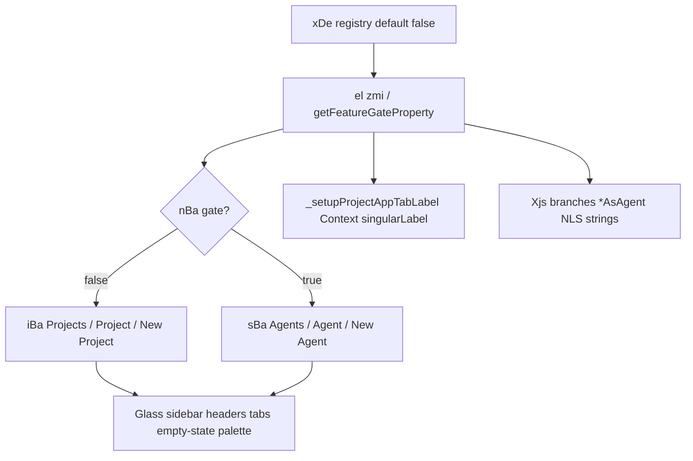

# Detective: `glass_projects_as_agents`

Theme: `feature-flag-glass-projects-as-agents`  
Flag: `glass_projects_as_agents`  
Cursor: **3.15.1** / product commit `41c5e281845de0ce890a8053a3874064bfbdb8b0` (manifest listed `…bfbdb8bf`)  
Plan path: `/workspace/workspace/runs/20260805T110539Z/plans/detective-feature-flag-glass-projects-as-agents.plan.md`

## 1. Objective

Determine how client feature gate `glass_projects_as_agents` is registered, which call sites consult it, what default/effective value applies in this extract, which Glass modules own Projects-vs-Agents UI presentation copy, and whether a local override is present.

**Success criteria:** registry entry confirmed (`POe` / `xDe`), call-site classification with Confirmed snippets, modules list, local override status, full Phase 1–5 + 4b report at this path.

**Assumptions**

- Inventory `default: false` matches minified `default:!1` (prefer inventory when they agree).
- Desktop client gate registry is `POe`; glass twin is `xDe`.
- Extract under `runs/20260805T110539Z/extract/new` is authoritative when live install is absent.

**Unknowns (pre-probe)**

- Live Statsig remote treatment on this host.
- Whether a developer local override exists in `state.vscdb`.

## 2. Environment

| Item | Value |
|------|--------|
| OS | Linux (cloud agent VM) |
| `locate-cursor.sh` | `install_status=not_found`, `WORKBENCH_JS=` empty (no live Cursor install); `/tmp/.mount_cursor*` absent |
| Workbench used | `/workspace/workspace/runs/20260805T110539Z/extract/new/usr/share/cursor/resources/app/out/vs/workbench/workbench.desktop.main.js` |
| Glass twin | `…/workbench.glass.main.js` (**sole active consumer**) |
| Version / channel | `product.json`: version=**3.15.1**, quality=stable, commit=`41c5e281845de0ce890a8053a3874064bfbdb8b0` |
| User config / `state.vscdb` | Absent (`~/.config/Cursor/User` missing) |
| Inventory | `/workspace/workspace/runs/20260805T110539Z/feature-flags-inventory.json` → `{name, client:true, default:false}` |
| Precomputed evidence | `/workspace/workspace/runs/20260805T110539Z/plans/_evidence/glass-projects-as-agents.json` |

## 3. Scan checklist

| Script / probe | Exit | One-line result |
|----------------|------|-----------------|
| `locate-cursor.sh` | 0 | No install; `WORKBENCH_JS` empty |
| `scan-paths.sh` | 0 | No Cursor User config / global `state.vscdb`; projects root exists (tiny) |
| `grep-workbench.sh` (desktop, flag) | 0 | `hit_count=1` — registry only |
| `grep-workbench.sh` (glass, flag) | 0 | `hit_count=2` — registry + `zmi` in `agents-ui-presentation.js` |
| `grep-workbench.sh` (desktop, `glass_projects_`) | 0 | Neighbor cluster + `glass_projects_enabled` consumers unrelated to this gate |
| `grep-workbench.sh` (desktop builtins) | 0 | `toolFormerData` / `composerData` present (bundle healthy) |
| `inspect-state-vscdb.sh` | 1 | `state.vscdb not found` (no local Statsig/override store) |
| Inventory JSON | — | `default: false`, `client: true` |
| Bundle deep extract (Phase 4b) | — | Registry **POe** / **xDe**; glass hooks `el`/`ww` → `getFeatureGateProperty(zmi)` |
| Local override probe | — | No User storage → **none** |

## 4. Findings

### Registry (feature-gate map)

- **Confirmed:** Desktop gate registry is minified as **`POe`** (assignment near `agent_goal_continuation`).
- **Confirmed:** Glass twin registry is **`xDe`**.
- **Confirmed:** Exact entry in both bundles:  
  `glass_projects_as_agents:{client:!0,default:!1}`  
  → client gate, **default false** (`!1`). Matches inventory (`prefer inventory default`).
- **Confirmed:** Neighbor cluster: `glass_projects_enabled`, `glass_chats_section_reset`, `glass_project_send_message_bubbles`, `glass_projects_empty_state`, `glass_project_app_agents_topics_prs`, other `glass_*` gates.

### Call sites (active consumers)

- **Confirmed — Glass only:** Constant `zmi="glass_projects_as_agents"` in `out-build/vs/glass/browser/agents-ui-presentation.js`.
- **Confirmed — Label maps:** `iBa` = Projects vocabulary (`sectionLabel:"Projects"`, `singularLabel:"Project"`, `newLabel:"New Project"`); `sBa` = Agents vocabulary (`"Agents"` / `"Agent"` / `"New Agent"`). Selector `nBa(t)=t?sBa:iBa`.
- **Confirmed — Hooks** (`use-glass-agents-ui.react.js`):  
  - `Xjs()` → `el(zmi)` reactive gate property.  
  - `Eyn()` → `nBa(Xjs())` label bundle for UI.  
  - `EZy(t)` → `nBa(ww(zmi,t))` with exposure-logging variant of the gate read.
- **Confirmed — Gate hook:** `el(name)` = `experimentService.getFeatureGateProperty(name)` (reactive). `ww(name, expose)` optionally calls `checkFeatureGate` then returns `el(name)`.
- **Confirmed — Desktop:** Flag string appears **only** in `POe` registry — no `agents-ui-presentation` module / no `zmi` consumer in desktop workbench.
- **Confirmed — Not registry-only on glass:** Multiple presentation consumers (sidebar, headers, tabs, empty state, command palette).

### What the gate changes

- **Confirmed:** When gate is **true**, Glass UI copy that would say “Project(s)” switches to “Agent(s)” via `nBa` / localized `*AsAgent` strings.
- **Confirmed:** When gate is **false** (bundled default), Projects vocabulary remains.
- **Confirmed consumers:**
  - Context/app tab label: `_setupProjectAppTabLabel` in `glass-tab-persistence-service.js` sets Context tab `singularLabel` from `nBa(gate)`.
  - Agent panel / project header fallbacks: `Xjs()` picks `…AsAgent` vs default NLS keys (`New Agent` vs `New Project`).
  - Sidebar expand/collapse: `Expand/Collapse Agent` vs `… Project`.
  - `Eyn()` supplies `sectionLabel` / `singularLabel` / `newLabel` into create-project, empty-state, sidebar grouping, and command-palette style surfaces.
- **Inferred:** Product intent is a presentation rename of Glass “Projects” UX to “Agents” without changing project-agent data model (eligibility still uses `isProject` / project composers elsewhere).

### Effective value (Statsig / local)

- **Confirmed:** Bundled default is **false** (`!1` / inventory).
- **Confirmed:** Override machinery exists (`_featureFlagOverrides`, storage key `workbench.experiments.featureFlagOverrides`, TTL `FEATURE_FLAG_OVERRIDE_TTL_MS`) but requires User storage.
- **Unknown:** Live Statsig remote value — no running Cursor / no `state.vscdb` / no Statsig cache on disk.
- **Confirmed:** Local feature-flag override: **none**.

### Confidence

**Confirmed** on registry, defaults, glass-only call sites, Projects↔Agents label split, related modules, and local-override absence. **Unknown** only for remote Statsig treatment on a live client. **Inferred** only for product-intent wording above.

## 5. Internal code map

### Module table

| Module / symbol | Role vs theme |
|-----------------|---------------|
| `out-build/vs/glass/browser/agents-ui-presentation.js` (`zmi`, `iBa`, `sBa`, `nBa`, `xZy`) | Owns flag string + Projects/Agents label maps |
| `out-build/vs/glass/browser/hooks/use-glass-agents-ui.react.js` (`Xjs`, `Eyn`, `EZy`) | Reactive gate → label bundle hooks |
| `out-build/vs/glass/browser/services/tab-persistence/glass-tab-persistence-service.js` | `_setupProjectAppTabLabel` uses `getFeatureGateProperty(zmi)` |
| `out-build/vs/glass/browser/components/agent-panel/hooks/use-agent-panel-header-actions.react.js` | Header fallback title via `Xjs()` / `z0g()` |
| `out-build/vs/glass/browser/components/editor-panel/project-tasks-composition.react.js` | Project header fallback name via `Xjs()` |
| `out-build/vs/glass/browser/components/agent-panel/hooks/empty-state-submit-options.js` | Create flow uses `Eyn()` labels |
| Glass experiment hooks `el` / `ww` (`Vs` experiment service) | `getFeatureGateProperty` / `checkFeatureGate` |
| Desktop `POe` / glass `xDe` | Default gate registries |

### Entry points

| Entry | Condition | Effect |
|-------|-----------|--------|
| `el(zmi)` / `Xjs()` | Gate property read | boolean Projects-as-Agents |
| `nBa(true)` / `Eyn()` when on | Gate on | Agents section/singular/new labels |
| `nBa(false)` / default | Gate off | Projects labels |
| `_setupProjectAppTabLabel` | Gate property changes / tab push | Context tab label = current singularLabel |
| NLS `*AsAgent` branches | `Xjs()` true | “New Agent” / “Expand Agent” copy |

### Implementation snippets (Confirmed)

Registry (desktop `POe` / glass `xDe`):

```text
glass_projects_enabled:{client:!0,default:!1},
glass_chats_section_reset:{client:!0,default:!1},
glass_projects_as_agents:{client:!0,default:!1},
glass_project_send_message_bubbles:{client:!0,default:!1},
glass_projects_empty_state:{client:!0,default:!1}
```

Glass presentation module + hooks:

```text
rBa=B({"out-build/vs/glass/browser/agents-ui-presentation.js"(){
  zmi="glass_projects_as_agents",
  iBa={sectionLabel:"Projects",singularLabel:"Project",newLabel:"New Project"},
  sBa={sectionLabel:"Agents",singularLabel:"Agent",newLabel:"New Agent"},
  bAm=new Set([iBa.singularLabel,sBa.singularLabel,"Context"])
}});
function nBa(t){return t?sBa:iBa}
function Xjs(){return el(zmi)}
function Eyn(){… return nBa(Xjs()) …}
function EZy(t){… return nBa(ww(zmi,t)) …}
ott=B({"out-build/vs/glass/browser/hooks/use-glass-agents-ui.react.js"(){…}})
```

Tab label + header copy:

```text
_setupProjectAppTabLabel(){
  const t=this._experimentService.getFeatureGateProperty(zmi),
  e=i=>{const s=nBa(t.nonReactive()===!0).singularLabel, … setLabel(…,label:s)}
}
z0g(){return Xjs()?T("…projectHeaderFallbackTitleAsAgent","New Agent")
                  :T("…projectHeaderFallbackTitle","New Project")}
```

## 6. Diagram



## 7. Gaps & follow-ups

- **Blocked:** Live Statsig treatment — no Cursor User profile / `state.vscdb` on this VM.
- **Blocked:** Cannot confirm persisted `workbench.experiments.featureFlagOverrides` contents (storage absent).
- **Note:** Several late-inlined `Eyn()` / `Xjs()` call sites lack nearby AMD path strings after a 15–20KB lookback; behavior is still Confirmed via shared hooks and NLS keys. Desktop has no runtime consumer beyond registry.

## 8. Workspace relevance

Flag controls **Projects ↔ Agents presentation copy** in Glass (labels, fallbacks, sidebar expand/collapse, Context tab singular label). It does not gate project-agent eligibility or send-message bubble layout (those are sibling flags such as `glass_projects_enabled` / `glass_project_send_message_bubbles`). Unrelated to cursor-sync chat transport layers.
