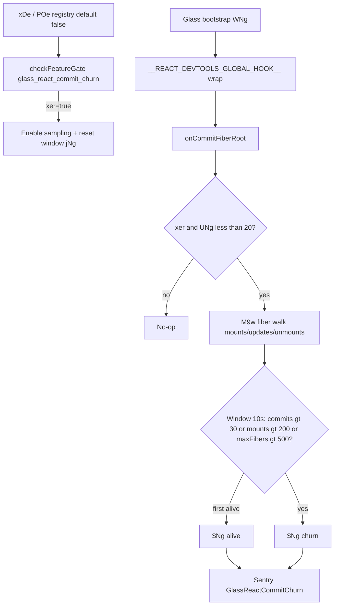

# Detective: `glass_react_commit_churn`

Theme: `feature-flag-glass-react-commit-churn`  
Flag: `glass_react_commit_churn`  
Cursor: **3.15.1** / product commit `41c5e281845de0ce890a8053a3874064bfbdb8b0` (precomputed evidence listed `…bfbdb8bf`)  
Plan path: `/workspace/workspace/runs/20260805T110539Z/plans/detective-feature-flag-glass-react-commit-churn.plan.md`

## 1. Objective

Determine how client feature gate `glass_react_commit_churn` is registered, which call sites consult it, what default/effective value applies in this extract, which modules own React fiber commit-churn instrumentation for Glass, and whether a local override is present.

**Success criteria:** registry entry confirmed (`POe` / `xDe`), call-site classification with Confirmed snippets, modules list, local override status, full Phase 1–5 + 4b report at this path.

**Assumptions**

- Inventory `default: false` matches minified `default:!1` (prefer inventory when they agree).
- Desktop client gate registry is `POe`; glass twin is `xDe`.
- Extract under `runs/20260805T110539Z/extract/new` is authoritative when live install is absent.

**Unknowns (pre-probe)**

- Live Statsig remote treatment on this host.
- Whether a developer local override exists in `state.vscdb`.

## 2. Environment

| Item | Value |
|------|--------|
| OS | Linux (cloud agent VM) |
| `locate-cursor.sh` | `install_status=not_found`, `WORKBENCH_JS=` empty (no live Cursor install) |
| Workbench used | `/workspace/workspace/runs/20260805T110539Z/extract/new/usr/share/cursor/resources/app/out/vs/workbench/workbench.desktop.main.js` |
| Glass twin | `…/workbench.glass.main.js` (**sole active consumer**) |
| Version / channel | `product.json`: version=**3.15.1**, quality=stable, commit=`41c5e281845de0ce890a8053a3874064bfbdb8b0` |
| User config / `state.vscdb` | Absent (`~/.config/Cursor/User` missing) |
| Inventory | `/workspace/workspace/runs/20260805T110539Z/feature-flags-inventory.json` → `{name, client:true, default:false}` |
| Precomputed evidence | `/workspace/workspace/runs/20260805T110539Z/plans/_evidence/glass-react-commit-churn.json` |

## 3. Scan checklist

| Script / probe | Exit | One-line result |
|----------------|------|-----------------|
| `locate-cursor.sh` | 0 | No install; `WORKBENCH_JS` empty |
| `scan-paths.sh` | 0 | No Cursor User config / global `state.vscdb`; projects root exists (tiny) |
| `grep-workbench.sh` (desktop, flag) | 0 | `hit_count=1` — registry only |
| `grep-workbench.sh` (glass, flag) | 0 | `hit_count=2` — registry + `checkFeatureGate` consumer |
| `grep-workbench.sh` (glass, contrib ID) | 0 | `workbench.contrib.glassReactCommitChurn` registered `Eventually` |
| `grep-workbench.sh` (glass, error name) | 0 | `GlassReactCommitChurn` Sentry error factory |
| `grep-workbench.sh` (desktop builtins) | 0 | `toolFormerData` / `composerData` present (bundle healthy) |
| `inspect-state-vscdb.sh` | 0* | Prints `state.vscdb not found`; *no local Statsig/override store |
| Inventory JSON | — | `default: false`, `client: true` |
| Bundle deep extract (Phase 4b) | — | Registry **POe** / **xDe**; glass DevTools hook wrap + thresholds |
| Local override probe | — | No User storage → **none** |

## 4. Findings

### Registry (feature-gate map)

- **Confirmed:** Desktop gate registry is minified as **`POe`** (`POe={agent_goal_continuation:…`).
- **Confirmed:** Glass twin registry is **`xDe`**.
- **Confirmed:** Exact entry in both bundles:  
  `glass_react_commit_churn:{client:!0,default:!1}`  
  → client gate, **default false** (`!1`). Matches inventory (`prefer inventory default`).
- **Confirmed:** Neighbor cluster (perf/metrics): `solidjs_total_observers_metric`, `renderer_heap_metrics`, `sand_renderer_heap_metrics`, `collect_sample_for_unresponsive_ext_host`.

### Call sites (active consumers)

- **Confirmed — Desktop:** Registry only (`mention_counts.desktop=1`). No `glassReactCommitChurn` contrib, no `GlassReactCommitChurn` error, no fiber walk.
- **Confirmed — Glass:** Contribution `J1i` / `workbench.contrib.glassReactCommitChurn` (phase `ma.Eventually`) reads `IExperimentService.checkFeatureGate("glass_react_commit_churn",{disableExposureLog:!0})`, sets global enable flag `xer`, and on rising edge calls `jNg(performance.now())` to reset the window. Re-runs on `onDidChangeGates`.
- **Confirmed — Instrumentation (always installed on glass; gated at sample time):**
  - `WNg` wraps `globalThis.__REACT_DEVTOOLS_GLOBAL_HOOK__` so `onCommitFiberRoot` → `M9w(root)` and `onCommitFiberUnmount` increments `Zll` when `xer`.
  - `M9w` walks up to `ONg=2000` fibers per commit; counts mounts (`alternate===null`), updates (`flags&R9w` where `R9w=1`), compiled updates (`updateQueue.memoCache`), unmounts; tracks walk time and max fibers.
  - Window `P9w=1e4` ms; thresholds `Gll={commits:30,mounts:200,commitFibers:500}`; max reports `D9w=20`.
  - `$Ng(kind, extra)` builds `Error` named `GlassReactCommitChurn` and captures via `TD` with fingerprint `["glass-react-commit-churn", kind]`, tags `client_error_type:"react_commit_churn"`, `churn_kind` ∈ `{alive,churn}`.
- **Confirmed — Not a product UX flag:** Does not change composer/transcript UI; observability-only when enabled.

### Effective value (Statsig / local)

- **Confirmed:** Bundled default is **false** (`!1` / inventory).
- **Confirmed:** Override machinery exists (`_featureFlagOverrides`, storage key `workbench.experiments.featureFlagOverrides`) but requires User storage.
- **Unknown:** Live Statsig remote value — no running Cursor / no `state.vscdb` / no Statsig cache on disk.
- **Confirmed:** Local feature-flag override: **none**.

### Confidence

**Confirmed** on registry, defaults, glass-only consumer + DevTools hook instrumentation, thresholds, Sentry reporting shape, related modules, and local-override absence. **Unknown** only for remote Statsig treatment on a live client. **Inferred** only that product intent is Glass React performance regression detection (commit/mount churn) behind a default-off gate.

## 5. Internal code map

### Module table

| Module / symbol | Role vs theme |
|-----------------|---------------|
| `workbench.contrib.glassReactCommitChurn` (`J1i`) | Gate watcher; toggles `xer` / resets window via `jNg` |
| Inline glass block (`WNg`, `M9w`, `$Ng`, `jNg`) | React DevTools hook wrap + fiber walk + Sentry capture (no discrete `out-build/…glassReactCommitChurn.js` string) |
| `out-build/.../services/experiment/browser/experimentService.js` | `POe`/`xDe` defaults; `checkFeatureGate` / overrides |
| `out-build/.../services/experiment/browser/experimentHooks.js` | Related experiment hook helpers (bundle neighbor) |
| `../packages/metrics/src/label-middleware.ts` | Metrics package present in both bundles (sibling telemetry surface; not this gate’s direct call site) |

### Entry points

| Entry | Condition | Effect |
|-------|-----------|--------|
| `checkFeatureGate("glass_react_commit_churn")` | Contrib ctor + `onDidChangeGates` | Sets `xer`; rising edge resets counters |
| `WNg` → `onCommitFiberRoot` | Always (glass bootstrap) | Calls `M9w` |
| `M9w` | `xer===true` and `UNg<D9w` | Samples fiber tree; may `$Ng("alive"\|"churn")` |
| `$Ng` | Threshold / first-alive | Sentry-style capture `GlassReactCommitChurn` |

### Implementation snippets (Confirmed)

Registry (desktop `POe` / glass `xDe`):

```text
solidjs_total_observers_metric:{client:!0,default:!1},
renderer_heap_metrics:{client:!0,default:!1},
glass_react_commit_churn:{client:!0,default:!1},
sand_renderer_heap_metrics:{client:!0,default:!1}
```

Glass gate + contrib:

```text
var J1i=class extends Xe{constructor(t){super(),Promise.resolve().then(()=>(Tr(),s_u)).then(e=>{
  t.invokeFunction(n=>{const i=n.get(e.IExperimentService),s=()=>{
    const r=i.checkFeatureGate("glass_react_commit_churn",{disableExposureLog:!0});
    r&&!xer&&jNg(performance.now()),xer=r};
  s(),this._register(i.onDidChangeGates(s))})},()=>{})}};
J1i.ID="workbench.contrib.glassReactCommitChurn";
ua(J1i.ID,J1i,ma.Eventually)
```

Hook wrap + report:

```text
function $Ng(t,e){UNg++;const n=Object.assign(new Error(`glass react commit churn (${t})`),{name:"GlassReactCommitChurn"});
  TD(n,{captureContext:{fingerprint:["glass-react-commit-churn",t],
    tags:{client_error_type:"react_commit_churn",churn_kind:t},extra:e}})}
function M9w(t){if(!xer||UNg>=D9w)return; /* fiber walk; thresholds Gll */ }
function WNg(t){ /* wrap __REACT_DEVTOOLS_GLOBAL_HOOK__; onCommitFiberRoot→M9w */ }
```

## 6. Diagram



## 7. Gaps & follow-ups

- **Blocked:** Live Statsig treatment — no Cursor User profile / `state.vscdb` on this VM.
- **Blocked:** Cannot confirm persisted `workbench.experiments.featureFlagOverrides` contents (storage absent).
- **Note:** Glass instrumentation is late-inlined (no AMD `out-build/…/glassReactCommitChurn.js` path string); owning source file name beyond contrib ID `workbench.contrib.glassReactCommitChurn` is **Unknown** after module-table walk.

## 8. Workspace relevance

Flag gates **Glass-only React fiber commit-churn telemetry** (DevTools hook → Sentry). Desktop ships the registry default but does not install the contrib. Sibling registry neighbors (`renderer_heap_metrics`, `sand_renderer_heap_metrics`) are separate metrics gates. Unrelated to cursor-sync chat transport layers.
