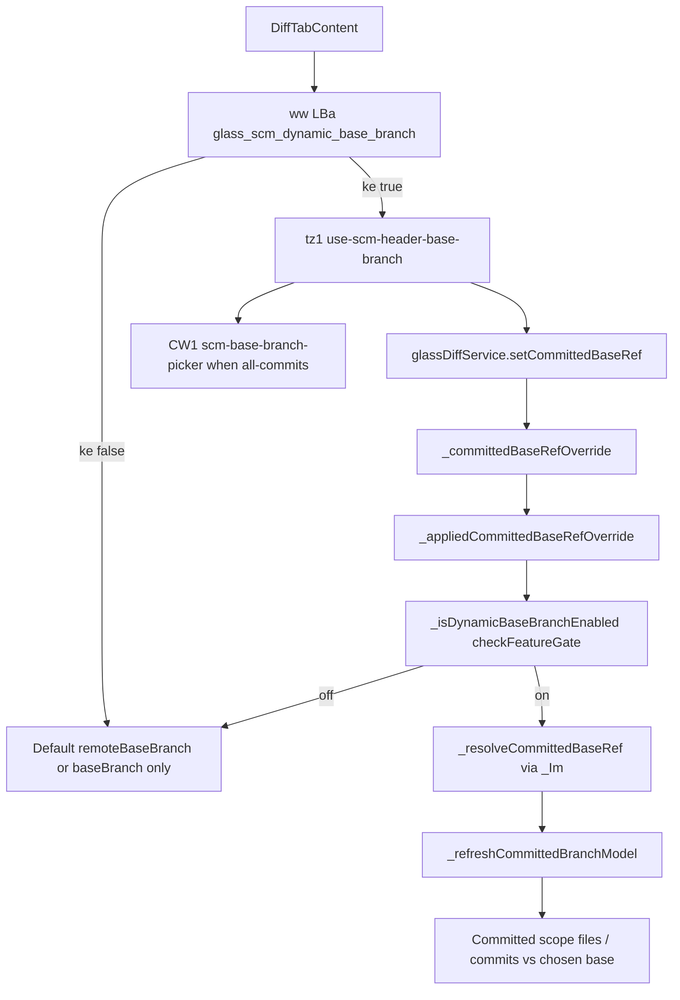

# Detective: `glass_scm_dynamic_base_branch`

Theme: `feature-flag-glass-scm-dynamic-base-branch`  
Flag: `glass_scm_dynamic_base_branch`  
Cursor: **3.15.1** / product commit `41c5e281845de0ce890a8053a3874064bfbdb8b0` (precomputed evidence listed `…bfbdb8bf`)  
Plan path: `/workspace/workspace/runs/20260805T110539Z/plans/detective-feature-flag-glass-scm-dynamic-base-branch.plan.md`

## 1. Objective

Determine how client feature gate `glass_scm_dynamic_base_branch` is registered, which call sites consult it, what default/effective value applies in this extract, which Glass SCM/diff modules own dynamic committed-base selection, and whether a local override is present.

**Success criteria:** registry entry confirmed (minified vars `POe` / `xDe`), call-site classification with Confirmed snippets, modules list, local override status, full Phase 1–5 + 4b report at this path.

**Assumptions**

- Inventory `default: false` matches minified `default:!1` (prefer inventory when they agree).
- Desktop client gate registry is `POe` (not `kFe`); glass twin is `xDe`.
- Extract under `runs/20260805T110539Z/extract/new` is authoritative when live install is absent.

**Unknowns (pre-probe)**

- Live Statsig remote treatment on this host.
- Whether a developer local override exists in `state.vscdb`.

## 2. Environment

| Item | Value |
|------|--------|
| OS | Linux (cloud agent VM) |
| `locate-cursor.sh` | `install_status=not_found`, `WORKBENCH_JS=` empty (no live Cursor install) |
| Workbench used | `/workspace/workspace/runs/20260805T110539Z/extract/new/usr/share/cursor/resources/app/out/vs/workbench/workbench.desktop.main.js` |
| Glass twin | `…/workbench.glass.main.js` (**sole active consumer**) |
| Version / channel | `product.json`: version=**3.15.1**, quality=stable, commit=`41c5e281845de0ce890a8053a3874064bfbdb8b0` |
| User config / `state.vscdb` | Absent (`~/.config/Cursor/User` missing) |
| Inventory | `/workspace/workspace/runs/20260805T110539Z/feature-flags-inventory.json` → `{name, client:true, default:false}` |
| Precomputed evidence | `/workspace/workspace/runs/20260805T110539Z/plans/_evidence/glass-scm-dynamic-base-branch.json` |

## 3. Scan checklist

| Script / probe | Exit | One-line result |
|----------------|------|-----------------|
| `locate-cursor.sh` | 0 | No install; `WORKBENCH_JS` empty |
| `scan-paths.sh` | 0 | No Cursor User config / global `state.vscdb`; projects root exists (tiny) |
| `grep-workbench.sh` (desktop, flag) | 0 | `hit_count=1` — registry only |
| `grep-workbench.sh` (glass, flag) | 0 | `hit_count=2` — registry + `LBa="glass_scm_dynamic_base_branch"` in `glassDiffService` |
| `grep-workbench.sh` (glass builtins) | 0 | `toolFormerData` / `composerData` present (bundle healthy) |
| `inspect-state-vscdb.sh` | 1 | `state.vscdb not found` (no local Statsig/override store) |
| Inventory JSON | — | `default: false`, `client: true` |
| Bundle deep extract (Phase 4b) | — | Registry **POe** / **xDe**; service gate via `_isDynamicBaseBranchEnabled`; UI via `ww(LBa,_)` → `tz1` / `CW1` picker |
| Local override probe | — | No User storage → **none** |

## 4. Findings

### Registry (feature-gate map)

- **Confirmed:** Desktop gate registry is minified as **`POe`**. `c_n=Object.keys(POe)` follows the client-gate map.
- **Confirmed:** Glass twin registry is **`xDe`** (`dct=Object.keys(xDe)`).
- **Confirmed:** Exact entry in both bundles:  
  `glass_scm_dynamic_base_branch:{client:!0,default:!1}`  
  → client gate, **default false** (`!1`). Matches inventory (`prefer inventory default`).
- **Confirmed:** Neighbor cluster: `glass_all_changes_diff_scope`, `glass_direct_github_connect`, `scm_connect_in_app_ad*`, `glass_last_turn_diff_scope`, other `glass_*` / SCM gates.

### Call sites (active consumers)

- **Confirmed — Desktop:** Registry-only. No `LBa`, no `_isDynamicBaseBranchEnabled`, no `ww(LBa,…)`, no DiffTab / SCM-header consumers under this flag.
- **Confirmed — Glass (sole runtime consumer):** Constant `LBa="glass_scm_dynamic_base_branch"` in `glass-diff-service.js` (`yU=xn("glassDiffService")`).
  1. **Service path:** `_isDynamicBaseBranchEnabled()` → `this._experimentService.checkFeatureGate(LBa,{disableExposureLog:!0})`.
  2. **`_appliedCommittedBaseRefOverride()`:** returns `this._committedBaseRefOverride?.trim()` only when the gate is on; otherwise `undefined` → committed diffs use `_getDefaultCommittedBaseRef()` (`remoteBaseBranch || baseBranch`).
  3. **UI path (DiffTabContent):** `ke=ww(LBa,_)` (reactive gate + exposure when second arg truthy). Passed as `enabled:ke` into `tz1` (`use-scm-header-base-branch.react.js`). Effect `R.setCommittedBaseRef(gm)` pushes override into the service.
  4. **Picker:** When `ke` and committed selection is `all-commits`, `TH1` gets `baseBranchControl: c0(CW1,{…})` (`scm-base-branch-picker.react.js`).

### Dynamic base-branch semantics

- **Confirmed — Override application:** `_refreshCommittedBranchModel` uses `i=this._appliedCommittedBaseRefOverride()`, `s=this._getDefaultCommittedBaseRef()`, `r=i===void 0?s:await this._resolveCommittedBaseRef()`. Gate off ⇒ override ignored even if `_committedBaseRefOverride` is set in memory.
- **Confirmed — Resolution:** `_resolveCommittedBaseRef` expands candidates via `_Im({targetRef, remoteBaseBranch, knownRemoteNames})` (tries `refs/remotes/<remote>/<name>`, `refs/heads/<name>`, etc.) then `resolveGitRevision`; falls back to default if none verify.
- **Confirmed — UI hook `tz1`:** When `enabled` is false, skips manual map / cloud-agent override (`n?u.get(i):void 0`, `n?r:void 0`) so `committedBaseRefOverride` stays unset; when true, prefers manual selection, else cloud-agent base if it differs from default, else default (`Qig` / `YH1` in `scm-header-base-branch.js`).
- **Confirmed — Options:** `getCommittedBaseBranchOptions()` / DiffTab `Uf` loads branch names for the picker (`Yig=50` max via `ZH1`).
- **Confirmed:** When gate is **off** (shipped default): no base-branch picker control for `all-commits`; committed scope always diffs against configured default remote/base branch.
- **Confirmed:** When gate is **on**: user (or cloud-agent metadata) can select an alternate committed base; service applies it when resolving merge-base / committed file lists.
- **Inferred:** Product intent is optional per-repo dynamic base for Glass SCM “committed / all commits” diffs without changing the default base-branch detection path.

### Effective value (Statsig / local)

- **Confirmed:** Bundled default is **false** (`!1` / inventory).
- **Confirmed:** UI reads via `ww` → `el` → `experimentService.getFeatureGateProperty`; service reads via `checkFeatureGate` with exposure logging disabled.
- **Unknown:** Live Statsig remote value — no running Cursor / no `state.vscdb` / no Statsig cache on disk.
- **Confirmed:** Local feature-flag override: **none**.

### Confidence

**Confirmed** on registry, defaults, Glass-only call sites, service override gating, DiffTab/picker wiring, related modules, and local-override absence. **Unknown** only for remote Statsig treatment on a live client. **Inferred** only for product intent wording above.

## 5. Internal code map

### Module table

| Module / symbol | Role vs theme |
|-----------------|---------------|
| `out-build/vs/glass/browser/services/diff/glass-diff-service.js` (`mWs` / `yU` / `LBa`) | Owns gate constant; `_isDynamicBaseBranchEnabled`; `_appliedCommittedBaseRefOverride`; `setCommittedBaseRef` / `getCommittedBaseBranchOptions` |
| `out-build/vs/glass/browser/services/diff/glass-diff-committed-branch-model.js` (`kXy` / `SXy` / `yXy`) | Committed branch model refresh given resolved `baseRef` |
| `out-build/vs/glass/browser/services/diff/glass-diff-committed-branch-parsing.js` | Commit list parsing helpers adjacent to model |
| `_Im` / `bIm` (adjacent to committed-branch model) | Expand base ref candidates with remote prefixes |
| `out-build/vs/glass/browser/components/editor-panel/diff-tab/diff-tab-content.react.js` | `ke=ww(LBa,_)`; wires `tz1`; `setCommittedBaseRef`; mounts `CW1` when `ke && all-commits` |
| `out-build/vs/glass/browser/components/editor-panel/scm-header/use-scm-header-base-branch.react.js` (`tz1`) | Computes override / effective name / options / select callback when `enabled` |
| `out-build/vs/glass/browser/components/editor-panel/scm-header/scm-header-base-branch.js` (`SSn`/`Qig`/`YH1`/`ZH1`) | Pure helpers for manual vs cloud vs default base |
| `out-build/vs/glass/browser/components/editor-panel/scm-header/scm-base-branch-picker.react.js` (`CW1`) | Base-branch dropdown UI (`data-component="scm-base-branch-picker"`) |
| `out-build/vs/glass/browser/hooks/use-feature-gate.react.js` (`el` / `ww` / `Id`) | Gate property subscription / optional exposure |
| `out-build/vs/workbench/services/experiment/browser/experimentService.js` | `POe`/`xDe` defaults; `getFeatureGateProperty` / `checkFeatureGate` |

### Entry points

| Entry | Condition | Effect |
|-------|-----------|--------|
| `ke=ww(LBa,_)` | Gate property true | Enables DiffTab base-branch UX + exposure |
| `tz1({enabled:ke,…})` | `ke` true | Manual/cloud overrides → `committedBaseRefOverride` |
| `R.setCommittedBaseRef(gm)` | Override string changes | Stores `_committedBaseRefOverride`; refreshes committed scope |
| `_appliedCommittedBaseRefOverride()` | Gate on via `checkFeatureGate(LBa)` | Returns trimmed override; else ignores stored override |
| `_resolveCommittedBaseRef` / `_refreshCommittedBranchModel` | Applied override or default | Resolves merge-base + committed commits/files vs chosen base |
| `CW1` picker | `ke && selection.kind==="all-commits"` | Lets user pick alternate base branch |

### Implementation snippets (Confirmed)

Registry (desktop `POe` / glass `xDe`):

```text
glass_all_changes_diff_scope:{client:!0,default:!1},
glass_scm_dynamic_base_branch:{client:!0,default:!1},
glass_direct_github_connect:{client:!0,default:!1},
scm_connect_in_app_ad:{client:!0,default:!1}
```

Service gate + override (glass `glassDiffService`):

```text
yU=xn("glassDiffService"),LBa="glass_scm_dynamic_base_branch",…
_isDynamicBaseBranchEnabled(){
  return this._experimentService.checkFeatureGate(LBa,{disableExposureLog:!0})
}
_appliedCommittedBaseRefOverride(){
  if(this._isDynamicBaseBranchEnabled())
    return this._committedBaseRefOverride?.trim()||void 0
}
```

DiffTab wiring:

```text
ke=ww(LBa,_),…
{committedBaseRefOverride:gm,effectiveBaseBranchName:e_,baseBranchOptions:gy,selectBaseBranch:t_}=
  tz1({enabled:ke,repositoryIdentityKey:L,defaultBaseBranch:ze.baseBranch,
       cloudAgentBaseBranch:bf,branchOptions:tg,…});
Bwt(()=>{R.setCommittedBaseRef(gm)},[gm,L,R]);
// header:
baseBranchControl: ke&&tf.selection.kind==="all-commits"
  ? c0(CW1,{baseBranchName:e_,baseBranchOptions:gy,…,onSelectBaseBranch:t_})
  : void 0
```

`tz1` enable gate:

```text
const k=n?u.get(i):void 0, C=n?r:void 0;
p=Qig({manualBaseBranch:k,cloudAgentBaseBranch:C,defaultBaseBranch:s});
m=YH1({manualBaseBranch:k,cloudAgentBaseBranch:C,defaultBaseBranch:s});
// returns {committedBaseRefOverride:p, effectiveBaseBranchName:g, …}
```

## 6. Diagram



## 7. Gaps & follow-ups

- **Blocked:** Live Statsig treatment — no Cursor User profile / `state.vscdb` on this VM (`inspect-state-vscdb.sh` exit 1).
- **Blocked:** Live install mount — `locate-cursor.sh` found no AppImage/`WORKBENCH_JS`; used run extract path instead (documented above).
- **Not applicable:** Desktop runtime path — flag is registry-only there; behavior is Glass DiffTab / `glassDiffService`-scoped.

## 8. Workspace relevance

Flag gates Glass editor-panel **SCM committed-diff base branch** selection (dynamic override + picker). Sibling gates `glass_all_changes_diff_scope` / `glass_last_turn_diff_scope` shape adjacent diff filter scopes but do not own base-ref override application. Unrelated to cursor-sync chat transport layers.
