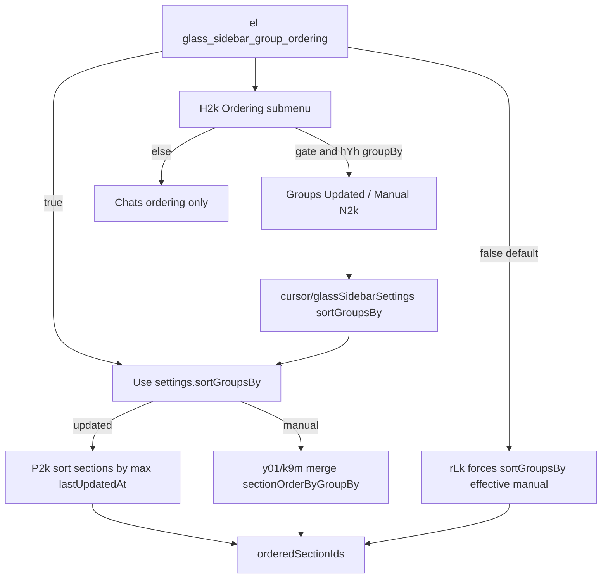

# Detective: `glass_sidebar_group_ordering`

Theme: `feature-flag-glass-sidebar-group-ordering`  
Flag: `glass_sidebar_group_ordering`  
Cursor: **3.15.1** / product commit `41c5e281845de0ce890a8053a3874064bfbdb8b0` (manifest/inventory listed `…bfbdb8bf`)  
Plan path: `/workspace/workspace/runs/20260805T110539Z/plans/detective-feature-flag-glass-sidebar-group-ordering.plan.md`

## 1. Objective

Determine how client feature gate `glass_sidebar_group_ordering` is registered, which Glass sidebar call sites consult it, what default/effective value applies in this extract, which modules own group-order UX (sort groups Updated/Manual + section reorder), and whether a local override is present.

**Success criteria:** registry entry confirmed (`POe` / `xDe`), call-site classification with Confirmed snippets, modules list, local override status, full Phase 1–5 + 4b report at this path.

**Assumptions**

- Inventory `default: false` matches minified `default:!1` (prefer inventory when they agree).
- Desktop client gate registry is `POe`; glass twin is `xDe`.
- Extract under `runs/20260805T110539Z/extract/new` is authoritative when live install is absent.

**Unknowns (pre-probe)**

- Live Statsig remote treatment on this host.
- Whether a developer local override exists in `state.vscdb`.

## 2. Environment

| Item | Value |
|------|--------|
| OS | Linux (cloud agent VM) |
| `locate-cursor.sh` | `install_status=not_found`, `WORKBENCH_JS=` empty (no live Cursor install) |
| Workbench used | `/workspace/workspace/runs/20260805T110539Z/extract/new/usr/share/cursor/resources/app/out/vs/workbench/workbench.desktop.main.js` |
| Glass twin | `…/workbench.glass.main.js` (**sole active consumer**) |
| Version / channel | `product.json`: version=**3.15.1**, quality=stable, commit=`41c5e281845de0ce890a8053a3874064bfbdb8b0` |
| User config / `state.vscdb` | Absent (`~/.config/Cursor/User` missing) |
| Inventory | `/workspace/workspace/runs/20260805T110539Z/feature-flags-inventory.json` → `{name, client:true, default:false}` (`registry_var: POe`) |
| Precomputed evidence | `/workspace/workspace/runs/20260805T110539Z/plans/_evidence/glass-sidebar-group-ordering.json` |

## 3. Scan checklist

| Script / probe | Exit | One-line result |
|----------------|------|-----------------|
| `locate-cursor.sh` | 0 | No install; `WORKBENCH_JS` empty |
| `scan-paths.sh` | 0 | No Cursor User config / global `state.vscdb`; projects root exists (tiny) |
| `grep-workbench.sh` (desktop, flag) | 0 | `hit_count=1` — registry only |
| `grep-workbench.sh` (glass, flag) | 0 | `hit_count=2` — registry + `var zbf="…"` consumer block |
| `grep-workbench.sh` (desktop builtins) | 0 | `toolFormerData` / `composerData` present (bundle healthy) |
| `inspect-state-vscdb.sh` | 1 | `state.vscdb not found` (no local Statsig/override store) |
| Inventory JSON | — | `default: false`, `client: true`, `registry_var: POe` |
| Bundle deep extract (Phase 4b) | — | Registry **POe** / **xDe**; Glass `zbf` + `el(zbf)` ×2; helpers `I2k`/`R2k`/`P2k`/`rLk`/`hYh`/`H2k` |
| Local override probe | — | No User storage → **none** |

## 4. Findings

### Registry (feature-gate map)

- **Confirmed:** Desktop gate registry is minified as **`POe`**. Assignment starts at `POe={agent_goal_continuation:…}`; `c_n=Object.keys(POe)`. Inventory `registry_var: POe`.
- **Confirmed:** Glass twin registry is **`xDe`**; `dct=Object.keys(xDe)`.
- **Confirmed:** Exact entry in both bundles:  
  `glass_sidebar_group_ordering:{client:!0,default:!1}`  
  → client gate, **default false** (`!1`). Matches inventory (`prefer inventory default`).
- **Confirmed:** Neighbor cluster: `glass_sidebar_source_metadata`, `glass_sidebar_recency_filter`, then this flag, then `glass_sidebar_scroll_active_row_if_needed`, `glass_sidebar_archive_toggle`, `glass_btw_side_question` / `glass_side_chats`.

### Call sites (active consumers)

- **Confirmed — Desktop:** Registry-only. No `el("glass_sidebar_group_ordering")` / no `zbf` consumer in `workbench.desktop.main.js`.
- **Confirmed — Glass (sole runtime consumer):** `var zbf="glass_sidebar_group_ordering"` plus two `el(zbf)` sites:

| Site | Symbol | Role |
|------|--------|------|
| Customize menu | `H2k` (`M=el(zbf)`) | `ee=M&&hYh(j)` — when gate on **and** groupBy is location-like (`workspace`/`repository`/`environment`/`environmentInstance`), Ordering submenu shows **Groups** section (`N2k`: Updated / Manual) alongside Chats; when off, only Chats ordering UI |
| Main sidebar | late-inlined agents list (`un=el(zbf)`) | Passes `groupOrderingEnabled:un` into `rLk` section-order hook |

### Group-ordering semantics

- **Confirmed — `hYh(groupBy)`:** Returns true for `workspace` / `repository` / `environment` / `environmentInstance`; false for `time` / `status`. Gates whether Groups ordering UI + reorder path apply for the current group mode.
- **Confirmed — `N2k`:** `[{value:"updated",label:"Updated"},{value:"manual",label:"Manual"}]` — Groups order modes in customize menu.
- **Confirmed — Default settings (`z$e`):** `sortGroupsBy:"manual"` (with `groupBy:"repository"`, `sortAgentsBy:"updated"`, `sectionOrderByGroupBy:{}`).
- **Confirmed — `rLk`:** When `groupOrderingEnabled` (`o`) is false, effective mode `_` is forced to `"manual"` (ignores stored `sortGroupsBy`). When true, `_=l.sortGroupsBy`. If workspace-section reorder enabled (`r` / `Pn` via `Okk` for workspace|repository groupBy) and `_==="updated"`, ordered ids come from `P2k(visibleSections)` (recency sort). Otherwise manual path merges saved `sectionOrderByGroupBy[groupBy]` via `y01`/`k9m`.
- **Confirmed — `P2k` / `R2k` / `I2k`:** Section recency = max `lastUpdatedAt` over headers + agentProjects (after unwrapping empty filtered `removalSource` via `I2k`); sort desc by that timestamp, tie-break `section.id.localeCompare`.
- **Confirmed — Persistence:** `cursor/glassSidebarSettings` fields `sortGroupsBy` and `sectionOrderByGroupBy` (`F9m` / `$9m`). Drag reorder (`reorderVisibleGroups`) writes order and forces `"manual"` via `$9m(...,"manual")`.
- **Confirmed:** When gate is **off** (shipped default), Groups Updated/Manual UI hidden; `rLk` always treats group order as manual (saved `sortGroupsBy:"updated"` unused).
- **Confirmed:** When gate is **on** and groupBy qualifies, users can pick Updated (auto recency via `P2k`) or Manual (persisted section order / drag reorder).

### Effective value (Statsig / local)

- **Confirmed:** Bundled default is **false** (`!1` / inventory).
- **Confirmed:** Call sites use `el(...)` from `use-feature-gate.react.js` → experiment service `checkFeatureGate` / `getFeatureGateProperty`.
- **Unknown:** Live Statsig remote value — no running Cursor / no `state.vscdb` / no Statsig cache on disk.
- **Confirmed:** Local feature-flag override: **none**.

### Confidence

**Confirmed** on registry, defaults, Glass-only call sites, Groups ordering UI + `rLk`/`P2k` behavior, related helpers/modules, and local-override absence. **Unknown** only for remote Statsig treatment on a live client. **Inferred** only for product intent: gate Glass sidebar section/group ordering controls (Updated vs Manual) without shipping them on by default.

## 5. Internal code map

### Module table

| Module / symbol | Role vs theme |
|-----------------|---------------|
| `out-build/vs/glass/browser/components/glass-sidebar/utils/section-order.js` | AMD shell adjacent to section-order helpers (`Wja`); order merge/persist lives nearby |
| `out-build/vs/glass/browser/components/glass-sidebar/sidebar-settings.js` | `z$e` defaults, `sortGroupsBy`, `sectionOrderByGroupBy`, storage key `cursor/glassSidebarSettings` |
| `out-build/vs/glass/browser/components/glass-sidebar/utils/filter-group.js` | Loaded immediately before `zbf` / `I2k`/`R2k`/`P2k` block (`OLa`) |
| `out-build/vs/glass/browser/utils/group-agents.js` | Agent/section grouping pipeline feeding sidebar sections |
| `out-build/vs/glass/browser/components/glass-sidebar/utils/pinned-agent-order.js` | Pinned-agent order (adjacent ordering surface) |
| `out-build/vs/glass/browser/services/glass-sidebar-agent-order-service.js` | Agent-order service (related; not the gate string itself) |
| Late-inlined Glass (`H2k` / `rLk` / `P2k` / `hYh` / `Okk`) | Owns Groups Ordering submenu + ordered section ids (no discrete `*group-ordering*` path string) |
| `out-build/vs/glass/browser/hooks/use-feature-gate.react.js` | `el` / `ww` gate hooks |
| `out-build/vs/workbench/services/experiment/browser/experimentService.js` | `checkFeatureGate` / `getFeatureGateProperty`; `POe`/`xDe` defaults |
| Storage `cursor/glassSidebarSettings` | Persists `sortGroupsBy` + `sectionOrderByGroupBy` |

### Entry points

| Entry | Condition | Effect |
|-------|-----------|--------|
| `H2k` Ordering submenu | `el(zbf) && hYh(groupBy)` | Shows Groups Updated/Manual (`N2k`); else Chats-only ordering |
| `rLk` | `groupOrderingEnabled=el(zbf)` | If off → force `sortGroupsBy` effective `"manual"`; if on + `"updated"` → `P2k` order |
| Main list `Pn`/`Okk` | groupBy workspace\|repository | Enables workspace section reorder path that consumes `rLk` output |

### Implementation snippets (Confirmed)

Registry (desktop `POe` / glass `xDe`):

```text
glass_sidebar_recency_filter:{client:!0,default:!1},
glass_sidebar_group_ordering:{client:!0,default:!1},
glass_sidebar_scroll_active_row_if_needed:{client:!0,default:!0}
```

Helpers + gate constant (glass):

```text
var zbf="glass_sidebar_group_ordering";
function I2k(t){return t.isFilterEmpty&&t.removalSource?t.removalSource:t}
function R2k(t){const e=I2k(t);let n=0;for(const i of e.headers)n=Math.max(n,i.lastUpdatedAt.value);for(const i of e.agentProjects)n=Math.max(n,i.lastUpdatedAt.value);return n}
function P2k(t){return t.map(e=>({section:e,lastUpdatedAt:R2k(e)})).sort((e,n)=>{const i=n.lastUpdatedAt-e.lastUpdatedAt;return i!==0?i:e.section.id.localeCompare(n.section.id)}).map(({section:e})=>e)}
function hYh(t){switch(t){case"workspace":case"repository":case"environmentInstance":case"environment":return!0;case"time":case"status":return!1;default:return t}}
```

`rLk` effective mode + Updated path:

```text
const _=o?l.sortGroupsBy:"manual";
// ...
if(_==="updated"){ U=P2k(s).map(oLk); ... }
```

Customize menu (`H2k`):

```text
M=el(zbf);
ie=M&&hYh(j);
ws=ee?/* Chats + Groups(N2k Updated|Manual) */:jr /* Chats only */
```

Main sidebar:

```text
un=el(zbf);
rLk({..., groupOrderingEnabled:un, ...})
```

## 6. Diagram



## 7. Gaps & follow-ups

- **Blocked:** Live Statsig treatment — no Cursor User profile / `state.vscdb` on this VM (`inspect-state-vscdb.sh` exit 1).
- **Blocked:** No discrete `out-build/…/group-ordering*.js` path string; `H2k`/`rLk`/`P2k` bodies are late-inlined in `workbench.glass.main.js` after AMD `filter-group.js` / `sidebar-settings.js` / `section-order.js` (tried: module-table walk near `zbf`/`N2k`/`groupOrderingEnabled`, glob `*group*order*` — no gate-named module).
- **Not applicable:** Desktop runtime path — flag is registry-only there; behavior is Glass-sidebar-scoped.

## 8. Workspace relevance

Flag is a Glass **sidebar section/group ordering** gate (Updated vs Manual group order + persisted section order). Unrelated to cursor-sync chat transport. Closely related: `cursor/glassSidebarSettings.sortGroupsBy` / `sectionOrderByGroupBy`, sibling gates `glass_sidebar_recency_filter` / `glass_sidebar_source_metadata` / `glass_sidebar_archive_toggle`, and `section-order.js` / agent-order utilities.
