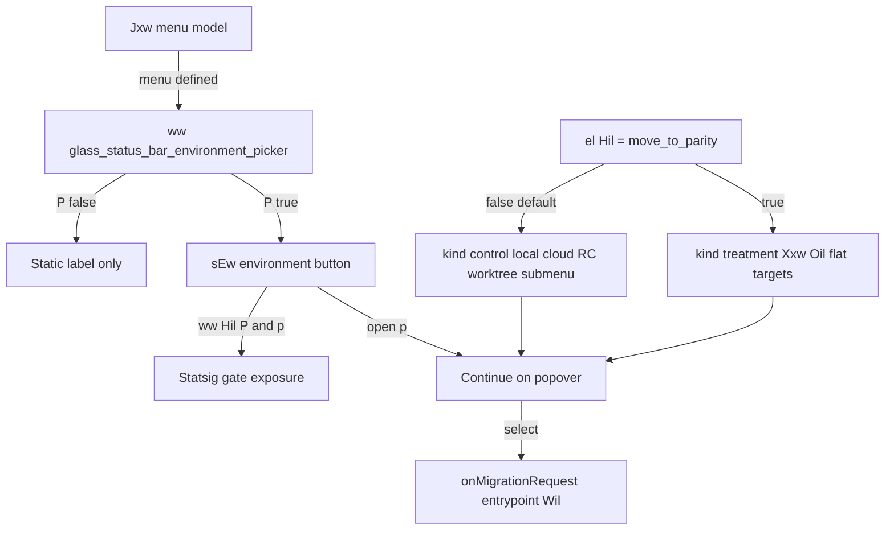

# Detective: `glass_status_bar_environment_picker_move_to_parity`

Theme: `feature-flag-glass-status-bar-environment-picker-move-to-parity`  
Flag: `glass_status_bar_environment_picker_move_to_parity`  
Cursor: **3.15.1** / product commit `41c5e281845de0ce890a8053a3874064bfbdb8b0` (inventory/evidence listed `…bfbdb8bf`)  
Plan path: `/workspace/workspace/runs/20260805T110539Z/plans/detective-feature-flag-glass-status-bar-environment-picker-move-to-parity.plan.md`

## 1. Objective

Determine how client feature gate `glass_status_bar_environment_picker_move_to_parity` is registered, which Glass status-bar call sites consult it, what default/effective value applies in this extract, which modules own the agent status-bar environment picker “move to parity” treatment vs control menu, and whether a local override is present.

**Success criteria:** registry entry confirmed (`POe` / `xDe`), call-site classification with Confirmed snippets, modules list, local override status, full Phase 1–5 + 4b report at this path.

**Assumptions**

- Inventory `default: false` matches minified `default:!1` (prefer inventory when they agree).
- Desktop client gate registry is `POe`; glass twin is `xDe`.
- Extract under `runs/20260805T110539Z/extract/new` is authoritative when live install is absent.

**Unknowns (pre-probe)**

- Live Statsig remote treatment on this host.
- Whether a developer local override exists in `state.vscdb`.

## 2. Environment

| Item | Value |
|------|--------|
| OS | Linux (cloud agent VM) |
| `locate-cursor.sh` | `install_status=not_found`, `WORKBENCH_JS=` empty (no live Cursor install) |
| Workbench used | `/workspace/workspace/runs/20260805T110539Z/extract/new/usr/share/cursor/resources/app/out/vs/workbench/workbench.desktop.main.js` |
| Glass twin | `…/workbench.glass.main.js` (**sole active consumer**) |
| Version / channel | `product.json`: version=**3.15.1**, quality=stable, commit=`41c5e281845de0ce890a8053a3874064bfbdb8b0` |
| User config / `state.vscdb` | Absent (`~/.config/Cursor/User` missing) |
| Inventory | `/workspace/workspace/runs/20260805T110539Z/feature-flags-inventory.json` → `{name, client:true, default:false}` (`registry_var: POe`) |
| Precomputed evidence | `/workspace/workspace/runs/20260805T110539Z/plans/_evidence/glass-status-bar-environment-picker-move-to-parity.json` |

## 3. Scan checklist

| Script / probe | Exit | One-line result |
|----------------|------|-----------------|
| `locate-cursor.sh` | 0 | No install; `WORKBENCH_JS` empty |
| `scan-paths.sh` | 0 | No Cursor User config / global `state.vscdb`; projects root exists (tiny) |
| `grep-workbench.sh` (desktop, flag) | 0 | `hit_count=1` — registry only |
| `grep-workbench.sh` (glass, flag) | 0 | `hit_count=2` — registry + `Hil=` / module `use-agent-status-environment-picker.react.js` |
| `grep-workbench.sh` (glass, parent picker) | 0 | Parent `glass_status_bar_environment_picker` + `ww(...)` enable path |
| `grep-workbench.sh` (desktop builtins) | 0 | `toolFormerData` / `composerData` present (bundle healthy) |
| `inspect-state-vscdb.sh` | 1 | `state.vscdb not found` (no local Statsig/override store) |
| Inventory JSON | — | `default: false`, `client: true` |
| Bundle deep extract (Phase 4b) | — | Registry **POe** / **xDe**; Glass `Hil`/`Wil`, `Jxw`/`sEw`, `el`/`ww` |
| Local override probe | — | No User storage → **none** |

## 4. Findings

### Registry (feature-gate map)

- **Confirmed:** Desktop gate registry is minified as **`POe`**. Assignment starts at `POe={…}`; `c_n=Object.keys(POe)`. Inventory `registry_var: POe`.
- **Confirmed:** Glass twin registry is **`xDe`**; `dct=Object.keys(xDe)`.
- **Confirmed:** Exact entry in both bundles:  
  `glass_status_bar_environment_picker_move_to_parity:{client:!0,default:!1}`  
  → client gate, **default false** (`!1`). Matches inventory (`prefer inventory default`).
- **Confirmed:** Neighbor cluster: `save_button_glass_env_setup`, `glass_status_bar_environment_picker`, **this flag**, `glass_agent_branch_status_picker`, `glass_all_changes_diff_scope`, …

### Call sites (active consumers)

- **Confirmed — Desktop:** Registry-only. No `use-agent-status-environment-picker`, no `Hil=`, no `el(Hil)` / `ww(Hil)` in `workbench.desktop.main.js`.
- **Confirmed — Glass (sole runtime consumer):** Constants and two gate reads in the status-bar environment picker stack:

| Symbol | Role |
|--------|------|
| `Hil` | String constant `="glass_status_bar_environment_picker_move_to_parity"` (module `use-agent-status-environment-picker.react.js`) |
| `Wil` | Analytics entrypoint `="status_bar_environment_picker"` on migration requests |
| `Jxw` | Builds menu model; `b=el(Hil)` selects **treatment** vs **control** shape |
| `sEw` | Renders status-bar environment button + popover; `ww(Hil,P&&p)` exposure when picker enabled & open |
| Parent gate | `ww("glass_status_bar_environment_picker", v!==void 0)` / `P=v!==void 0&&R` — must be on for interactive picker |

### Treatment vs control semantics

- **Confirmed — `el(Hil)` in `Jxw`:** When gate **true**, returns `{kind:"treatment", items: Xxw({targets, onSelectTarget, remoteControl?})}`. `Xxw` flattens migration targets via `Oil` (id/label/description/icon/onSelect) and optionally appends remote-control.
- **Confirmed — gate false (default):** Returns `{kind:"control", items: te.map(...)}` — typed actions for `local` / `cloud` / `remote-control` plus `worktree` **submenu** entries, filtered by migration directions (`Yxw` / `K6s`) and open-state availability.
- **Confirmed — `sEw` UI:** If `v.kind==="treatment"`, popover uses `$t.Section` + `y0g` list under title `"Continue on"`. Else control layout uses `f2` title + per-item `oS` / `$t.SubMenu` for worktree.
- **Confirmed — Parent picker gate:** Interactive chevron / open menu requires `glass_status_bar_environment_picker` via `ww(...)` **and** a non-void `Jxw` result. Parity gate alone does not show the picker.
- **Confirmed — Exposure:** `ww(t,e)` reads `el(t)` and, when `e` is truthy once, calls `checkFeatureGate(t,{disableExposureLog:!1})`. `ww(Hil,P&&p)` therefore logs parity-gate exposure when the environment menu is open under an enabled picker.
- **Confirmed:** Migration callbacks use `entrypoint:Wil` (`"status_bar_environment_picker"`).
- **Inferred:** Product intent is A/B “move to parity” for the Glass chat status-bar environment picker menu (flat destination list vs legacy control/submenu layout), defaulted off.

### Effective value (Statsig / local)

- **Confirmed:** Bundled default is **false** (`!1` / inventory).
- **Confirmed:** Call sites use `el` / `ww` from `use-feature-gate.react.js` → experiment service `getFeatureGateProperty` / `checkFeatureGate`.
- **Unknown:** Live Statsig remote value — no running Cursor / no `state.vscdb` / no Statsig cache on disk.
- **Confirmed:** Local feature-flag override: **none**.

### Confidence

**Confirmed** on registry, defaults, Glass-only call sites, treatment/control menu split, parent-picker dependency, related modules, and local-override absence. **Unknown** only for remote Statsig treatment on a live client. **Inferred** only for product naming intent (“parity” = treatment flat destinations UI).

## 5. Internal code map

### Module table

| Module / symbol | Role vs theme |
|-----------------|---------------|
| `out-build/vs/glass/browser/components/agent-panel/components/use-agent-status-environment-picker.react.js` | Defines `Wil`/`Hil`; hosts `Jxw` (menu model) + `sEw` (button/popover); **primary consumer** |
| `out-build/vs/glass/browser/components/agent-panel/components/glass-chat-status-bar-environment-segment.react.js` | Styles/`GAe` + mounts environment segment; depends on `eEw` (picker module) |
| `out-build/vs/glass/browser/components/agent-panel/components/glass-chat-status-bar.react.js` | Parent Glass chat status bar |
| `out-build/vs/glass/browser/components/agent-panel/components/glass-chat-status-bar-branch-segment.react.js` | Sibling status-bar branch picker surface |
| `out-build/vs/glass/browser/hooks/use-feature-gate.react.js` | `el` / `ww` gate hooks |
| `out-build/vs/workbench/services/experiment/browser/experimentService.js` | `checkFeatureGate` / `getFeatureGateProperty`; `POe`/`xDe` defaults (`xDe[t]?.default??!1`) |
| Sibling gates | `glass_status_bar_environment_picker` (show picker); `glass_worktree_to_cloud` (`Udi`); `glass_cloud_to_worktree` (`Q6s`) |

### Entry points

| Entry | Condition | Effect |
|-------|-----------|--------|
| `Jxw` → `el(Hil)` | Gate on | Menu `kind:"treatment"` via `Xxw`/`Oil` (+ optional remote-control) |
| `Jxw` → `el(Hil)` | Gate off (default) | Menu `kind:"control"` local/cloud/RC/worktree-submenu |
| `sEw` → `ww("glass_status_bar_environment_picker", …)` | Parent gate + menu defined | Enables interactive environment button (`P`) |
| `sEw` → `ww(Hil, P&&p)` | Picker enabled and open | Statsig exposure for parity gate |
| Migration `entrypoint:Wil` | User selects destination | Tags migrate analytics as `status_bar_environment_picker` |

### Implementation snippets (Confirmed)

Registry (desktop `POe` / glass `xDe`):

```text
save_button_glass_env_setup:{client:!0,default:!1},
glass_status_bar_environment_picker:{client:!0,default:!1},
glass_status_bar_environment_picker_move_to_parity:{client:!0,default:!1},
glass_agent_branch_status_picker:{client:!0,default:!1}
```

Module constants + menu branch (glass):

```text
Wil="status_bar_environment_picker",
Hil="glass_status_bar_environment_picker_move_to_parity"
// …
b=el(Hil)
// …
if(b)return{kind:"treatment",items:Xxw({targets:i?_:[],onSelectTarget:U,remoteControl:i&&O?{label:ae,onSelect:j}:void 0})};
// … else …
return{kind:"control",items:te.map(ce=>ue[ce])}
```

Render + exposure (`sEw`):

```text
R=ww("glass_status_bar_environment_picker",v!==void 0),P=v!==void 0&&R;ww(Hil,P&&p);
// …
ie=P?zil($t,{… children:[…, v.kind==="treatment"? /* Section+y0g */ : /* f2+SubMenu */ ]}):j(J)
```

Gate hooks:

```text
function el(t){… return TRy(… getFeatureGateProperty(t) …)}
function ww(t,e){… el(t); useEffect: e && checkFeatureGate(t,{disableExposureLog:!1}); return el(t)}
```

## 6. Diagram



## 7. Gaps & follow-ups

- **Blocked:** Live Statsig treatment — no Cursor User profile / `state.vscdb` on this VM (`inspect-state-vscdb.sh` exit 1).
- **Not applicable:** Desktop runtime path — flag is registry-only there; behavior is Glass status-bar scoped.
- **Note:** Inventory/evidence commit suffix `…bfbdb8bf` vs `product.json` `…bfbdb8b0` — same extract tree; product.json used for Environment.

## 8. Workspace relevance

Flag gates Glass **chat status-bar environment picker menu shape** (treatment/parity flat destinations vs control/submenu). Unrelated to cursor-sync chat transport. Closely related: parent `glass_status_bar_environment_picker`, migration direction gates `glass_worktree_to_cloud` / `glass_cloud_to_worktree`, and sibling `glass_agent_branch_status_picker`.
