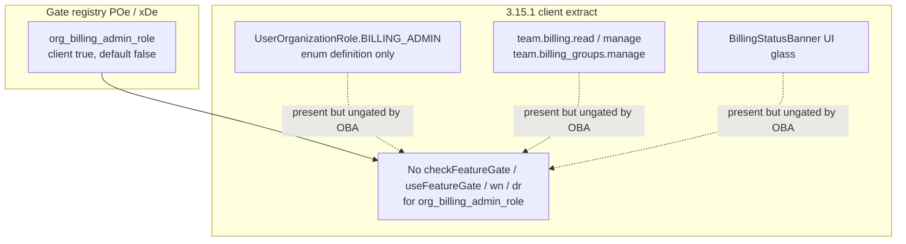

# Detective: `org_billing_admin_role`

Theme: `feature-flag-org-billing-admin-role`  
Flag: `org_billing_admin_role`  
Cursor: **3.15.1** / product commit `41c5e281845de0ce890a8053a3874064bfbdb8b0` (inventory/evidence listed `…bfbdb8bf`)  
Plan path: `/workspace/workspace/runs/20260805T110539Z/plans/detective-feature-flag-org-billing-admin-role.plan.md`

## 1. Objective

Determine how client feature gate `org_billing_admin_role` is registered in Cursor 3.15.1, whether any `checkFeatureGate` / `useFeatureGate` / `wn` / `dr` helpers consult it, what default applies from inventory vs minified registry (`POe` / `xDe`), how it relates to org billing-admin surfaces (proto role, team billing permissions, billing banners), and whether a local override is present.

**Success criteria:** registry entry confirmed, call-site vs registry-only classification with Confirmed snippets, modules list, local override status, full Phase 1–5 + 4b report at this path.

**Assumptions**

- Inventory `default: false` matches minified `default:!1`.
- Desktop client gate registry is `POe` (not `kFe`); glass twin is `xDe`.
- Extract under `runs/20260805T110539Z/extract/new` is authoritative when live install is absent.
- Prefer inventory default when Statsig / overrides are unprobeable.

**Unknowns (pre-probe)**

- Live Statsig remote treatment on this host.
- Whether a developer local override exists in `state.vscdb`.
- Whether any non-string / server-only consumer exists outside this AppImage extract.

## 2. Environment

| Item | Value |
|------|--------|
| OS | Linux (cloud agent VM) |
| `locate-cursor.sh` | `install_status=not_found`, `WORKBENCH_JS=` empty (no live Cursor install) |
| Workbench used | `/workspace/workspace/runs/20260805T110539Z/extract/new/usr/share/cursor/resources/app/out/vs/workbench/workbench.desktop.main.js` |
| Glass twin | `…/workbench.glass.main.js` |
| Version / channel | `product.json`: version=**3.15.1**, quality=stable, commit=`41c5e281845de0ce890a8053a3874064bfbdb8b0` |
| User config / `state.vscdb` | Absent (`~/.config/Cursor/User` missing) |
| Inventory | `/workspace/workspace/runs/20260805T110539Z/feature-flags-inventory.json` → `{name, client:true, default:false}` |
| Precomputed evidence | `/workspace/workspace/runs/20260805T110539Z/plans/_evidence/org-billing-admin-role.json` |

## 3. Scan checklist

| Script / probe | Exit | One-line result |
|----------------|------|-----------------|
| `locate-cursor.sh` | 0 | No install; `WORKBENCH_JS` empty |
| `scan-paths.sh` | 0 | No Cursor User config / global `state.vscdb`; projects root exists (tiny) |
| `grep-workbench.sh` (desktop, `org_billing_admin_role`) | 0 | **1** line hit — registry cluster only (`default:!1`) |
| `grep-workbench.sh` (glass, flag) | 0 | **1** line hit — same registry entry |
| `grep-workbench.sh` (builtins) | 0 | `toolFormerData` / `composerData` present (bundle healthy) |
| Full-extract `rg` (`org_billing_admin_role`) | 0 | Hits only in desktop, glass, `out/main.js`, `cursor-agent-host`, `cursor-always-local` (registry copies) |
| `checkFeatureGate` / `useFeatureGate` / `wn` / `dr` for flag | 0 | **Zero** call sites in entire extract |
| `inspect-state-vscdb.sh` | 0 | Error: `state.vscdb` not found (no local Statsig/override store) |
| `inspect-store-db.sh` | 0 | `--db PATH required` / no chats store |
| Inventory JSON | — | `default: false`, `client: true` |
| Bundle deep extract (Phase 4b) | — | Registry **POe** / **xDe**; proto `USER_ORGANIZATION_ROLE_BILLING_ADMIN` + team billing permissions present but ungated by this flag |
| Local override probe | — | No User storage → **none** |

## 4. Findings

### Registry (feature-gate map)

- **Confirmed:** Desktop gate registry is minified as **`POe`**, not `kFe`. Assignment: `POe={agent_goal_continuation:…}`; `c_n=Object.keys(POe)`. Flag sits at the head of `POe` (immediately after `agent_goal_continuation`).
- **Confirmed:** Glass twin registry is **`xDe`** (`dct=Object.keys(xDe)`).
- **Confirmed:** Exact entry in both bundles (and registry copies in `out/main.js`, `cursor-agent-host`, `cursor-always-local`):  
  `org_billing_admin_role:{client:!0,default:!1}`  
  → client gate, **default false** (`!1`). Matches inventory.
- **Confirmed:** Neighbor cluster (start of `POe`/`xDe`):  
  `agent_goal_continuation` (default false) →  
  **`org_billing_admin_role`** (default **false**) →  
  `focus_gate_local_agent_pr_poll` (default true) →  
  `response_comparison_comment_prompt` …

### Call sites (active consumers)

- **Confirmed:** Desktop and glass have **zero** `checkFeatureGate("org_billing_admin_role"…)` / `useFeatureGate("org_billing_admin_role"…)`.
- **Confirmed:** Entire AppImage extract has **zero** `checkFeatureGate` / `useFeatureGate` / `wn(` / `dr(` string consumers for this flag (searched workbench, `out/main.js`, and all `extensions/*/dist/main.js`).
- **Confirmed:** Every mention is **registry-only** (`:{client:!0,default:!1}`); mention counts desktop=1, glass=1 (plus three registry copies elsewhere).
- **Confirmed:** Sampled client `checkFeatureGate("…")` string args include no `org_billing_*` gate; only admin-adjacent sample was unrelated `admin_command_denylist_enforcement_killswitch`.

### Effective value (Statsig / local)

- **Confirmed:** `ExperimentService._checkGateWithoutOverride` falls back to `POe[e]?.default??!1` (desktop) / `xDe[…]?.default??!1` (glass) when Statsig is missing or throws.
- **Confirmed:** Bundled / inventory default for this flag is **false** (prefer inventory).
- **Unknown:** Live Statsig remote value — no running Cursor / no `state.vscdb` / no Statsig cache on disk.
- **Confirmed:** Local feature-flag override: **none** (no `~/.config/Cursor/User`; override storage key exists in bundle as `workbench.experiments.featureFlagOverrides` but nothing persisted here).

### Semantics (what it would change)

- **Confirmed:** In 3.15.1 client bundles, flipping this gate has **no direct UI/runtime effect** — there is no client call site.
- **Confirmed (adjacent org/billing surface, ungated by this flag):**
  - Proto enum `aiserver.v1.UserOrganizationRole` includes `USER_ORGANIZATION_ROLE_BILLING_ADMIN` / localName `BILLING_ADMIN` (alongside ADMIN / MEMBER). Enum appears in desktop + glass; **no** client runtime branch on `.BILLING_ADMIN` / role comparisons found beyond the enum definition.
  - Team permission strings: `ReadTeamBilling:"team.billing.read"`, `ManageTeamBilling:"team.billing.manage"`, `ManageBillingGroups:"team.billing_groups.manage"`.
  - Glass composer billing UI modules: `BillingStatusBanner` (+ CSS / shared / react model) — not wired to this gate string.
  - Analytics event `billing_banner.manage_billing_clicked` present in desktop.
- **Inferred:** Name + proto `BILLING_ADMIN` role + team billing permission surface imply a **pre-registered / dormant rollout switch** for exposing or enforcing an organization billing-admin role in the client (portal/IDE), not yet hooked into `checkFeatureGate`.
- **Inferred:** Until call sites land, Statsig treatments for `org_billing_admin_role` would only matter if future client code consults the gate (or if server/portal uses the same Statsig name — not visible in this extract).

### Confidence

**Confirmed** on registry (`POe`/`xDe`), default **false**, full-extract registry-only classification, adjacent billing-admin proto/permissions distinction, modules, and local-override **none**.  
**Inferred** on intended product meaning (dormant org billing-admin role enablement switch).  
**Unknown** only for remote Statsig treatment on a live client.

## 5. Internal code map

### Module table

| Module path | Role vs theme |
|-------------|----------------|
| `out-build/vs/platform/experiments/common/experimentConfig.gen.js` (via `POe`/`xDe`) | Client gate registry including `org_billing_admin_role` |
| `out-build/vs/workbench/services/experiment/browser/experimentService.js` | `checkFeatureGate`, overrides, `POe`/`xDe` default fallback |
| `out-build/vs/workbench/services/experiment/browser/experimentHooks.js` | Gate hooks (no consumer of this flag) |
| `out/main.js` / `cursor-agent-host` / `cursor-always-local` | Registry copies only (no dedicated call) |
| `out-build/proto/aiserver/v1/dashboard_pb.js` | `UserOrganizationRole` incl. `BILLING_ADMIN`; org/team admin RPCs |
| `out-build/vs/workbench/contrib/composer/browser/components/BillingStatusBanner.js` (+ `.react` / shared / CSS) | Billing status banner UI (glass; ungated by this flag) |
| `out-build/vs/workbench/contrib/composer/browser/components/useBillingStatusBannerModel.react.js` | Banner model (glass) |
| `out-build/vs/workbench/services/agent/browser/slackSubscriptionEvent.js` | Subscription event surface (name-adjacent only) |

### Entry points

| Symbol / API | Bundle | Role |
|--------------|--------|------|
| `POe` / `xDe` | desktop / glass | Gate map; entry `org_billing_admin_role:{client:!0,default:!1}` |
| `checkFeatureGate("org_billing_admin_role")` | — | **Absent** in 3.15.1 extract |
| `UserOrganizationRole.BILLING_ADMIN` | desktop / glass | Proto enum only; no client gate wiring |
| `ManageTeamBilling` / `ReadTeamBilling` / `ManageBillingGroups` | both | Team permission string constants (ungated by this flag) |

### Implementation snippets (Confirmed)

**Registry (desktop `POe`, glass `xDe`):**

```text
POe={agent_goal_continuation:{client:!0,default:!1},
org_billing_admin_role:{client:!0,default:!1},
focus_gate_local_agent_pr_poll:{client:!0,default:!0},
response_comparison_comment_prompt:{client:!0,default:!1},…}
```

**Default fallback (`experimentService.js`):**

```text
_checkGateWithoutOverride(e,t){
  if(this._statsig) try { return this._statsig.checkGate(e,t) }
  catch { …; return POe[e]?.default??!1 }  // glass: xDe[…]?.default??!1
  else return … POe[e]?.default??!1
}
```

**Adjacent proto (ungated by this flag):**

```text
aiserver.v1.UserOrganizationRole:
  UNSPECIFIED, ADMIN, MEMBER, BILLING_ADMIN (no:4)
```

**Adjacent permissions (ungated):**

```text
ManageBillingGroups:"team.billing_groups.manage",
ReadTeamBilling:"team.billing.read",
ManageTeamBilling:"team.billing.manage",
```

## 6. Diagram



## 7. Gaps & follow-ups

- Live Statsig treatment unprobeable (no `state.vscdb`, no running client).
- Server-side or portal web consumers of Statsig gate `org_billing_admin_role` are outside this AppImage extract — not attempted beyond client bundles.
- Proto `BILLING_ADMIN` role and team billing permissions exist without client branching on the enum in this extract; full org-admin UX ownership (dashboard web vs IDE) was not reverse-engineered beyond confirming no string gate reads.
- When future builds add `checkFeatureGate("org_billing_admin_role")`, re-run Phase 4b to locate modules.

## 8. Workspace relevance

Feature-flag inventory + extract under `/workspace/workspace/runs/20260805T110539Z/` are the authoritative inputs for this Notion sync / flag catalog run. Precomputed evidence JSON matched probes (registry-only samples; empty `modules_near_mentions`); deep extract confirmed **POe**/**xDe**, default false, and zero call sites across the full extract.
