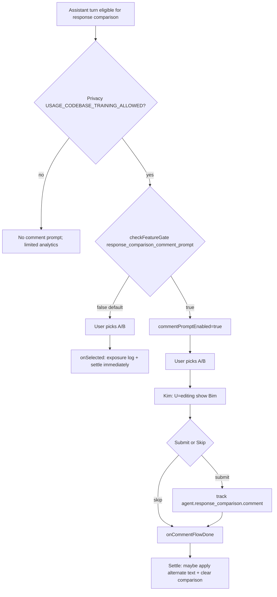

# Detective: `response_comparison_comment_prompt`

Theme: `feature-flag-response-comparison-comment-prompt`  
Flag: `response_comparison_comment_prompt`  
Cursor: **3.15.1** / product commit `41c5e281845de0ce890a8053a3874064bfbdb8b0` (manifest/inventory listed `…bfbdb8bf`)  
Plan path: `/workspace/workspace/runs/20260805T110539Z/plans/detective-feature-flag-response-comparison-comment-prompt.plan.md`

## 1. Objective

Determine how client feature gate `response_comparison_comment_prompt` is registered, which agent response-comparison call sites consult it, what default/effective value applies in this extract, which modules own the optional post-selection comment prompt UX, and whether a local override is present.

**Success criteria:** registry entry confirmed (`POe` / `xDe`), call-site classification with Confirmed snippets, modules list, local override status, full Phase 1–5 + 4b report at this path.

**Assumptions**

- Inventory `default: false` matches minified `default:!1` (prefer inventory when they agree).
- Desktop client gate registry is `POe`; glass twin is `xDe`.
- Extract under `runs/20260805T110539Z/extract/new` is authoritative when live install is absent.

**Unknowns (pre-probe)**

- Live Statsig remote treatment on this host.
- Whether a developer local override exists in `state.vscdb`.

## 2. Environment

| Item | Value |
|------|--------|
| OS | Linux (cloud agent VM) |
| `locate-cursor.sh` | `install_status=not_found`, `WORKBENCH_JS=` empty (no live Cursor install) |
| Workbench used | `/workspace/workspace/runs/20260805T110539Z/extract/new/usr/share/cursor/resources/app/out/vs/workbench/workbench.desktop.main.js` |
| Glass twin | `…/workbench.glass.main.js` (parallel consumers; same gate semantics) |
| Version / channel | `product.json`: version=**3.15.1**, quality=stable, commit=`41c5e281845de0ce890a8053a3874064bfbdb8b0` |
| User config / `state.vscdb` | Absent (`~/.config/Cursor/User` missing) |
| Inventory | `/workspace/workspace/runs/20260805T110539Z/feature-flags-inventory.json` → `{name, client:true, default:false}` (`registry_var: POe`) |
| Precomputed evidence | `/workspace/workspace/runs/20260805T110539Z/plans/_evidence/response-comparison-comment-prompt.json` |

## 3. Scan checklist

| Script / probe | Exit | One-line result |
|----------------|------|-----------------|
| `locate-cursor.sh` | 0 | No install; `WORKBENCH_JS` empty |
| `scan-paths.sh` | 0 | No Cursor User config / global `state.vscdb`; projects root exists (tiny) |
| `grep-workbench.sh` (desktop, flag) | 0 | `hit_count=3` — registry + 2 consumer sites (3× `checkFeatureGate` in-bundle) |
| `grep-workbench.sh` (glass, flag) | 0 | `hit_count=3` — same shape as desktop |
| `grep-workbench.sh` (desktop builtins) | 0 | `toolFormerData` / `composerData` present (bundle healthy) |
| `grep-workbench.sh` (commentPrompt / analytics) | 0 | `commentPromptEnabled`, `ResponseComparisonComment`, `agent.response_comparison.*`, `seedResponseComparisonForTesting` |
| `inspect-state-vscdb.sh` | 1 | `state.vscdb not found` (no local Statsig/override store) |
| `inspect-store-db.sh` | 0 | `--db PATH required` / no chats store |
| Inventory JSON | — | `default: false`, `client: true`, `registry_var: POe` |
| Bundle deep extract (Phase 4b) | — | Registry **POe** / **xDe**; UI `Kim`/`Bim`/`cdv`; state + composer comparison modules |
| Local override probe | — | No User storage → **none** |

## 4. Findings

### Registry (feature-gate map)

- **Confirmed:** Desktop gate registry is minified as **`POe`**. Assignment starts at `POe={agent_goal_continuation:…}`; `c_n=Object.keys(POe)`. Inventory `registry_var: POe`.
- **Confirmed:** Glass twin registry is **`xDe`**; `dct=Object.keys(xDe)`.
- **Confirmed:** Exact entry in both bundles:  
  `response_comparison_comment_prompt:{client:!0,default:!1}`  
  → client gate, **default false** (`!1`). Matches inventory (`prefer inventory default`).
- **Confirmed:** Neighbor cluster (early `POe`/`xDe`):  
  `org_billing_admin_role` (default false) →  
  `focus_gate_local_agent_pr_poll` (default true) →  
  **`response_comparison_comment_prompt`** (default **false**) →  
  `sand_multitask` (default true) …

### Call sites (active consumers)

- **Confirmed — Desktop & Glass (parity):** Three `experimentService.checkFeatureGate("response_comparison_comment_prompt", …)` per bundle (not registry-only).

| Site | Role |
|------|------|
| Assistant comparison props builder | `commentPromptEnabled = privacyAllowsTraining && checkFeatureGate(flag, {disableExposureLog:!0})` — desktop `dr` / glass `Rn` |
| `onSelected` | Re-checks gate with `{disableExposureLog:!1}` (exposure on selection); if **`!commentPromptEnabled`**, immediately settles via `Jr` / `$n` (apply alternate text if needed + clear comparison) |
| Dev console `seedResponseComparisonForTesting` | Returns `commentPromptFlagEnabled: checkFeatureGate(flag, {disableExposureLog:!0})` plus privacy mode fields |

- **Confirmed — Privacy AND-gate:** Comment prompt enablement also requires `granularPrivacyModeRawEnum() === USAGE_CODEBASE_TRAINING_ALLOWED` (desktop `Vn()`, glass `Ut()`). Gate alone is insufficient when privacy disallows training.
- **Confirmed — Analytics:** Events `agent.response_comparison.presented` / `.selected` / `.outcome` / `.comment` (comment payload includes `selectedCandidate`, `comment`, `commentLength`). Comment submit path is additionally gated by privacy + once-per-comparison helpers (`bkv` desktop / `oMy` glass).

### Comment-prompt UX semantics

- **Confirmed — UI package `Kim` (ResponseComparison):** After a winner is chosen, if `commentPromptEnabled===!0`, transitions local phase `U` to `"editing"` and renders **`Bim`** comment editor; when `"done"`, shows thanks (`Uim` / `data-response-comparison-thanks`).
- **Confirmed — `Bim` (ResponseComparisonComment form):** Prompt `✓ {winnerLabel} — what made it better?`; textarea placeholder `Optional — tell us why…`; Enter sends / Esc skips; Skip control `aria-label="Skip comment"`; Send button; `data-response-comparison-comment-editor`.
- **Confirmed — When gate is off (shipped default):** Selection still works; `onSelected` calls settle immediately (`!dr&&Jr()`); comment editor never opens (`u===!0&&…` branches false).
- **Confirmed — When gate is on + privacy allows:** User picks A/B → optional comment → skip/submit → then settle (apply alternate bubble text if selected, clear comparison session).

### Effective value (Statsig / local)

- **Confirmed:** Bundled default is **false** (`!1` / inventory).
- **Confirmed:** Call sites use `experimentService.checkFeatureGate` (not `el`/`useFeatureGate` react hook for this string).
- **Unknown:** Live Statsig remote value — no running Cursor / no `state.vscdb` / no Statsig cache on disk.
- **Confirmed:** Local feature-flag override: **none**.

### Confidence

**Confirmed** on registry, defaults, dual desktop/glass call sites, privacy AND-gate, comment UI (`Kim`/`Bim`), analytics, related modules, and local-override absence. **Unknown** only for remote Statsig treatment on a live client. **Inferred** only for product intent: gate optional free-text feedback after response-comparison winner selection without shipping it on by default.

## 5. Internal code map

### Module table

| Module / symbol | Role vs theme |
|-----------------|---------------|
| `out-build/vs/platform/experiments/common/experimentConfig.gen.js` | `POe` / `xDe` registry entry for the flag |
| `../packages/ui/dist/esm/components/AgentConversation/ResponseComparison.js` | A/B comparison UI shell (`Kim`); consumes `commentPromptEnabled` |
| `../packages/ui/dist/esm/components/AgentConversation/ResponseComparisonComment.js` | Comment editor package shell; form impl `Bim` |
| `out-build/vs/workbench/services/agent/browser/responseComparisonState.js` | Comparison session state (`WeakMap`) |
| `out-build/vs/workbench/contrib/composer/browser/components/responseComparisonShared.js` | Shared comparison helpers / WeakMaps (present in both bundles) |
| `out-build/vs/workbench/contrib/composer/browser/components/ComposerAssistantResponseComparison.react.js` | Composer wiring for assistant response comparison rows |
| Late-inlined composer consumer | Builds `{commentPromptEnabled, onCommentSubmitted, onSelected, …}` for comparison row |
| ComposerService / chat service (dev) | `seedResponseComparisonForTesting` reports `commentPromptFlagEnabled` |
| `out-build/vs/workbench/services/experiment/browser/experimentService.js` | `checkFeatureGate` / Statsig-backed evaluation |

### Entry points

| Entry | Condition | Effect |
|-------|-----------|--------|
| Props builder | privacy training allowed **and** gate true | `commentPromptEnabled=true` passed into `ResponseComparison` |
| `onSelected` | always (when privacy allows tracking) | Exposure log (`disableExposureLog:!1`); if gate **off**, settle immediately |
| `Kim` after pick | `commentPromptEnabled===true` | `W("editing")` → show `Bim` comment form |
| `Bim` submit/skip | gate on | `agent.response_comparison.comment` (submit) then `onCommentFlowDone` → settle |

### Implementation snippets (Confirmed)

Registry (desktop `POe` / glass `xDe`):

```text
focus_gate_local_agent_pr_poll:{client:!0,default:!0},
response_comparison_comment_prompt:{client:!0,default:!1},
sand_multitask:{client:!0,default:!0},
```

Enablement + settle-when-off (desktop):

```text
dr=Vn()&&be.experimentService.checkFeatureGate("response_comparison_comment_prompt",{disableExposureLog:!0}),
// …
commentPromptEnabled:dr,
onSelected:Pi=>{
  Vn()&&be.experimentService.checkFeatureGate("response_comparison_comment_prompt",{disableExposureLog:!1}),
  Vn()&&gkv(bn,Cn.comparisonId)&&(si(),be.analyticsService.trackEvent("agent.response_comparison.selected",{…})),
  !dr&&Jr()
},
```

Comment UI gate inside `Kim`:

```text
u===!0&&W("editing")
u===!0&&Hs&&U==="editing"?QR(Bim,{winnerLabel:Bo,onSkip:bt,onSubmit:tn}):… /* "X is Better" button */
u===!0&&Hs&&U==="done"?QR(Uim,{}):null
```

`Bim` prompt copy:

```text
`✓ ${n} — what made it better?`
placeholder:"Optional — tell us why…"
"Enter to send · Esc to skip"
data-response-comparison-comment-editor
```

Dev seed:

```text
commentPromptFlagEnabled:this.experimentService.checkFeatureGate("response_comparison_comment_prompt",{disableExposureLog:!0}),
privacyModeAllowsComment:Dt===vl.USAGE_CODEBASE_TRAINING_ALLOWED
```

## 6. Diagram



## 7. Gaps & follow-ups

- Live Statsig treatment unprobeable: no Cursor install / no `~/.config/Cursor/User/globalStorage/state.vscdb`.
- `/tmp/.mount_cursor*` absent; used AppImage extract under `runs/20260805T110539Z/extract/new` instead.
- Remote experiment layer (server assignment of which comparisons appear) is out of scope of this client gate; only the post-selection **comment prompt** is gated here.

## 8. Workspace relevance

Feature-flag inventory run `20260805T110539Z` for Cursor 3.15.1; this plan is the detective artifact for Notion/sync consumers of `response_comparison_comment_prompt`.
