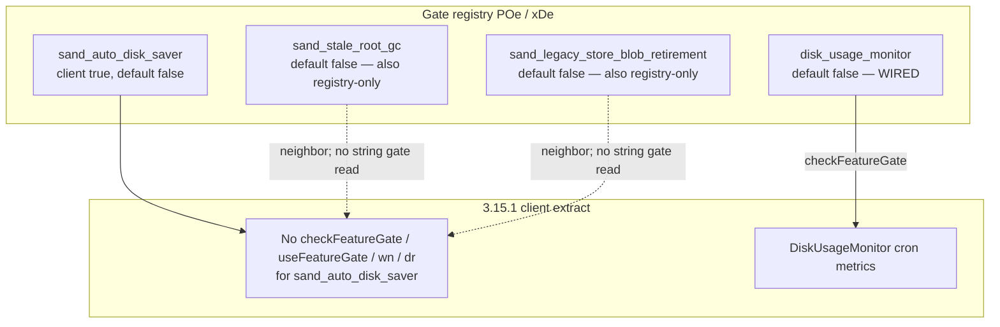

# Detective: `sand_auto_disk_saver`

Theme: `feature-flag-sand-auto-disk-saver`  
Flag: `sand_auto_disk_saver`  
Cursor: **3.15.1** / product commit `41c5e281845de0ce890a8053a3874064bfbdb8b0` (inventory/evidence listed `…bfbdb8bf`)  
Plan path: `/workspace/workspace/runs/20260805T110539Z/plans/detective-feature-flag-sand-auto-disk-saver.plan.md`

## 1. Objective

Determine how client feature gate `sand_auto_disk_saver` is registered in Cursor 3.15.1, whether any `checkFeatureGate` / `useFeatureGate` / `wn` / `dr` helpers consult it, what default applies from inventory vs minified registry (`POe` / `xDe`), how it relates to disk-usage / GC / store-blob surfaces, and whether a local override is present.

**Success criteria:** registry entry confirmed, call-site vs registry-only classification with Confirmed snippets, modules list, local override status, full Phase 1–5 + 4b report at this path.

**Assumptions**

- Inventory `default: false` matches minified `default:!1`.
- Desktop client gate registry is `POe` (not `kFe`); glass twin is `xDe`.
- Extract under `runs/20260805T110539Z/extract/new` is authoritative when live install is absent.
- Prefer inventory default when Statsig / overrides are unprobeable.

**Unknowns (pre-probe)**

- Live Statsig remote treatment on this host.
- Whether a developer local override exists in `state.vscdb`.
- Whether any non-string / server-only consumer exists outside this AppImage extract.

## 2. Environment

| Item | Value |
|------|--------|
| OS | Linux (cloud agent VM) |
| `locate-cursor.sh` | `install_status=not_found`, `WORKBENCH_JS=` empty (no live Cursor install) |
| Workbench used | `/workspace/workspace/runs/20260805T110539Z/extract/new/usr/share/cursor/resources/app/out/vs/workbench/workbench.desktop.main.js` |
| Glass twin | `…/workbench.glass.main.js` |
| Version / channel | `product.json`: version=**3.15.1**, quality=stable, commit=`41c5e281845de0ce890a8053a3874064bfbdb8b0` |
| User config / `state.vscdb` | Absent (`~/.config/Cursor/User` missing) |
| Inventory | `/workspace/workspace/runs/20260805T110539Z/feature-flags-inventory.json` → `{name, client:true, default:false}`; `registry_var` present on inventory root |
| Manifest category | `other` |
| Precomputed evidence | `/workspace/workspace/runs/20260805T110539Z/plans/_evidence/sand-auto-disk-saver.json` |

## 3. Scan checklist

| Script / probe | Exit | One-line result |
|----------------|------|-----------------|
| `locate-cursor.sh` | 0 | No install; `WORKBENCH_JS` empty |
| `scan-paths.sh` | 0 | No Cursor User config / global `state.vscdb`; projects root exists (tiny) |
| `grep-workbench.sh` (desktop, `sand_auto_disk_saver`) | 0 | **1** hit — registry cluster only (`default:!1`) |
| `grep-workbench.sh` (glass, flag) | 0 | **1** hit — same registry entry |
| `grep-workbench.sh` (builtins) | 0 | `toolFormerData` / `composerData` present (bundle healthy) |
| `grep-workbench.sh` (`disk_usage_monitor`) | 0 | Registry + **1** live `checkFeatureGate` (separate gate) |
| Full-extract `rg` (`sand_auto_disk_saver`) | 0 | Hits only in desktop, glass, `out/main.js`, `cursor-agent-host`, `cursor-always-local` (registry copies) |
| `checkFeatureGate` / `useFeatureGate` / `wn` / `dr` for flag | 0 | **Zero** call sites in entire extract; also **zero** `checkFeatureGate("sand_*")` in workbench |
| `inspect-state-vscdb.sh` | 0 | Error: `state.vscdb` not found (no local Statsig/override store) |
| `inspect-store-db.sh` | 0 | `--db PATH required` / no chats store |
| Inventory JSON | — | `default: false`, `client: true` |
| Bundle deep extract (Phase 4b) | — | Registry **POe** / **xDe**; neighbors `sand_stale_root_gc` / `sand_legacy_store_blob_retirement` / `sand_pr_menu`; adjacent wired `disk_usage_monitor` → `DiskUsageMonitor` (ungated by this flag) |
| Local override probe | — | No User storage → **none** |

## 4. Findings

### Registry (feature-gate map)

- **Confirmed:** Desktop gate registry is minified as **`POe`**, not `kFe`. Assignment: `POe={agent_goal_continuation:…}`; `c_n=Object.keys(POe)`. Flag sits inside `POe` before the keys enumeration (`POe` start < flag < `c_n`). Module header immediately preceding registry: `out-build/vs/platform/experiments/common/experimentConfig.gen.js`.
- **Confirmed:** Glass twin registry is **`xDe`** (`Object.keys(xDe)` / `dct=Object.keys(xDe)`).
- **Confirmed:** Exact entry in both bundles (and registry copies in `out/main.js`, `cursor-agent-host`, `cursor-always-local`):  
  `sand_auto_disk_saver:{client:!0,default:!1}`  
  → client gate, **default false** (`!1`). Matches inventory. Prefer inventory when Statsig uninitialized — `POe[e]?.default??!1` in `ExperimentService._checkGateWithoutOverride`.
- **Confirmed:** Neighbor cluster (sand family inside `POe`/`xDe`, immediately before this key):  
  `sand_stale_root_gc` (default false) →  
  `sand_legacy_store_blob_retirement` (default false) →  
  `sand_multiplayer` (default false) →  
  `sand_shared_room_box_tools_kill_switch` (default false) →  
  `sand_global_search` (default true) →  
  `sand_pr_menu` (default true) →  
  **`sand_auto_disk_saver`** (default **false**) →  
  `disable_smart_auto_show_routed_model` …

### Call sites (active consumers)

- **Confirmed:** Desktop and glass have **zero** `checkFeatureGate("sand_auto_disk_saver"…)` / `useFeatureGate("sand_auto_disk_saver"…)`.
- **Confirmed:** Entire AppImage extract has **zero** `checkFeatureGate` / `useFeatureGate` / `wn(` / `dr(` / `checkGate(` / `getDynamicConfig(` string consumers for this flag (searched workbench, `out/main.js`, and `extensions/*/dist/main.js`).
- **Confirmed:** Every mention of `sand_auto_disk_saver` is **registry-only** (`:{client:!0,default:!1}`); mention counts desktop=1, glass=1 (plus three registry copies elsewhere). Precomputed evidence `modules_near_mentions: []` matches.
- **Confirmed:** Workbench has **zero** `checkFeatureGate("sand_*")` string args at all in 3.15.1 (entire sand gate family is currently dormant at call-site level in client bundles).
- **Confirmed:** No camelCase symbols `AutoDiskSaver` / `autoDiskSaver` / `DiskSaver` / `diskSaver` exist in the workbench bundles.

### Effective value (Statsig / local)

- **Confirmed:** `ExperimentService._checkGateWithoutOverride` falls back to `POe[e]?.default??!1` (desktop) / `xDe[t]?.default??!1` (glass) when Statsig is missing or throws.
- **Confirmed:** Bundled / inventory default for this flag is **false** (prefer inventory).
- **Unknown:** Live Statsig remote value — no running Cursor / no `state.vscdb` / no Statsig cache on disk.
- **Confirmed:** Local feature-flag override: **none** (no `~/.config/Cursor/User`; override storage key exists in bundle as `workbench.experiments.featureFlagOverrides` but nothing persisted here).

### Semantics (what it would change)

- **Confirmed:** In 3.15.1 client bundles, flipping this gate has **no direct UI/runtime effect** — there is no client call site.
- **Confirmed (adjacent disk surfaces, ungated by this flag):**
  - Separate client gate **`disk_usage_monitor`** (`{client:!0,default:!1}`) **is** wired: `this.experimentService.checkFeatureGate("disk_usage_monitor",{disableExposureLog:!1})` gates a `DiskUsageMonitor` service that cron-collects volume + directory size metrics (`collectVolumeMetrics` / `collectDirectorySizeMetrics`), skips remote sessions, and logs under `[DiskUsageMonitor]`.
  - Neighbor sand gates **`sand_stale_root_gc`** and **`sand_legacy_store_blob_retirement`** (both default false) sit earlier in the same sand cluster; likewise **registry-only** (no `checkFeatureGate` string consumers) — naming implies GC / blob-retirement disk hygiene, not yet hooked.
  - Package path `../packages/agent-exec/src/mcp-disk-catalog.ts` present; no reference to this gate string.
- **Inferred:** Name `sand_auto_disk_saver` + placement after other sand storage/GC neighbors and near UI sand gates (`sand_global_search` / `sand_pr_menu`) imply a **pre-registered / dormant rollout switch** for an automatic disk-space saver (cleanup / retention) path — distinct from the already-wired **`disk_usage_monitor`** metrics collector.
- **Inferred:** Until call sites land, Statsig treatments for `sand_auto_disk_saver` would only matter if future client code consults the gate (or if server/agent runtime uses the same Statsig name — not visible as a string consumer in this extract).

### Confidence

**Confirmed** on registry (`POe`/`xDe`), default **false**, full-extract registry-only classification, adjacent `disk_usage_monitor` distinction, modules, and local-override **none**.  
**Inferred** on intended product meaning (dormant auto disk-saver / cleanup enablement switch).  
**Unknown** only for remote Statsig treatment on a live client.

## 5. Internal code map

### Module table

| Module path | Role vs theme |
|-------------|----------------|
| `out-build/vs/platform/experiments/common/experimentConfig.gen.js` (via `POe`/`xDe`) | Client gate registry including `sand_auto_disk_saver` |
| `out-build/vs/workbench/services/experiment/browser/experimentService.js` | `checkFeatureGate`, overrides, `POe`/`xDe` default fallback |
| `out/main.js` / `cursor-agent-host` / `cursor-always-local` | Registry copies only (no dedicated call) |
| `DiskUsageMonitor` (no `out-build/…DiskUsage…` path string found) | Wired consumer of **sibling** gate `disk_usage_monitor` only — not this flag |
| `../packages/agent-exec/src/mcp-disk-catalog.ts` | Adjacent disk-named package (ungated by this flag) |

### Entry points

| Symbol / API | Bundle | Role |
|--------------|--------|------|
| `POe` / `xDe` | desktop / glass | Gate map; entry `sand_auto_disk_saver:{client:!0,default:!1}` |
| `checkFeatureGate("sand_auto_disk_saver")` | — | **Absent** in 3.15.1 extract |
| `disk_usage_monitor` + `DiskUsageMonitor` | both | Separate metrics monitor gated by its own flag |
| `sand_stale_root_gc` / `sand_legacy_store_blob_retirement` | both | Neighbor sand gates; also registry-only |
| `workbench.experiments.featureFlagOverrides` | both | Override storage key; empty/absent on this host |

### Implementation snippets (Confirmed)

**Registry (desktop `POe`, glass `xDe`):**

```text
sand_stale_root_gc:{client:!0,default:!1},
sand_legacy_store_blob_retirement:{client:!0,default:!1},
sand_multiplayer:{client:!0,default:!1},
sand_shared_room_box_tools_kill_switch:{client:!0,default:!1},
sand_global_search:{client:!0,default:!0},
sand_pr_menu:{client:!0,default:!0},
sand_auto_disk_saver:{client:!0,default:!1},
disable_smart_auto_show_routed_model:{client:!0,default:!1},
```

**Default fallback (`experimentService.js`):**

```text
_checkGateWithoutOverride(e,t){
  if(this._statsig) try { return this._statsig.checkGate(e,t) }
  catch { …; return POe[e]?.default??!1 }  // glass: xDe[t]?.default??!1
  else return … POe[e]?.default??!1
}
```

**Sibling wired gate (not this flag):**

```text
disk_usage_monitor:{client:!0,default:!1}
…
if(!this.experimentService.checkFeatureGate("disk_usage_monitor",{disableExposureLog:!1})){
  this.logService.debug("[DiskUsageMonitor] Skipping: feature flag disabled");return}
…
await Promise.all([this.collectVolumeMetrics(),this.collectDirectorySizeMetrics()])
```

## 6. Diagram



## 7. Gaps & follow-ups

- Live Statsig treatment unprobeable (no `state.vscdb`, no running client).
- Server-side or agent-runtime consumers of Statsig gate `sand_auto_disk_saver` are outside string-searchable client bundles — not attempted beyond this AppImage extract.
- Exact `out-build/…` module path string for `DiskUsageMonitor` not present near the implementation (anonymous class); cited by log tag + gate only.
- Neighbor sand GC/blob gates likewise lack string consumers; intended cleanup pipeline not reverse-engineered beyond confirming dormancy.
- When future builds add `checkFeatureGate("sand_auto_disk_saver")`, re-run Phase 4b to locate modules.

## 8. Workspace relevance

Feature-flag inventory + extract under `/workspace/workspace/runs/20260805T110539Z/` are the authoritative inputs for this Notion sync / flag catalog run. Precomputed evidence JSON matched probes (registry-only samples; empty `modules_near_mentions`); deep extract confirmed **POe**/**xDe**, default false, and zero call sites across the full extract.

---

### Verdict summary

| Field | Value |
|-------|--------|
| Confidence | **Confirmed** (registry-only / default false); **Inferred** (intended auto disk-saver rollout); **Unknown** (live Statsig) |
| What it changes | **Nothing in 3.15.1 client** — registry-only; no `checkFeatureGate` consumer. Name/neighbors imply a future automatic disk-saver/cleanup switch (distinct from wired `disk_usage_monitor` metrics). |
| Modules | `experimentConfig.gen.js` (`POe`/`xDe`), `experimentService.js`; registry copies in `out/main.js` / agent-host / always-local; adjacent ungated `DiskUsageMonitor` (`disk_usage_monitor`) |
| Local Override | **none** |
| Inventory default | **false** (`!1`) |
| Registry var | **POe** (desktop); **xDe** (glass) — not `kFe` |
| Call sites | **0** (registry-only) |
