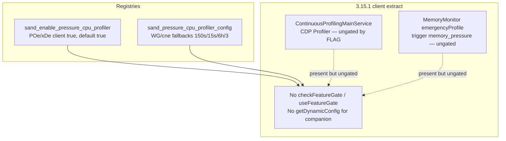

# Detective: `sand_enable_pressure_cpu_profiler`

Theme: `feature-flag-sand-enable-pressure-cpu-profiler`  
Flag: `sand_enable_pressure_cpu_profiler`  
Cursor: **3.15.1** / product commit `41c5e281845de0ce890a8053a3874064bfbdb8b0` (inventory/evidence listed `…bfbdb8bf`)  
Plan path: `/workspace/workspace/runs/20260805T110539Z/plans/detective-feature-flag-sand-enable-pressure-cpu-profiler.plan.md`

## 1. Objective

Determine how client feature gate `sand_enable_pressure_cpu_profiler` is registered in Cursor 3.15.1, whether any `checkFeatureGate` / `useFeatureGate` / dynamic-config consumers consult it (or sibling `sand_pressure_cpu_profiler_config`), what default applies from inventory vs minified registry (`POe` / `xDe`), how it relates to CPU/pressure profiling surfaces, and whether a local override is present.

**Success criteria:** registry entry confirmed, call-site vs registry-only classification with Confirmed snippets, companion config fallbacks decoded, modules list, local override status, full Phase 1–5 + 4b report at this path.

**Assumptions**

- Inventory `default: true` matches minified `default:!0`.
- Desktop client gate registry is `POe` (not `kFe`); glass twin is `xDe`.
- Extract under `runs/20260805T110539Z/extract/new` is authoritative when live install is absent.
- Prefer inventory default when Statsig / overrides are unprobeable.

**Unknowns (pre-probe)**

- Live Statsig remote treatment on this host.
- Whether a developer local override exists in `state.vscdb`.
- Whether any non-string / server-only consumer exists outside this AppImage extract.

## 2. Environment

| Item | Value |
|------|--------|
| OS | Linux (cloud agent VM) |
| `locate-cursor.sh` | `install_status=not_found`, `WORKBENCH_JS=` empty (no live Cursor install) |
| Workbench used | `/workspace/workspace/runs/20260805T110539Z/extract/new/usr/share/cursor/resources/app/out/vs/workbench/workbench.desktop.main.js` |
| Glass twin | `…/workbench.glass.main.js` (registry var `xDe`) |
| Version / channel | `product.json`: version=**3.15.1**, quality=stable, commit=`41c5e281845de0ce890a8053a3874064bfbdb8b0` |
| User config / `state.vscdb` | Absent (`~/.config/Cursor/User` missing) |
| Inventory | `/workspace/workspace/runs/20260805T110539Z/feature-flags-inventory.json` → `{name, client:true, default:true}`; `registry_var=POe` |
| Precomputed evidence | `/workspace/workspace/runs/20260805T110539Z/plans/_evidence/sand-enable-pressure-cpu-profiler.json` |

## 3. Scan checklist

| Script / probe | Exit | One-line result |
|----------------|------|-----------------|
| `locate-cursor.sh` | 0 | No install; `WORKBENCH_JS` empty |
| `scan-paths.sh` | 0 | No Cursor User config / global `state.vscdb`; projects root exists (tiny) |
| `grep-workbench.sh` (desktop, flag) | 0 | **1** hit — registry only (`default:!0`) |
| `grep-workbench.sh` (glass, flag) | 0 | **1** hit — same registry entry |
| `grep-workbench.sh` (`checkFeatureGate("sand_enable_pressure_cpu_profiler`) | 0 | **0** hits |
| `grep-workbench.sh` (`sand_pressure_cpu_profiler_config`) | 0 | Schema + `WG`/`cne` fallbackValues only (2 hits desktop) |
| `grep-workbench.sh` (builtins) | 0 | Bundle healthy (`toolFormerData` / `composerData` present) |
| Full-extract search (flag + config + field names) | 0 | Flag/config only in desktop, glass, `out/main.js`, `cursor-agent-host`, `cursor-always-local` (registry/schema copies) |
| `getDynamicConfig("sand_pressure_cpu_profiler_config")` | 0 | **Zero** call sites in extract |
| `inspect-state-vscdb.sh` | 0 | Error: `state.vscdb` not found |
| `inspect-store-db.sh` | 0 | `--db PATH required` / no chats store |
| Phase 4b module enum | 0 | `experimentConfig.gen.js`, `experimentService.js`, continuousProfiling / MemoryMonitor adjacent (ungated by this flag) |
| Local override probe | — | No User storage → **none** |

## 4. Findings

### Registry (feature-gate map)

- **Confirmed:** Desktop gate registry is minified as **`POe`**, not `kFe`. Assignment: `POe={agent_goal_continuation:…}`; `c_n=Object.keys(POe)`.
- **Confirmed:** Glass twin registry is **`xDe`** (`Object.keys(xDe)` present).
- **Confirmed:** Exact entry in desktop, glass, and registry copies in `out/main.js`, `cursor-agent-host/dist/main.js`, `cursor-always-local/dist/main.js`:  
  `sand_enable_pressure_cpu_profiler:{client:!0,default:!0}`  
  → client gate, **default true** (`!0`). Matches inventory (`default: true`). Prefer inventory when Statsig uninitialized — `POe[e]?.default??!1` in `ExperimentService._checkGateWithoutOverride`.
- **Confirmed:** Neighbor cluster (sand_* gates in `POe`/`xDe`):  
  `sand_product_analytics` (default true) →  
  **`sand_enable_pressure_cpu_profiler`** (default **true**) →  
  `sand_action_audit_logs` (default false) →  
  `sand_stale_root_gc` / `sand_legacy_store_blob_retirement` …

### Companion dynamic config (also unwired)

- **Confirmed:** Dynamic-config registry desktop **`WG`** (`iEi=Object.keys(WG)`), glass **`cne`** (`cXt=Object.keys(cne)`), includes:  
  `sand_pressure_cpu_profiler_config:{client:!0,fallbackValues:{sustainedPressureWindowMs:15e4,profileDurationMs:15e3,minIntervalMs:216e5,maxRetainedProfiles:3}}`
- **Confirmed:** Zod/schema twin: `sand_pressure_cpu_profiler_config:ht.object({sustainedPressureWindowMs, profileDurationMs, minIntervalMs, maxRetainedProfiles})`.
- **Confirmed (decoded fallbacks):**
  | Field | Literal | Meaning |
  |-------|---------|---------|
  | `sustainedPressureWindowMs` | `15e4` | 150 000 ms = **150 s** |
  | `profileDurationMs` | `15e3` | 15 000 ms = **15 s** |
  | `minIntervalMs` | `216e5` | 21 600 000 ms = **6 h** |
  | `maxRetainedProfiles` | `3` | retain at most **3** profiles |
- **Confirmed:** Property names `sustainedPressureWindowMs` / `profileDurationMs` / `minIntervalMs` / `maxRetainedProfiles` appear **only** in schema + fallbackValues (2 hits each on desktop) — **no** consumer property reads.

### Call sites (active consumers)

- **Confirmed:** Desktop and glass have **zero** `checkFeatureGate("sand_enable_pressure_cpu_profiler"…)` / `useFeatureGate("sand_enable_pressure_cpu_profiler"…)`.
- **Confirmed:** Entire AppImage extract has **zero** string consumers of this gate (workbench, `out/main.js`, `extensions/*/dist/main.js`).
- **Confirmed:** **Zero** `getDynamicConfig("sand_pressure_cpu_profiler_config"…)` / `getDynamicConfig("sand_…")` call sites.
- **Confirmed:** Flag mention counts: desktop=1, glass=1 (registry-only); evidence `modules_near_mentions: []` matches.
- **Confirmed:** Sibling gate `memory_pressure_profiling` / config `memory_pressure_profiling_config` are likewise registry/schema-only in this extract (no `checkFeatureGate` / `getDynamicConfig` string sites) — separate from this sand flag.

### Semantics (what it changes)

- **Confirmed:** In 3.15.1 client bundles, enabling/disabling this gate has **no direct UI/runtime effect** — there is no client call site and no companion-config consumer.
- **Confirmed (adjacent profiling surfaces, ungated by this flag):**
  - Electron main `ContinuousProfilingMainService` / `ExtHostContinuousProfilingService` (`out-build/vs/platform/continuousProfiling/…`) — CDP `Profiler.start` / heap sampling; not referenced by this gate string.
  - Renderer `MemoryMonitor` emergency heap profiling on `trigger:"memory_pressure"` (`renderer.memoryMonitor.emergencyProfile.*`) — memory pressure, not CPU Compute Pressure; ungated by this flag.
  - `CursorProclistService` agent memory-pressure monitor uses `agent_memory_pressure_monitor` dynamic config — different name.
- **Inferred:** Name + companion config shape imply a **pre-registered / dormant** switch to auto-capture CPU profiles after sustained (CPU/system) pressure for ~150 s, run profiler ~15 s, cooldown 6 h, keep ≤3 profiles — intended for Sand/performance diagnostics, not yet hooked into `checkFeatureGate` / `getDynamicConfig` in 3.15.1.
- **Inferred:** Until call sites land, Statsig treatments for this gate/config would not change client behavior in this build (unless future code or out-of-extract services consult the same names).

### Effective value / overrides

- **Unknown (Statsig):** No running Cursor / no cached Statsig state on disk.
- **Confirmed (bundled / inventory default):** **true** (`!0` / inventory `default: true`). Prefer inventory.
- **Confirmed (local override):** **none** — no `~/.config/Cursor/User` / `state.vscdb`; override machinery key `workbench.experiments.featureFlagOverrides` exists in bundle but nothing persisted here.
- **Inferred (runtime without Statsig):** `_checkGateWithoutOverride` → `POe[e]?.default??!1` → **true** if anything consulted the gate; still a no-op because nothing does.

### Confidence

**Confirmed** on registry (`POe`/`xDe`), default **true**, companion config `WG`/`cne` fallbacks, full-extract registry-only classification (gate + config), adjacent ungated profiling modules, and local-override **none**.  
**Inferred** on intended product meaning (dormant pressure-triggered CPU profiler rollout).  
**Unknown** only for remote Statsig treatment on a live client.

## 5. Internal code map

### Module table

| Module path | Role vs theme |
|-------------|----------------|
| `out-build/vs/platform/experiments/common/experimentConfig.gen.js` (via `POe`/`xDe`, `WG`/`cne`) | Client gate + dynamic-config registries including this flag/config |
| `out-build/vs/workbench/services/experiment/browser/experimentService.js` | `checkFeatureGate`, overrides, `POe`/`xDe` default fallback |
| `out-build/vs/workbench/services/experiment/browser/experimentHooks.js` | Gate hooks (no consumer of this flag) |
| `out/main.js` / `cursor-agent-host` / `cursor-always-local` | Registry/schema copies only (no dedicated call) |
| `out-build/vs/platform/continuousProfiling/electron-main/continuousProfilingService.js` (+ common / extHost / initializeMain) | Existing CDP CPU/heap continuous profiling (ungated by this flag) |
| `out-build/vs/platform/profiling/electron-main/windowProfiling.js` | Window profiler helper (ungated) |
| Renderer MemoryMonitor (minified; `renderer.memoryMonitor.*` metrics) | Emergency profile on **memory** pressure (ungated by this flag) |

### Entry points

| Symbol / API | Bundle | Role |
|--------------|--------|------|
| `POe` / `xDe` | desktop / glass | Gate map; `sand_enable_pressure_cpu_profiler:{client:!0,default:!0}` |
| `WG` / `cne` | desktop / glass | Dynamic config map; `sand_pressure_cpu_profiler_config` fallbacks |
| `checkFeatureGate("sand_enable_pressure_cpu_profiler")` | — | **Absent** in 3.15.1 extract |
| `getDynamicConfig("sand_pressure_cpu_profiler_config")` | — | **Absent** in 3.15.1 extract |

### Implementation snippets (Confirmed)

**Registry (desktop `POe`, glass `xDe`):**

```text
…sand_product_analytics:{client:!0,default:!0},
sand_enable_pressure_cpu_profiler:{client:!0,default:!0},
sand_action_audit_logs:{client:!0,default:!1},…
```

**Dynamic config (desktop `WG`, glass `cne`):**

```text
sand_pressure_cpu_profiler_config:{client:!0,fallbackValues:{
  sustainedPressureWindowMs:15e4,  // 150s
  profileDurationMs:15e3,          // 15s
  minIntervalMs:216e5,             // 6h
  maxRetainedProfiles:3
}}
```

**Default fallback (`experimentService.js`):**

```text
…POe[e]?.default??!1   // glass: xDe[…]?.default??!1
```

## 6. Diagram



## 7. Gaps & follow-ups

- Live Statsig treatment unprobeable (no `state.vscdb`, no running client).
- Server-side or portal consumers of Statsig names `sand_enable_pressure_cpu_profiler` / `sand_pressure_cpu_profiler_config` are outside this AppImage extract.
- Intended pressure signal source (Compute Pressure API vs OS CPU vs memory) not implementable from registry alone — no consumer code.
- When future builds add `checkFeatureGate` / `getDynamicConfig` for these names, re-run Phase 4b to locate modules.

## 8. Workspace relevance

Feature-flag inventory + extract under `/workspace/workspace/runs/20260805T110539Z/` are the authoritative inputs for this Notion sync / flag catalog run. Precomputed evidence JSON matched probes (registry-only samples; empty `modules_near_mentions`); deep extract confirmed **POe**/**xDe**, default **true**, companion **WG**/**cne** config, and zero call sites across the full extract.

---

### Verdict summary

| Field | Value |
|-------|--------|
| Confidence | **Confirmed** (registry-only / default true); **Inferred** (intended pressure→CPU-profile rollout); **Unknown** (live Statsig) |
| What it changes | **Nothing in 3.15.1 client** — dormant gate (default on) + unused `sand_pressure_cpu_profiler_config` (150s window / 15s profile / 6h cooldown / keep 3). No `checkFeatureGate` / `getDynamicConfig` consumers. |
| Modules | `experimentConfig.gen.js` (`POe`/`xDe`, `WG`/`cne`); `experimentService.js`; registry copies in `out/main.js` / agent-host / always-local; adjacent ungated continuousProfiling + MemoryMonitor |
| Local Override | **none** |
| Inventory default | **true** (`!0`) |
| Registry var | **POe** (desktop); **xDe** (glass) — not `kFe` |
| Call sites | **0** (registry-only) |
