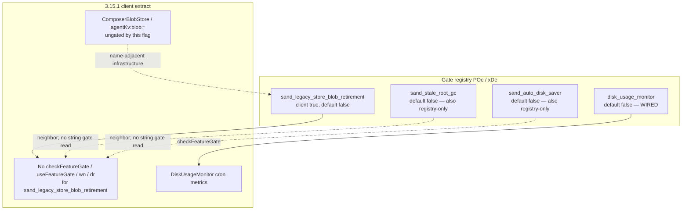

# Detective: `sand_legacy_store_blob_retirement`

Theme: `feature-flag-sand-legacy-store-blob-retirement`  
Flag: `sand_legacy_store_blob_retirement`  
Cursor: **3.15.1** / product commit `41c5e281845de0ce890a8053a3874064bfbdb8b0` (inventory/evidence listed `…bfbdb8bf`)  
Plan path: `/workspace/workspace/runs/20260805T110539Z/plans/detective-feature-flag-sand-legacy-store-blob-retirement.plan.md`

## 1. Objective

Determine how client feature gate `sand_legacy_store_blob_retirement` is registered in Cursor 3.15.1, whether any `checkFeatureGate` / `useFeatureGate` / `wn` / `dr` helpers consult it, what default applies from inventory vs minified registry (`POe` / `xDe`), how it relates to store-blob / GC / disk surfaces (`composerBlobStore`, `agentKv:blob`, neighbors), and whether a local override is present.

**Success criteria:** registry entry confirmed, call-site vs registry-only classification with Confirmed snippets, modules list, local override status, full Phase 1–5 + 4b report at this path.

**Assumptions**

- Inventory `default: false` matches minified `default:!1`.
- Desktop client gate registry is `POe` (not `kFe`); glass twin is `xDe`.
- Extract under `runs/20260805T110539Z/extract/new` is authoritative when live install is absent.
- Prefer inventory default when Statsig / overrides are unprobeable.

**Unknowns (pre-probe)**

- Live Statsig remote treatment on this host.
- Whether a developer local override exists in `state.vscdb`.
- Whether any non-string / server-only consumer exists outside this AppImage extract.

## 2. Environment

| Item | Value |
|------|--------|
| OS | Linux (cloud agent VM) |
| `locate-cursor.sh` | `install_status=not_found`, `WORKBENCH_JS=` empty (no live Cursor install) |
| Workbench used | `/workspace/workspace/runs/20260805T110539Z/extract/new/usr/share/cursor/resources/app/out/vs/workbench/workbench.desktop.main.js` |
| Glass twin | `…/workbench.glass.main.js` |
| Version / channel | `product.json`: version=**3.15.1**, quality=stable, commit=`41c5e281845de0ce890a8053a3874064bfbdb8b0` |
| User config / `state.vscdb` | Absent (`~/.config/Cursor/User` missing) |
| Inventory | `/workspace/workspace/runs/20260805T110539Z/feature-flags-inventory.json` → `{name, client:true, default:false}`; root `registry_var`: **POe** |
| Manifest category | `other` |
| Precomputed evidence | `/workspace/workspace/runs/20260805T110539Z/plans/_evidence/sand-legacy-store-blob-retirement.json` |

## 3. Scan checklist

| Script / probe | Exit | One-line result |
|----------------|------|-----------------|
| `locate-cursor.sh` | 0 | No install; `WORKBENCH_JS` empty |
| `scan-paths.sh` | 0 | No Cursor User config / global `state.vscdb`; projects root exists (tiny) |
| `grep-workbench.sh` (desktop, flag) | 0 | **1** hit — registry cluster only (`default:!1`) |
| `grep-workbench.sh` (glass, flag) | 0 | **1** hit — same registry entry |
| `grep-workbench.sh` (builtins) | 0 | `toolFormerData` / `composerData` / `cursorDiskKV` present; `store.db` hit_count=0 in workbench |
| `grep-workbench.sh` (`agentKv:blob` / `composerBlobStore` / `TranscriptStore`) | 0 | Adjacent blob/store surfaces present; **ungated** by this flag |
| Full-extract `rg` (flag string) | 0 | Hits only in desktop, glass, `out/main.js`, `cursor-agent-host`, `cursor-always-local` (registry copies) |
| `checkFeatureGate` / `useFeatureGate` / `wn` / `dr` for flag | 0 | **Zero** call sites in entire extract; also **zero** `checkFeatureGate("sand_*")` in workbench |
| `inspect-state-vscdb.sh` | 1 | Error: `state.vscdb` not found (no local Statsig/override store) |
| `inspect-store-db.sh` | 1 | `--db PATH required` / no chats store |
| Inventory JSON | — | `default: false`, `client: true`, `registry_var: POe` |
| Bundle deep extract (Phase 4b) | — | Registry **POe** / **xDe**; neighbors `sand_stale_root_gc` / `sand_multiplayer`; adjacent `composerBlobStore` + `agentKv:blob:` (ungated) |
| Local override probe | — | No User storage → **none** |

## 4. Findings

### Registry (feature-gate map)

- **Confirmed:** Desktop gate registry is minified as **`POe`**, not `kFe`. Flag sits inside `POe` before `Object.keys(POe)` / `c_n`. Module header immediately preceding registry: `out-build/vs/platform/experiments/common/experimentConfig.gen.js`. Inventory root also records `registry_var: POe`.
- **Confirmed:** Glass twin registry is **`xDe`** (`Object.keys(xDe)`).
- **Confirmed:** Exact entry in both bundles (and registry copies in `out/main.js`, `cursor-agent-host`, `cursor-always-local`):  
  `sand_legacy_store_blob_retirement:{client:!0,default:!1}`  
  → client gate, **default false** (`!1`). Matches inventory. Prefer inventory when Statsig uninitialized — `POe[e]?.default??!1` in `ExperimentService._checkGateWithoutOverride`.
- **Confirmed:** Neighbor cluster (sand family inside `POe`/`xDe`):  
  `sand_action_audit_logs` (default false) →  
  `sand_stale_root_gc` (default false) →  
  **`sand_legacy_store_blob_retirement`** (default **false**) →  
  `sand_multiplayer` (default false) →  
  `sand_shared_room_box_tools_kill_switch` (default false) →  
  `sand_global_search` / `sand_pr_menu` / `sand_auto_disk_saver` …

### Call sites (active consumers)

- **Confirmed:** Desktop and glass have **zero** `checkFeatureGate("sand_legacy_store_blob_retirement"…)` / `useFeatureGate("sand_legacy_store_blob_retirement"…)`.
- **Confirmed:** Entire AppImage extract has **zero** `checkFeatureGate` / `useFeatureGate` / `wn(` / `dr(` / `checkGate(` / `getDynamicConfig(` string consumers for this flag (searched workbench, `out/main.js`, and `extensions/*/dist/main.js`). Every mention is **REGISTRY** (`:{client:!0,default:!1}`).
- **Confirmed:** Precomputed evidence `modules_near_mentions: []`, mention counts desktop=1, glass=1 — matches probes.
- **Confirmed:** Workbench has **zero** `checkFeatureGate("sand_*")` string args at all in 3.15.1 (entire sand gate family dormant at call-site level in client bundles).
- **Confirmed:** No camelCase symbols `LegacyStore` / `legacyStore` / `BlobRetirement` / `blobRetirement` / `retireBlob` / `StaleRoot` exist in the workbench bundles.

### Effective value (Statsig / local)

- **Confirmed:** `ExperimentService._checkGateWithoutOverride` falls back to `POe[e]?.default??!1` (desktop) / `xDe[t]?.default??!1` (glass) when Statsig is missing or throws.
- **Confirmed:** Bundled / inventory default for this flag is **false** (prefer inventory).
- **Unknown:** Live Statsig remote value — no running Cursor / no `state.vscdb` / no Statsig cache on disk.
- **Confirmed:** Local feature-flag override: **none** (no `~/.config/Cursor/User`; override storage key exists in bundle as `workbench.experiments.featureFlagOverrides` but nothing persisted here).

### Semantics (what it would change)

- **Confirmed:** In 3.15.1 client bundles, flipping this gate has **no direct UI/runtime effect** — there is no client call site.
- **Confirmed (adjacent store/blob surfaces, ungated by this flag):**
  - `out-build/vs/workbench/contrib/composer/browser/composerBlobStore.js` defines `YNt="agentKv:blob:"` plus checkpoint/artifact prefixes; `ComposerBlobStore` (`getBlob` / pending blob writes) is live infrastructure, not gated by this string.
  - `TranscriptStore` / `createTranscriptStore` write JSONL transcripts (log tags present); no reference to this gate.
  - Sibling sand gate **`sand_stale_root_gc`** (default false) sits immediately before this key; likewise **registry-only**.
  - Sibling **`sand_auto_disk_saver`** (default false) later in the same sand cluster; also registry-only. Separate wired gate **`disk_usage_monitor`** → `DiskUsageMonitor` metrics (not this flag).
- **Inferred:** Name `sand_legacy_store_blob_retirement` + placement beside `sand_stale_root_gc` / near disk-saver sand gates imply a **pre-registered / dormant rollout switch** for retiring legacy store blobs (`agentKv:blob:*` / composer blob store hygiene), not yet hooked in 3.15.1 client.
- **Inferred:** Until call sites land, Statsig treatments would only matter if future client code consults the gate (or if server/agent runtime uses the same Statsig name — not visible as a string consumer in this extract).

### Confidence

**Confirmed** on registry (`POe`/`xDe`), default **false**, full-extract registry-only classification, adjacent ungated blob-store surfaces, modules, and local-override **none**.  
**Inferred** on intended product meaning (dormant legacy store-blob retirement / GC enablement switch).  
**Unknown** only for remote Statsig treatment on a live client.

## 5. Internal code map

### Module table

| Module path | Role vs theme |
|-------------|----------------|
| `out-build/vs/platform/experiments/common/experimentConfig.gen.js` (via `POe`/`xDe`) | Client gate registry including `sand_legacy_store_blob_retirement` |
| `out-build/vs/workbench/services/experiment/browser/experimentService.js` | `checkFeatureGate`, overrides, `POe`/`xDe` default fallback |
| `out-build/vs/workbench/contrib/composer/browser/composerBlobStore.js` | Live `agentKv:blob:` / checkpoint blob store — **ungated** by this flag |
| `TranscriptStore` / `createTranscriptStore` (log-tagged; no dedicated `out-build/…TranscriptStore…` path near all call sites) | Adjacent transcript persistence — ungated |
| `out/main.js` / `cursor-agent-host` / `cursor-always-local` | Registry copies only (no dedicated call) |

### Entry points

| Symbol / API | Bundle | Role |
|--------------|--------|------|
| `POe` / `xDe` | desktop / glass | Gate map; entry `sand_legacy_store_blob_retirement:{client:!0,default:!1}` |
| `checkFeatureGate("sand_legacy_store_blob_retirement")` | — | **Absent** in 3.15.1 extract |
| `YNt="agentKv:blob:"` / `ComposerBlobStore` | both | Adjacent blob KV; not gated by this flag |
| `sand_stale_root_gc` / `sand_auto_disk_saver` | both | Neighbor sand gates; also registry-only |
| `disk_usage_monitor` + `DiskUsageMonitor` | both | Separate metrics monitor gated by its own flag |
| `workbench.experiments.featureFlagOverrides` | both | Override storage key; empty/absent on this host |

### Implementation snippets (Confirmed)

**Registry (desktop `POe`, glass `xDe`):**

```text
sand_action_audit_logs:{client:!0,default:!1},
sand_stale_root_gc:{client:!0,default:!1},
sand_legacy_store_blob_retirement:{client:!0,default:!1},
sand_multiplayer:{client:!0,default:!1},
sand_shared_room_box_tools_kill_switch:{client:!0,default:!1},
sand_global_search:{client:!0,default:!0},
sand_pr_menu:{client:!0,default:!0},
sand_auto_disk_saver:{client:!0,default:!1},
```

**Default fallback (`experimentService.js`):**

```text
_checkGateWithoutOverride(e,t){
  if(this._statsig) try { return this._statsig.checkGate(e,t) }
  catch { …; return POe[e]?.default??!1 }  // glass: xDe[t]?.default??!1
  else return … POe[e]?.default??!1
}
```

**Adjacent ungated blob store (`composerBlobStore.js`):**

```text
YNt="agentKv:blob:",Kbn="agentKv:checkpoint:",Qbn="agentKv:bubbleCheckpoint:",KAs="agentKv:artifact:"
…
keyFor(e){return`${YNt}${e_(e)}`}
async getBlob(e,t){… ComposerBlobStore.getBlob …}
```

## 6. Diagram



## 7. Gaps & follow-ups

- Live Statsig treatment unprobeable (no `state.vscdb`, no running client).
- Server-side or agent-runtime consumers of Statsig gate `sand_legacy_store_blob_retirement` are outside string-searchable client bundles — not attempted beyond this AppImage extract.
- Intended retirement pipeline (which legacy blob keys, schedule, GC vs migrate) not reverse-engineered beyond confirming dormancy and naming adjacency to `composerBlobStore` / `sand_stale_root_gc`.
- When future builds add `checkFeatureGate("sand_legacy_store_blob_retirement")`, re-run Phase 4b to locate modules.

## 8. Workspace relevance

Feature-flag inventory + extract under `/workspace/workspace/runs/20260805T110539Z/` are the authoritative inputs for this Notion sync / flag catalog run. Precomputed evidence JSON matched probes (registry-only samples; empty `modules_near_mentions`); deep extract confirmed **POe**/**xDe**, default false, and zero call sites across the full extract.

---

### Verdict summary

| Field | Value |
|-------|--------|
| Confidence | **Confirmed** (registry-only / default false); **Inferred** (intended legacy store-blob retirement); **Unknown** (live Statsig) |
| What it changes | **Nothing in 3.15.1 client** — registry-only; no `checkFeatureGate` consumer. Name/neighbors imply a future legacy `agentKv`/composer store-blob retirement switch (distinct from live `ComposerBlobStore` and wired `disk_usage_monitor`). |
| Modules | `experimentConfig.gen.js` (`POe`/`xDe`), `experimentService.js`; registry copies in `out/main.js` / agent-host / always-local; adjacent ungated `composerBlobStore.js` (`agentKv:blob:`) |
| Local Override | **none** |
| Inventory default | **false** (`!1`) |
| Registry var | **POe** (desktop); **xDe** (glass) — not `kFe` |
| Call sites | **0** (registry-only) |
