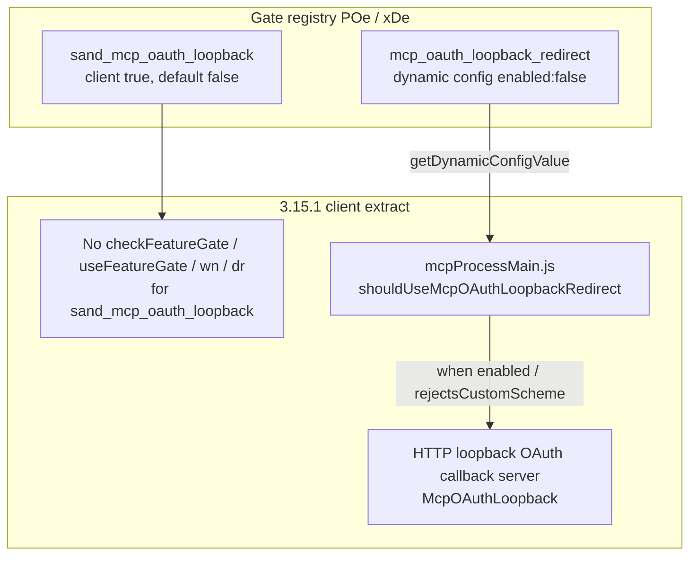

# Detective: `sand_mcp_oauth_loopback`

Theme: `feature-flag-sand-mcp-oauth-loopback`  
Flag: `sand_mcp_oauth_loopback`  
Cursor: **3.15.1** / product commit `41c5e281845de0ce890a8053a3874064bfbdb8b0` (inventory/evidence listed `…bfbdb8bf`)  
Plan path: `/workspace/workspace/runs/20260805T110539Z/plans/detective-feature-flag-sand-mcp-oauth-loopback.plan.md`

## 1. Objective

Determine how client feature gate `sand_mcp_oauth_loopback` is registered in Cursor 3.15.1, whether any `checkFeatureGate` / `useFeatureGate` / `wn` / `dr` helpers consult it, what default applies from inventory vs minified registry (`POe` / `xDe`), how it relates to MCP OAuth loopback redirect surfaces, and whether a local override is present.

**Success criteria:** registry entry confirmed, call-site vs registry-only classification with Confirmed snippets, modules list, local override status, full Phase 1–5 + 4b report at this path.

**Assumptions**

- Inventory `default: false` matches minified `default:!1`.
- Desktop client gate registry is `POe` (not `kFe`); glass twin is `xDe`.
- Extract under `runs/20260805T110539Z/extract/new` is authoritative when live install is absent.
- Prefer inventory default when Statsig / overrides are unprobeable.

**Unknowns (pre-probe)**

- Live Statsig remote treatment on this host.
- Whether a developer local override exists in `state.vscdb`.
- Whether any non-string / server-only consumer exists outside this AppImage extract.

## 2. Environment

| Item | Value |
|------|--------|
| OS | Linux (cloud agent VM) |
| `locate-cursor.sh` | `install_status=not_found`, `WORKBENCH_JS=` empty (no live Cursor install) |
| Workbench used | `/workspace/workspace/runs/20260805T110539Z/extract/new/usr/share/cursor/resources/app/out/vs/workbench/workbench.desktop.main.js` |
| Glass twin | `…/workbench.glass.main.js` |
| Version / channel | `product.json`: version=**3.15.1**, quality=stable, commit=`41c5e281845de0ce890a8053a3874064bfbdb8b0` |
| User config / `state.vscdb` | Absent (`~/.config/Cursor/User` missing) |
| Inventory | `/workspace/workspace/runs/20260805T110539Z/feature-flags-inventory.json` → `{name, client:true, default:false}`; `registry_var: POe` |
| Manifest category | `other` |
| Precomputed evidence | `/workspace/workspace/runs/20260805T110539Z/plans/_evidence/sand-mcp-oauth-loopback.json` |

## 3. Scan checklist

| Script / probe | Exit | One-line result |
|----------------|------|-----------------|
| `locate-cursor.sh` | 0 | No install; `WORKBENCH_JS` empty |
| `scan-paths.sh` | 0 | No Cursor User config / global `state.vscdb`; projects root exists (tiny) |
| `grep-workbench.sh` (desktop, `sand_mcp_oauth_loopback`) | 0 | **1** hit — registry cluster only (`default:!1`) |
| `grep-workbench.sh` (glass, flag) | 0 | **1** hit — same registry entry |
| `grep-workbench.sh` (builtins) | 0 | `toolFormerData` / `composerData` / `cursorDiskKV` present (bundle healthy) |
| Full-extract `rg` (`sand_mcp_oauth_loopback`) | 0 | Hits only in desktop, glass, `out/main.js`, `cursor-agent-host`, `cursor-always-local` (registry copies) |
| `checkFeatureGate` / `useFeatureGate` / `wn` / `dr` for flag | 0 | **Zero** call sites in entire extract; also **zero** `checkFeatureGate("sand_*")` in workbench |
| `inspect-state-vscdb.sh` | 1 | Error: `state.vscdb` not found (no local Statsig/override store) |
| `inspect-store-db.sh` | 1 | `--db PATH required` / no chats store |
| Inventory JSON | — | `default: false`, `client: true` |
| Bundle deep extract (Phase 4b) | — | Registry **POe** / **xDe**; adjacent dynamic config **`mcp_oauth_loopback_redirect`** actively consumed in `mcpProcessMain.js` (ungated by this flag) |
| Local override probe | — | No User storage → **none** |

## 4. Findings

### Registry (feature-gate map)

- **Confirmed:** Desktop gate registry is minified as **`POe`**, not `kFe`. Assignment: `POe={agent_goal_continuation:…}`; `c_n=Object.keys(POe)`. Flag sits inside `POe` before the keys enumeration (`POe` start < flag < `c_n`). Module header immediately preceding registry: `out-build/vs/platform/experiments/common/experimentConfig.gen.js`.
- **Confirmed:** Glass twin registry is **`xDe`** (`dct=Object.keys(xDe)`).
- **Confirmed:** Exact entry in both bundles (and registry copies in `out/main.js`, `cursor-agent-host`, `cursor-always-local`):  
  `sand_mcp_oauth_loopback:{client:!0,default:!1}`  
  → client gate, **default false** (`!1`). Matches inventory.
- **Confirmed:** Neighbor cluster inside `POe`/`xDe`:  
  `origin_raw_file_links` (default false) →  
  `sand_auto_review` (default false) →  
  **`sand_mcp_oauth_loopback`** (default **false**) →  
  `sand_spotlight` (default true) →  
  `smart_mode_classifier_shadow_mode` (default false) → …

### Call sites (active consumers)

- **Confirmed:** Desktop and glass have **zero** `checkFeatureGate("sand_mcp_oauth_loopback"…)` / `useFeatureGate("sand_mcp_oauth_loopback"…)`.
- **Confirmed:** Entire AppImage extract has **zero** `checkFeatureGate` / `useFeatureGate` / `wn(` / `dr(` string consumers for this flag (searched workbench, `out/main.js`, `mcpProcessMain.js`, and all `extensions/*/dist/main.js`).
- **Confirmed:** `mcpProcessMain.js` mentions **`sand_mcp_oauth_loopback` zero times** — loopback OAuth there is driven by dynamic config, not this gate.
- **Confirmed:** Every mention of `sand_mcp_oauth_loopback` is **registry-only** (`:{client:!0,default:!1}`); mention counts desktop=1, glass=1 (plus three registry copies elsewhere). Precomputed evidence `modules_near_mentions: []` matches.
- **Confirmed:** Workbench has **zero** `checkFeatureGate("sand_*")` string args at all in 3.15.1 (entire sand gate family is currently dormant at call-site level in client bundles).

### Effective value (Statsig / local)

- **Confirmed:** `ExperimentService._checkGateWithoutOverride` falls back to `POe[e]?.default??!1` (desktop) / `xDe[t]?.default??!1` (glass) when Statsig is missing or throws.
- **Confirmed:** Bundled / inventory default for this flag is **false** (prefer inventory).
- **Unknown:** Live Statsig remote value — no running Cursor / no `state.vscdb` / no Statsig cache on disk.
- **Confirmed:** Local feature-flag override: **none** (no `~/.config/Cursor/User`; override storage key exists in bundle as `workbench.experiments.featureFlagOverrides` but nothing persisted here).

### Semantics (what it would change)

- **Confirmed:** In 3.15.1 client bundles, flipping this gate has **no direct UI/runtime effect** — there is no client call site.
- **Confirmed (adjacent MCP OAuth loopback surface, ungated by this flag):**
  - Dynamic config **`mcp_oauth_loopback_redirect`** registered in `experimentConfig.gen.js` with schema `{enabled:boolean, denylist:string[]}` and fallbackValues `{enabled:!1, denylist:[]}`.
  - **Active consumer** in `mcpProcessMain.js`: `QC="mcp_oauth_loopback_redirect"`; `d=await this.mcpHostEnvironment?.getDynamicConfigValue(QC)`; `shouldUseMcpOAuthLoopbackRedirect` (`ng`) decides whether to pass `createRedirectHandle` that starts a local HTTP loopback OAuth callback server (`$C` / `UC`, log prefix `[McpOAuthLoopback]`).
  - `ng({config, serverUrl})` returns true when hostname has `rejectsCustomSchemeRedirects===true` (e.g. Google Workspace MCP catalog), **or** when `config.enabled===true` and server URL is not on `denylist`.
  - Related MCP OAuth proto/API surface: `StoreMcpOAuthToken*`, `CompleteMcpOAuth*`, `GetMcpOAuthPendingState*`, refresh locks, etc. in `aiserver/v1/mcp_pb.js` (ungated by this flag).
  - Workbench MCP OAuth modules present (`mcpConnectFlow`, `cloudMcpOAuthFlowState`, `mcpAuthAnalytics`, `mcpAuthQueryHandler`, packages `mcp-auth-flow.ts` / `default-auth.ts`) — none reference the gate string `sand_mcp_oauth_loopback`.
- **Inferred:** Name + placement next to sand family + sibling dynamic config `mcp_oauth_loopback_redirect` imply a **pre-registered / dormant rollout switch** intended to gate MCP OAuth loopback-redirect behavior, not yet hooked into `checkFeatureGate` (actual enablement today is via Statsig dynamic config `mcp_oauth_loopback_redirect.enabled`, default off).
- **Inferred:** Until call sites land, Statsig treatments for `sand_mcp_oauth_loopback` would only matter if future client code consults the gate (or if server uses the same Statsig name — not visible as a string consumer in this extract).

### Confidence

**Confirmed** on registry (`POe`/`xDe`), default **false**, full-extract registry-only classification, adjacent wired `mcp_oauth_loopback_redirect` consumer in mcpProcess, modules, and local-override **none**.  
**Inferred** on intended product meaning (dormant sand gate for MCP OAuth loopback, parallel to the already-wired dynamic config).  
**Unknown** only for remote Statsig treatment on a live client.

## 5. Internal code map

### Module table

| Module path | Role vs theme |
|-------------|----------------|
| `out-build/vs/platform/experiments/common/experimentConfig.gen.js` (via `POe`/`xDe`) | Client gate registry including `sand_mcp_oauth_loopback`; also `mcp_oauth_loopback_redirect` dynamic config schema + fallbacks |
| `out-build/vs/workbench/services/experiment/browser/experimentService.js` | `checkFeatureGate`, overrides, `POe`/`xDe` default fallback |
| `out/vs/code/electron-utility/mcpProcess/mcpProcessMain.js` | **Active** loopback OAuth redirect: `shouldUseMcpOAuthLoopbackRedirect` + `getDynamicConfigValue("mcp_oauth_loopback_redirect")` (does **not** read this flag) |
| `out/main.js` / `cursor-agent-host` / `cursor-always-local` | Registry copies only (no dedicated call) |
| `out-build/vs/workbench/services/ai/browser/mcpConnectFlow.js` | MCP connect / OAuth flow UI plumbing (ungated by this flag) |
| `out-build/vs/workbench/contrib/aiSettings/browser/cloudMcpOAuthFlowState.js` | Cloud MCP OAuth flow state (ungated) |
| `out-build/vs/workbench/services/ai/browser/mcpAuthAnalytics.js` | MCP OAuth analytics (ungated) |
| `out-build/vs/workbench/services/agent/browser/toolCallHandlers/mcpAuth/*` | Agent MCP auth tool handlers (ungated) |
| `../packages/agent-core/src/mcp-auth-flow.ts` | Shared MCP auth flow package (ungated) |
| `../packages/cursor-config/src/mcp/default-auth.ts` | Default MCP auth config (ungated) |

### Entry points

| Symbol / API | Bundle | Role |
|--------------|--------|------|
| `POe` / `xDe` | desktop / glass | Gate map; entry `sand_mcp_oauth_loopback:{client:!0,default:!1}` |
| `checkFeatureGate("sand_mcp_oauth_loopback")` | — | **Absent** in 3.15.1 extract |
| `mcp_oauth_loopback_redirect` | workbench + mcpProcess | Related dynamic config; **consumed** in mcpProcess via `getDynamicConfigValue` |
| `shouldUseMcpOAuthLoopbackRedirect` (`ng`) | mcpProcess | Decides whether to create HTTP loopback redirect handle |
| `$C` / `UC` / `[McpOAuthLoopback]` | mcpProcess | Local loopback OAuth callback HTTP server |
| `workbench.experiments.featureFlagOverrides` | both | Override storage key; empty/absent on this host |

### Implementation snippets (Confirmed)

**Registry (desktop `POe`, glass `xDe`):**

```text
origin_raw_file_links:{client:!0,default:!1},
sand_auto_review:{client:!0,default:!1},
sand_mcp_oauth_loopback:{client:!0,default:!1},
sand_spotlight:{client:!0,default:!0},
smart_mode_classifier_shadow_mode:{client:!0,default:!1},
```

**Default fallback (`experimentService.js`):**

```text
_checkGateWithoutOverride(e,t){
  if(this._statsig) try { return this._statsig.checkGate(e,t) }
  catch { …; return POe[e]?.default??!1 }  // glass: xDe[t]?.default??!1
  else return … POe[e]?.default??!1
}
```

**Related dynamic config (ungated by this flag):**

```text
mcp_oauth_loopback_redirect:ht.object({enabled:ht.boolean(),denylist:ht.array(ht.string())})
mcp_oauth_loopback_redirect:{client:!0,fallbackValues:{enabled:!1,denylist:[]}}
```

**Active mcpProcess consumer (ungated by this flag):**

```text
QC="mcp_oauth_loopback_redirect"
d=await this.mcpHostEnvironment?.getDynamicConfigValue(QC)
g=ng({config:d,serverUrl:i})?w=>$C({returnToCursorUrl:this.getLoopbackReturnToCursorUrl(),onDispose:w}):void 0

function ng(e){
  // rejectsCustomSchemeRedirects hostname → true
  // else require config.enabled===true and serverUrl not in denylist
}
```

## 6. Diagram



## 7. Gaps & follow-ups

- Live Statsig treatment unprobeable (no `state.vscdb`, no running client).
- Server-side or agent-runtime consumers of Statsig gate `sand_mcp_oauth_loopback` are outside string-searchable client bundles — not attempted beyond this AppImage extract.
- Whether future builds wire `checkFeatureGate("sand_mcp_oauth_loopback")` as a hard kill-switch in front of `mcp_oauth_loopback_redirect` is unknown; re-run Phase 4b when call sites appear.
- `getDynamicConfig("mcp_oauth_loopback_redirect")` string literal absent in workbench (only registry + mcpProcess `getDynamicConfigValue(QC)`); workbench may proxy via host environment — not fully reverse-engineered beyond confirming no literal gate read for this flag.

## 8. Workspace relevance

Forensic extract under `/workspace/workspace/runs/20260805T110539Z/` (Cursor 3.15.1 AppImage). No live Cursor User state on this VM.

### Verdict summary

| Field | Value |
|-------|--------|
| Confidence | **Confirmed** (registry-only / default false); **Inferred** (intended MCP OAuth loopback rollout switch); **Unknown** (live Statsig) |
| What it changes | **Nothing in 3.15.1 client** — registry-only; no `checkFeatureGate` consumer. Actual loopback OAuth is gated by dynamic config `mcp_oauth_loopback_redirect` in mcpProcess (default `enabled: false`). |
| Modules | `experimentConfig.gen.js` (`POe`/`xDe`), `experimentService.js`; registry copies in `out/main.js` / agent-host / always-local; adjacent wired `mcpProcessMain.js` (`mcp_oauth_loopback_redirect`) |
| Local Override | **none** |
| Inventory default | **false** (`!1`) |
| Registry var | **POe** (desktop); **xDe** (glass) — not `kFe` |
| Call sites | **0** (registry-only) |
