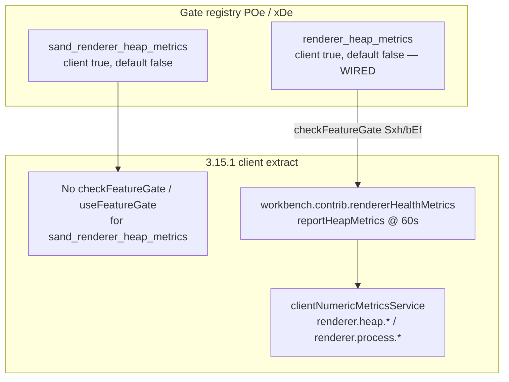

# Detective: `sand_renderer_heap_metrics`

Theme: `feature-flag-sand-renderer-heap-metrics`  
Flag: `sand_renderer_heap_metrics`  
Cursor: **3.15.1** / product commit `41c5e281845de0ce890a8053a3874064bfbdb8b0` (inventory/evidence listed `…bfbdb8bf`)  
Plan path: `/workspace/workspace/runs/20260805T110539Z/plans/detective-feature-flag-sand-renderer-heap-metrics.plan.md`

## 1. Objective

Determine how client feature gate `sand_renderer_heap_metrics` is registered in Cursor 3.15.1, whether any `checkFeatureGate` / `useFeatureGate` consumers consult it, what default applies from inventory vs minified registry (`POe` / `xDe`), how it relates to the wired sibling `renderer_heap_metrics` / `workbench.contrib.rendererHealthMetrics`, and whether a local override is present.

**Success criteria:** registry entry confirmed, call-site vs registry-only classification with Confirmed snippets, modules list, local override status, full Phase 1–5 + 4b report at this path.

**Assumptions**

- Inventory `default: false` matches minified `default:!1`.
- Desktop client gate registry is `POe` (not `kFe`); glass twin is `xDe`.
- Extract under `runs/20260805T110539Z/extract/new` is authoritative when live install is absent.
- Prefer inventory default when Statsig / overrides are unprobeable.

**Unknowns (pre-probe)**

- Live Statsig remote treatment on this host.
- Whether a developer local override exists in `state.vscdb`.
- Whether any non-string / server-only consumer exists outside this AppImage extract.

## 2. Environment

| Item | Value |
|------|--------|
| OS | Linux (cloud agent VM) |
| `locate-cursor.sh` | `install_status=not_found`, `WORKBENCH_JS=` empty (no live Cursor install) |
| Workbench used | `/workspace/workspace/runs/20260805T110539Z/extract/new/usr/share/cursor/resources/app/out/vs/workbench/workbench.desktop.main.js` |
| Glass twin | `…/workbench.glass.main.js` (registry var `xDe`) |
| Version / channel | `product.json`: version=**3.15.1**, quality=stable, commit=`41c5e281845de0ce890a8053a3874064bfbdb8b0` |
| User config / `state.vscdb` | Absent (`~/.config/Cursor/User` missing) |
| Inventory | `/workspace/workspace/runs/20260805T110539Z/feature-flags-inventory.json` → `{name, client:true, default:false}`; `registry_var=POe` |
| Manifest category | `other` |
| Precomputed evidence | `/workspace/workspace/runs/20260805T110539Z/plans/_evidence/sand-renderer-heap-metrics.json` |

## 3. Scan checklist

| Script / probe | Exit | One-line result |
|----------------|------|-----------------|
| `locate-cursor.sh` | 0 | No install; `WORKBENCH_JS` empty |
| `scan-paths.sh` | 0 | No Cursor User config / global `state.vscdb`; projects root exists (tiny) |
| `grep-workbench.sh` (desktop, flag) | 0 | **1** hit — registry only (`default:!1`) |
| `grep-workbench.sh` (glass, flag) | 0 | **1** hit — same registry entry |
| `grep-workbench.sh` (`checkFeatureGate("sand_renderer_heap_metrics`) | 0 | **0** hits |
| `grep-workbench.sh` (`useFeatureGate("sand_renderer_heap_metrics`) | 0 | **0** hits |
| `grep-workbench.sh` (`renderer_heap` / `HeapMetrics`) | 0 | Sibling registry sibling + live `reportHeapMetrics` contrib |
| `grep-workbench.sh` (builtins) | 0 | Bundle healthy (`toolFormerData` / `composerData` present) |
| Full-extract `rg` (`sand_renderer_heap_metrics`) | 0 | Hits only in desktop, glass, `out/main.js`, `cursor-agent-host`, `cursor-always-local` (registry copies) |
| Full-extract `reportHeapMetrics` | 0 | Desktop + glass only (wired sibling gate `renderer_heap_metrics`) |
| `inspect-state-vscdb.sh` | 1 | Error: `state.vscdb` not found |
| `inspect-store-db.sh` | 1 | `--db PATH required` / no chats store |
| Phase 4b module enum | 0 | `experimentConfig.gen.js`, `experimentService.js`, `clientNumericMetricsService.js`; contrib `workbench.contrib.rendererHealthMetrics` |
| Local override probe | — | No User storage → **none** |

## 4. Findings

### Registry (feature-gate map)

- **Confirmed:** Desktop gate registry is minified as **`POe`**, not `kFe`. Assignment: `POe={…}`; `Object.keys(POe)` after the map. Flag sits inside `POe` (`POe` start < flag < keys enum). Module header: `out-build/vs/platform/experiments/common/experimentConfig.gen.js`.
- **Confirmed:** Glass twin registry is **`xDe`** (`Object.keys(xDe)` present; flag within range).
- **Confirmed:** Exact entry in desktop, glass, and registry copies in `out/main.js`, `cursor-agent-host/dist/main.js`, `cursor-always-local/dist/main.js`:  
  `sand_renderer_heap_metrics:{client:!0,default:!1}`  
  → client gate, **default false** (`!1`). Matches inventory. Prefer inventory when Statsig uninitialized — `POe[e]?.default??!1` in `ExperimentService` gate-check catch/else.
- **Confirmed:** Neighbor cluster (metrics / health gates in `POe`/`xDe`):  
  `client_numeric_metrics` (default true) →  
  `metrics_background_aware_intervals` (default true) →  
  `solidjs_total_observers_metric` (default false) →  
  **`renderer_heap_metrics`** (default **false**) →  
  `glass_react_commit_churn` (default false) →  
  **`sand_renderer_heap_metrics`** (default **false**) →  
  `collect_sample_for_unresponsive_ext_host` (default false) → …

### Call sites (active consumers of *this* flag)

- **Confirmed:** Desktop and glass have **zero** `checkFeatureGate("sand_renderer_heap_metrics"…)` / `useFeatureGate("sand_renderer_heap_metrics"…)`.
- **Confirmed:** Entire AppImage extract has **zero** string consumers of this gate (workbench, `out/main.js`, `extensions/*/dist/main.js`) — every mention is registry-only.
- **Confirmed:** Mention counts desktop=1, glass=1; evidence `modules_near_mentions: []` matches.
- **Confirmed:** Workbench has **zero** `checkFeatureGate("sand_*")` string args at all in 3.15.1 (entire sand gate family dormant at call-site level in client bundles).

### Sibling wired gate (not this flag)

- **Confirmed:** Sibling gate **`renderer_heap_metrics`** (`{client:!0,default:!1}`) **is** wired in both desktop and glass via contrib `workbench.contrib.rendererHealthMetrics`.
- **Confirmed (desktop):** `var Sxh="renderer_heap_metrics"`, interval `Oi_=6e4` (60 s), `MOo=1024*1024`; class registers as `q2n.ID="workbench.contrib.rendererHealthMetrics"`.
- **Confirmed (glass):** `var bEf="renderer_heap_metrics"`; same `reportHeapMetrics` / `reportProcessMemory` logic; `SRi.ID="workbench.contrib.rendererHealthMetrics"`.
- **Confirmed:** Gating call: `this.experimentService.checkFeatureGate(Sxh,{disableExposureLog:e})` (glass: `bEf`); reacts to `onDidChangeGates` when changed set includes that gate.
- **Confirmed:** When enabled, reports via `clientNumericMetricsService`:
  - `renderer.heap.used_mb` ← `performance.memory.usedJSHeapSize / 1MiB`
  - `renderer.heap.limit_mb` ← `jsHeapSizeLimit`
  - `renderer.heap.total_mb` ← `totalJSHeapSize`
  - plus process memory: `renderer.process.resident_set_mb` / `private_mb` / `shared_mb` from `getProcessMemoryInfo()`
- **Confirmed:** `reportHeapMetrics` / metric name strings appear only in desktop + glass workbench (not in registry-copy `main.js` files).

### Semantics (what it changes)

- **Confirmed:** In 3.15.1 client bundles, enabling/disabling **`sand_renderer_heap_metrics`** has **no direct UI/runtime effect** — there is no client call site.
- **Confirmed:** Actual renderer heap numeric metrics collection is controlled by sibling gate **`renderer_heap_metrics`**, not this sand-prefixed twin.
- **Inferred:** Name + adjacency after `renderer_heap_metrics` / before unresponsive-ext-host sampling imply a **pre-registered / dormant Sand twin** of the already-wired heap-metrics reporter — intended for a Sand-scoped rollout of the same `rendererHealthMetrics` path, not yet hooked into `checkFeatureGate`.
- **Inferred:** Until call sites land (or the contrib is switched to consult `sand_renderer_heap_metrics`), Statsig treatments for this gate would not change client behavior in this build.

### Effective value / overrides

- **Unknown (Statsig):** No running Cursor / no cached Statsig state on disk.
- **Confirmed (bundled / inventory default):** **false** (`!1` / inventory `default: false`). Prefer inventory.
- **Confirmed (local override):** **none** — no `~/.config/Cursor/User` / `state.vscdb`; override machinery key `workbench.experiments.featureFlagOverrides` exists in bundle but nothing persisted here.
- **Inferred (runtime without Statsig):** `_checkGateWithoutOverride` → `POe[e]?.default??!1` → **false** if anything consulted the gate; still a no-op because nothing does.

### Confidence

**Confirmed** on registry (`POe`/`xDe`), default **false**, full-extract registry-only classification for this flag, wired sibling `renderer_heap_metrics` → `rendererHealthMetrics`, modules, and local-override **none**.  
**Inferred** on intended product meaning (dormant Sand twin of renderer heap metrics reporting).  
**Unknown** only for remote Statsig treatment on a live client.

## 5. Internal code map

### Module table

| Module path | Role vs theme |
|-------------|----------------|
| `out-build/vs/platform/experiments/common/experimentConfig.gen.js` (via `POe`/`xDe`) | Client gate registry including `sand_renderer_heap_metrics` + sibling `renderer_heap_metrics` |
| `out-build/vs/workbench/services/experiment/browser/experimentService.js` | `checkFeatureGate`, overrides, `POe`/`xDe` default fallback |
| `out-build/vs/workbench/services/experiment/browser/experimentHooks.js` | Gate hooks (no consumer of this sand flag) |
| `out-build/vs/workbench/services/ai/browser/clientNumericMetricsService.js` | Sink for `renderer.heap.*` / `renderer.process.*` reports |
| `out-build/vs/workbench/services/ai/browser/metricsService.js` / `metricsBackgroundIntervalsGate.js` | Adjacent metrics stack (neighbor gates) |
| `workbench.contrib.rendererHealthMetrics` (minified; no dedicated `out-build/…` path string near class) | Wired consumer of **sibling** gate `renderer_heap_metrics` only |
| `out/main.js` / `cursor-agent-host` / `cursor-always-local` | Registry copies only (no dedicated call / no `reportHeapMetrics`) |

### Entry points

| Symbol / API | Bundle | Role |
|--------------|--------|------|
| `POe` / `xDe` | desktop / glass | Gate map; `sand_renderer_heap_metrics:{client:!0,default:!1}` |
| `checkFeatureGate("sand_renderer_heap_metrics")` | — | **Absent** in 3.15.1 extract |
| `Sxh` / `bEf` = `"renderer_heap_metrics"` | desktop / glass | Wired sibling gate string |
| `checkFeatureGate(Sxh)` / `checkFeatureGate(bEf)` | both | Gates `rendererHealthMetrics` reporting |
| `workbench.contrib.rendererHealthMetrics` | both | Contrib ID; `reportHeapMetrics` every 60 s when on |
| `workbench.experiments.featureFlagOverrides` | both | Override storage key; empty/absent on this host |

### Implementation snippets (Confirmed)

**Registry (desktop `POe`, glass `xDe`):**

```text
client_numeric_metrics:{client:!0,default:!0},
metrics_background_aware_intervals:{client:!0,default:!0},
solidjs_total_observers_metric:{client:!0,default:!1},
renderer_heap_metrics:{client:!0,default:!1},
glass_react_commit_churn:{client:!0,default:!1},
sand_renderer_heap_metrics:{client:!0,default:!1},
collect_sample_for_unresponsive_ext_host:{client:!0,default:!1},
```

**Default fallback (`experimentService.js`):**

```text
…catch{…; return POe[e]?.default??!1}  // glass: xDe[t]?.default??!1
else return … POe[e]?.default??!1
```

**Sibling wired contrib (desktop; glass equivalent with `bEf` / `SRi`):**

```text
var Sxh="renderer_heap_metrics",Oi_=6e4,MOo=1024*1024;
function kxh(){return performance.memory}
// …
startStopReporting(e){
  const t=this.experimentService.checkFeatureGate(Sxh,{disableExposureLog:e});
  t!==this.reporting&&(this.reporting=t,
    t?(this.reportHeapMetrics(),this.reportTimer.cancelAndSet(()=>this.reportHeapMetrics(),Oi_))
     :this.reportTimer.cancel())
}
reportHeapMetrics(){
  … report("renderer.heap.used_mb"|limit_mb|total_mb …)
  this.reportProcessMemory()  // renderer.process.{resident_set,private,shared}_mb
}
q2n.ID="workbench.contrib.rendererHealthMetrics"
```

## 6. Diagram



## 7. Gaps & follow-ups

- Live Statsig treatment unprobeable (no `state.vscdb`, no running client).
- Exact `out-build/…` source path string for `rendererHealthMetrics` not present near the minified class (cited by contrib ID + gate constant).
- Server-side or portal consumers of Statsig name `sand_renderer_heap_metrics` are outside this AppImage extract.
- When future builds add `checkFeatureGate("sand_renderer_heap_metrics")` (or retarget the contrib), re-run Phase 4b to locate modules.

## 8. Workspace relevance

Feature-flag inventory + extract under `/workspace/workspace/runs/20260805T110539Z/` are the authoritative inputs for this Notion sync / flag catalog run. Precomputed evidence JSON matched probes (registry-only samples; empty `modules_near_mentions`); deep extract confirmed **POe**/**xDe**, default **false**, zero call sites for this sand flag, and the wired sibling **`renderer_heap_metrics`** → **`rendererHealthMetrics`**.

---

### Verdict summary

| Field | Value |
|-------|--------|
| Confidence | **Confirmed** (registry-only / default false); **Inferred** (dormant Sand twin of renderer heap metrics); **Unknown** (live Statsig) |
| What it changes | **Nothing in 3.15.1 client** — dormant gate (default off). Live heap metrics reporting is gated by sibling **`renderer_heap_metrics`** → `workbench.contrib.rendererHealthMetrics` (`renderer.heap.*` / process RSS every 60 s). |
| Modules | `experimentConfig.gen.js` (`POe`/`xDe`); `experimentService.js`; `clientNumericMetricsService.js`; contrib `workbench.contrib.rendererHealthMetrics`; registry copies in `out/main.js` / agent-host / always-local |
| Local Override | **none** |
| Inventory default | **false** (`!1`) |
| Registry var | **POe** (desktop); **xDe** (glass) — not `kFe` |
| Call sites | **0** (registry-only) |
