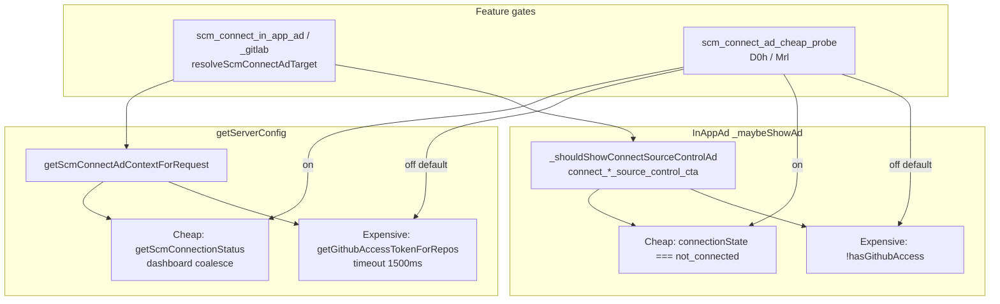

# Detective: `scm_connect_ad_cheap_probe`

Theme: `feature-flag-scm-connect-ad-cheap-probe`  
Flag: `scm_connect_ad_cheap_probe`  
Cursor: **3.15.1** / product commit `41c5e281845de0ce890a8053a3874064bfbdb8b0` (precomputed evidence listed `…bfbdb8bf`)  
Plan path: `/workspace/workspace/runs/20260805T110539Z/plans/detective-feature-flag-scm-connect-ad-cheap-probe.plan.md`

## 1. Objective

Determine how client feature gate `scm_connect_ad_cheap_probe` is registered in Cursor 3.15.1, which call sites consult it, what default applies (inventory vs minified registry `POe` / `xDe`), which InAppAd / SCM-connect modules own the cheap vs expensive connection probe paths, and whether a local override is present.

**Success criteria:** registry entry confirmed, active call-site classification with Confirmed snippets, modules list, local override status, full Phase 1–5 + 4b report at this path.

**Assumptions**

- Inventory `default: false` matches minified `default:!1` (prefer inventory when they agree).
- Desktop client gate registry is `POe` (not `kFe`); glass twin is `xDe`.
- Extract under `runs/20260805T110539Z/extract/new` is authoritative when live install is absent.

**Unknowns (pre-probe)**

- Live Statsig remote treatment on this host.
- Whether a developer local override exists in `state.vscdb`.

## 2. Environment

| Item | Value |
|------|--------|
| OS | Linux (cloud agent VM) |
| `locate-cursor.sh` | `install_status=not_found`, `WORKBENCH_JS=` empty (no live Cursor install) |
| Workbench used | `/workspace/workspace/runs/20260805T110539Z/extract/new/usr/share/cursor/resources/app/out/vs/workbench/workbench.desktop.main.js` |
| Glass twin | `…/workbench.glass.main.js` |
| Version / channel | `product.json`: version=**3.15.1**, quality=stable, commit=`41c5e281845de0ce890a8053a3874064bfbdb8b0` |
| User config / `state.vscdb` | Absent (`~/.config/Cursor/User` missing) |
| Inventory | `/workspace/workspace/runs/20260805T110539Z/feature-flags-inventory.json` → `{name, client:true, default:false}` |
| Precomputed evidence | `/workspace/workspace/runs/20260805T110539Z/plans/_evidence/scm-connect-ad-cheap-probe.json` |

## 3. Scan checklist

| Script / probe | Exit | One-line result |
|----------------|------|-----------------|
| `locate-cursor.sh` | 0 | No install; `WORKBENCH_JS` empty |
| `scan-paths.sh` | 0 | No Cursor User config / global `state.vscdb`; projects root exists (tiny) |
| `grep-workbench.sh` (desktop, flag) | 0 | `hit_count=2` — registry + `D0h="scm_connect_ad_cheap_probe"` |
| `grep-workbench.sh` (glass, flag) | 0 | `hit_count=2` — registry + `Mrl` in `scmConnectAdUtils.js` |
| `grep-workbench.sh` (desktop builtins) | 0 | Bundle healthy (`toolFormerData` / `composerData` / `createComposer` present) |
| `inspect-state-vscdb.sh` | 1 | `state.vscdb not found` (no local Statsig/override store) |
| `inspect-store-db.sh` | 1 | `--db PATH required` / no chats store |
| Inventory JSON | — | `default: false`, `client: true` |
| Bundle deep extract (Phase 4b) | — | Registry **POe** / **xDe**; active consumers in server-config + InAppAd show path |
| Local override probe | — | No User storage → **none** |

## 4. Findings

### Registry (feature-gate map)

- **Confirmed:** Desktop gate registry is minified as **`POe`**. Flag index sits inside `POe` (`POe` start < flag < `Object.keys(POe)` / `c_n=Object.keys(POe)`).
- **Confirmed:** Glass twin registry is **`xDe`** (`dct=Object.keys(xDe)`).
- **Confirmed:** Exact entry in both bundles:  
  `scm_connect_ad_cheap_probe:{client:!0,default:!1}`  
  → client gate, **default false** (`!1`). Matches inventory (prefer inventory default).
- **Confirmed:** Neighbor cluster: `glass_direct_github_connect` → `scm_connect_in_app_ad` → `scm_connect_in_app_ad_gitlab` → **`scm_connect_ad_cheap_probe`** → `glass_last_turn_diff_scope` …

### Call sites (active consumers)

- **Confirmed — Constants (desktop):**  
  `wQb="scm_connect_in_app_ad"`, `SQb="scm_connect_in_app_ad_gitlab"`, `D0h="scm_connect_ad_cheap_probe"`, `kQb="ad3ea84c-ede1-42fe-889a-16a8c94ccfdf"` (GitLab application id used when classifying gitlab.com remotes).
- **Confirmed — Constants (glass):** Same four strings as `TTg` / `ATg` / `Mrl` / `ITg` inside module `out-build/vs/workbench/contrib/inAppAd/common/scmConnectAdUtils.js`.
- **Confirmed — Path A (server config / getServerConfig context):**  
  `isScmConnectAdCheapProbeEnabled()` → `this.experimentService.checkFeatureGate(D0h,{disableExposureLog:!0})` (glass: `Mrl`).  
  In `getScmConnectAdContextForRequest`:
  - Gate **ON:** `xQb(await getScmConnectAdConnectionState(remoteUrl))` — dashboard RPC `getScmConnectionStatus` via `scmConnectAdProbeRequests` coalesce cache → maps `"connected"|"not_connected"|"unknown"` → `ScmConnectAdConnectionState` enum (`HAS_ACCESS` / `NOT_CONNECTED` / omit).
  - Gate **OFF (default):** `getScmAccessState(remoteUrl)` — `backgroundComposerClient.getGithubAccessTokenForRepos({mandatoryRepoUrls:[url], skipCache:!0})` with **1500ms** abort timeout (`P0h=1500`).
  - Early return when `workbenchEnvironmentService.isGlass===!0` (no SCM-connect-ad context attached on Glass surface for this request path).
- **Confirmed — Path B (client-side CTA suppression):**  
  `InAppAd` controller `_shouldShowConnectSourceControlAd`:
  - Gate **ON:** `serverConfigService.getScmConnectAdConnectionState(preferredRemote.url)==="not_connected"`.
  - Gate **OFF:** `!(await backgroundComposerService.hasGithubAccess({poll:!1, selectedRemote, skipCache:!0})).hasAccess`.
  - Used for ads classified by `hXb`: `connect_source_control_cta`, `connect_github_source_control_cta`, `connect_gitlab_source_control_cta`.
- **Confirmed — Sibling gates (separate):** `resolveScmConnectAdTarget` requires `checkFeatureGate(e.gate)` where `e.gate` is `scm_connect_in_app_ad` (GitHub) or `scm_connect_in_app_ad_gitlab` (GitLab) via `CQb(provider)`. Cheap-probe only changes *how* connection is measured after those ads are in play — not whether the SCM-connect ad program is enabled.

### Effective value (Statsig / local)

- **Confirmed:** Bundled / inventory default for this flag is **false**.
- **Confirmed:** `ExperimentService` falls back to `POe[e]?.default??!1` / `xDe[…]?.default??!1` when Statsig is missing.
- **Unknown:** Live Statsig remote value — no running Cursor / no `state.vscdb`.
- **Confirmed:** Local feature-flag override: **none** (no `~/.config/Cursor/User`; override key `workbench.experiments.featureFlagOverrides` exists in bundle only).

### Semantics (what it changes)

- **Confirmed:** When **off** (shipped default): connection eligibility for SCM-connect in-app ads is probed via the heavier GitHub access-token / `hasGithubAccess` path.
- **Confirmed:** When **on**: connection eligibility uses the lighter dashboard `GetScmConnectionStatus`-style probe (`getScmConnectionStatus`), avoiding per-refresh GitHub token fetches for ad context and CTA show/suppress decisions.
- **Inferred:** Product intent is a performance / cost experiment (“cheap probe”) for SCM-connect ad eligibility without changing ad creatives or the sibling `scm_connect_in_app_ad*` rollout gates.

### Confidence

**Confirmed** on registry (`POe`/`xDe`), default **false**, both call-site paths (server-config context + InAppAd `_shouldShowConnectSourceControlAd`), modules, and local-override **none**.  
**Inferred** only on product naming / rollout intent.  
**Unknown** only for remote Statsig treatment on a live client.

## 5. Internal code map

### Module table

| Module path | Role vs theme |
|-------------|----------------|
| `out-build/vs/workbench/contrib/inAppAd/common/scmConnectAdUtils.js` | Flag constants (`Mrl`/`D0h`), provider→sibling-gate map, hostname classifiers, connection-state mappers |
| `out-build/vs/workbench/contrib/inAppAd/browser/inAppAdController.js` (desktop class `e_t` / InAppAd service) | `_shouldShowConnectSourceControlAd` cheap vs `hasGithubAccess` branch |
| `out-build/vs/workbench/contrib/inAppAd/browser/mobileIosLaunchInAppAd.js` | Adjacent inAppAd surface (evidence module neighbor; not the cheap-probe gate itself) |
| Server config service (desktop `wNo`, registered on `xw`) | `isScmConnectAdCheapProbeEnabled`, `getScmConnectAdConnectionState`, `getScmConnectAdContextForRequest`, `getScmAccessState` |
| `out-build/vs/platform/experiments/common/experimentConfig.gen.js` (via `POe`/`xDe`) | Client gate registry entry |
| `out-build/vs/workbench/services/experiment/browser/experimentService.js` | `checkFeatureGate`, overrides, default fallback |
| Protobuf / dashboard client | `getScmConnectionStatus` / `ScmConnectAdConnectionState` / `ScmConnectAdProvider` |
| Background composer client | Expensive path: `getGithubAccessTokenForRepos`, `hasGithubAccess` |

### Entry points

1. `checkFeatureGate(D0h|Mrl,{disableExposureLog:!0})` — cheap-probe enablement.
2. `getScmConnectAdContextForRequest` → attached as `scmConnectAdContext` on `getServerConfig`.
3. `_maybeShowAd` → `hXb(adId)` → `_shouldShowConnectSourceControlAd`.

### Implementation snippets (Confirmed)

```text
// Constants + sibling gate map (desktop)
var wQb="scm_connect_in_app_ad",SQb="scm_connect_in_app_ad_gitlab",
    D0h="scm_connect_ad_cheap_probe",kQb="ad3ea84c-ede1-42fe-889a-16a8c94ccfdf";
function CQb(e){switch(e){case xhe.GITHUB:return wQb;case xhe.GITLAB:return SQb;default:return}}
```

```text
// Server-config path
isScmConnectAdCheapProbeEnabled(){
  return this.experimentService.checkFeatureGate(D0h,{disableExposureLog:!0})
}
async getScmConnectAdContextForRequest(e){
  if(this.workbenchEnvironmentService.isGlass===!0)return;
  const t=this.resolveScmConnectAdTarget(); if(t===void 0)return;
  const n=this.isScmConnectAdCheapProbeEnabled()
    ? xQb(await this.getScmConnectAdConnectionState(t.remoteUrl,{signal:e}))
    : await this.getScmAccessState(t.remoteUrl,e);
  ...
}
```

```text
// InAppAd CTA path
if(this.experimentService.checkFeatureGate(D0h,{disableExposureLog:!0}))
  return await this.serverConfigService.getScmConnectAdConnectionState(t.url)==="not_connected";
try{return!(await this.backgroundComposerService.hasGithubAccess({...})).hasAccess}catch{return!1}
```

```text
// Registry
scm_connect_ad_cheap_probe:{client:!0,default:!1}
```

## 6. Diagram



## 7. Gaps & follow-ups

- Live Statsig treatment not observable (no `state.vscdb`, no running Cursor).
- Desktop bundle omits explicit `out-build/.../scmConnectAdUtils.js` module wrapper strings (logic present; glass preserves `B({"out-build/.../scmConnectAdUtils.js"})`).
- Server-side ad selection using `scmConnectAdContext` is opaque from this client extract.

## 8. Workspace relevance

Run artifacts under `/workspace/workspace/runs/20260805T110539Z/` (inventory, evidence JSON, AppImage extract) are the authoritative probe surface for this detective pass.
