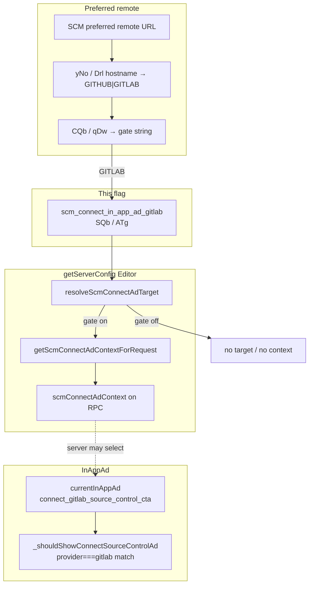

# Detective: `scm_connect_in_app_ad_gitlab`

Theme: `feature-flag-scm-connect-in-app-ad-gitlab`  
Flag: `scm_connect_in_app_ad_gitlab`  
Cursor: **3.15.1** / product commit `41c5e281845de0ce890a8053a3874064bfbdb8b0` (precomputed evidence listed `…bfbdb8bf`)  
Plan path: `/workspace/workspace/runs/20260805T110539Z/plans/detective-feature-flag-scm-connect-in-app-ad-gitlab.plan.md`

## 1. Objective

Determine how client feature gate `scm_connect_in_app_ad_gitlab` is registered in Cursor 3.15.1, which call sites consult it, what default applies (inventory vs minified registry `POe` / `xDe`), which InAppAd / SCM-connect modules own GitLab-specific connect-source-control ads, and whether a local override is present.

**Success criteria:** registry entry confirmed, active call-site classification with Confirmed snippets, modules list, local override status, full Phase 1–5 + 4b report at this path.

**Assumptions**

- Inventory `default: false` matches minified `default:!1` (prefer inventory when they agree).
- Desktop client gate registry is `POe` (not `kFe`); glass twin is `xDe`.
- Extract under `runs/20260805T110539Z/extract/new` is authoritative when live install is absent.

**Unknowns (pre-probe)**

- Live Statsig remote treatment on this host.
- Whether a developer local override exists in `state.vscdb`.

## 2. Environment

| Item | Value |
|------|--------|
| OS | Linux (cloud agent VM) |
| `locate-cursor.sh` | `install_status=not_found`, `WORKBENCH_JS=` empty (no live Cursor install) |
| Workbench used | `/workspace/workspace/runs/20260805T110539Z/extract/new/usr/share/cursor/resources/app/out/vs/workbench/workbench.desktop.main.js` |
| Glass twin | `…/workbench.glass.main.js` |
| Version / channel | `product.json`: version=**3.15.1**, quality=stable, commit=`41c5e281845de0ce890a8053a3874064bfbdb8b0` |
| User config / `state.vscdb` | Absent (`~/.config/Cursor/User` missing) |
| Inventory | `/workspace/workspace/runs/20260805T110539Z/feature-flags-inventory.json` → `{name, client:true, default:false}` |
| Precomputed evidence | `/workspace/workspace/runs/20260805T110539Z/plans/_evidence/scm-connect-in-app-ad-gitlab.json` |

## 3. Scan checklist

| Script / probe | Exit | One-line result |
|----------------|------|-----------------|
| `locate-cursor.sh` | 0 | No install; `WORKBENCH_JS` empty |
| `scan-paths.sh` | 0 | No Cursor User config / global `state.vscdb`; projects root exists (tiny) |
| `grep-workbench.sh` (desktop, flag) | 0 | `hit_count=2` — registry + `SQb="scm_connect_in_app_ad_gitlab"` |
| `grep-workbench.sh` (glass, flag) | 0 | `hit_count=2` — registry + `ATg` in `scmConnectAdUtils.js` |
| `grep-workbench.sh` (desktop builtins) | 0 | Bundle healthy (`toolFormerData` / `composerData` present) |
| `grep-workbench.sh` (glass, scmConnectAdUtils / qDw) | 0 | Module wrapper + `qDw` provider→gate map confirmed |
| `inspect-state-vscdb.sh` | 1 | `state.vscdb not found` (no local Statsig/override store) |
| `inspect-store-db.sh` | 1 | `--db PATH required` / no chats store |
| Inventory JSON | — | `default: false`, `client: true` |
| Bundle deep extract (Phase 4b) | — | Registry **POe** / **xDe**; active consumer via `resolveScmConnectAdTarget` + `CQb`/`qDw` |
| Local override probe | — | No User storage → **none** |

## 4. Findings

### Registry (feature-gate map)

- **Confirmed:** Desktop gate registry is minified as **`POe`**. Flag index sits inside `POe` (`POe=` start < flag < `c_n=Object.keys(POe)`).
- **Confirmed:** Glass twin registry is **`xDe`** (`dct=Object.keys(xDe)`).
- **Confirmed:** Exact entry in both bundles:  
  `scm_connect_in_app_ad_gitlab:{client:!0,default:!1}`  
  → client gate, **default false** (`!1`). Matches inventory (prefer inventory default).
- **Confirmed:** Neighbor cluster: `glass_direct_github_connect` → `scm_connect_in_app_ad` → **`scm_connect_in_app_ad_gitlab`** → `scm_connect_ad_cheap_probe` → `glass_last_turn_diff_scope` …

### Call sites (active consumers)

- **Confirmed — Constants (desktop):**  
  `wQb="scm_connect_in_app_ad"`, `SQb="scm_connect_in_app_ad_gitlab"`, `D0h="scm_connect_ad_cheap_probe"`, `kQb="ad3ea84c-ede1-42fe-889a-16a8c94ccfdf"` (GitLab application id for gitlab.com remotes).
- **Confirmed — Constants (glass):** Same four strings as `TTg` / `ATg` / `Mrl` / `ITg` inside module `out-build/vs/workbench/contrib/inAppAd/common/scmConnectAdUtils.js`.
- **Confirmed — Provider → gate map:**  
  - Desktop `CQb(e)`: `GITHUB → wQb`, `GITLAB → SQb`.  
  - Glass `qDw(t)`: `GITHUB → TTg`, `GITLAB → ATg`.
- **Confirmed — Hostname classifier:** Desktop `yNo` / glass `Drl` maps `gitlab.com` / `*.gitlab.com` / `gitlab.*` hostnames to `GITLAB` provider enum (`xhe` / `U0e`).
- **Confirmed — Primary gate check (`resolveScmConnectAdTarget`):**  
  1. `resolveScmConnectAdRemote()` picks preferred SCM remote, classifies provider via `yNo`/`Drl`, maps to gate via `CQb`/`qDw`.  
  2. `resolveScmConnectAdTarget()` returns `{remoteUrl, provider}` only when `experimentService.checkFeatureGate(e.gate, {disableExposureLog:!1})` is true.  
  For a GitLab preferred remote, `e.gate === SQb|ATg` (`scm_connect_in_app_ad_gitlab`). Gate **off** ⇒ no SCM-connect-ad target ⇒ no `scmConnectAdContext` on `getServerConfig`.
- **Confirmed — Server-config attachment:** `getScmConnectAdContextForRequest` early-returns when `isGlass===!0`; otherwise uses `resolveScmConnectAdTarget()` then cheap-probe vs expensive connection probe (sibling `scm_connect_ad_cheap_probe`). Attaches result as `scmConnectAdContext` on `getServerConfig`.
- **Confirmed — InAppAd CTA ids:** `connect_source_control_cta`, `connect_github_source_control_cta`, `connect_gitlab_source_control_cta` (`dXb`). `_shouldShowConnectSourceControlAd` matches ad button args `provider==="gitlab"` against preferred remote via `yNo`; connection measurement uses `scm_connect_ad_cheap_probe`, **not** this GitLab rollout gate.
- **Confirmed — Sibling (separate):** `scm_connect_in_app_ad` is the GitHub twin; `scm_connect_ad_cheap_probe` only changes *how* connection is probed after a target is selected.

### Effective value (Statsig / local)

- **Confirmed:** Bundled / inventory default for this flag is **false**.
- **Confirmed:** `ExperimentService` falls back to `POe[e]?.default??!1` / `xDe[…]?.default??!1` when Statsig is missing.
- **Unknown:** Live Statsig remote value — no running Cursor / no `state.vscdb`.
- **Confirmed:** Local feature-flag override: **none** (no `~/.config/Cursor/User`; override key `workbench.experiments.featureFlagOverrides` exists in bundle only).

### Semantics (what it changes)

- **Confirmed:** When **off** (shipped default): preferred remotes classified as GitLab never become an SCM-connect-ad target (`resolveScmConnectAdTarget` fails the gate check), so no GitLab `scmConnectAdContext` is sent with `getServerConfig` and the GitLab connect-source-control ad program does not roll out for that remote.
- **Confirmed:** When **on**: GitLab remotes can resolve as SCM-connect-ad targets; server may return `connect_gitlab_source_control_cta` (and related) creatives; client still suppresses when already connected / wrong remote / wrong provider via `_shouldShowConnectSourceControlAd`.
- **Inferred:** Product intent is a per-provider rollout gate for in-app “connect GitLab” ads, parallel to `scm_connect_in_app_ad` for GitHub.

### Confidence

**Confirmed** on registry (`POe`/`xDe`), default **false**, provider→gate map, `resolveScmConnectAdTarget` consumer, modules, and local-override **none**.  
**Inferred** only on product naming / rollout intent.  
**Unknown** only for remote Statsig treatment on a live client.

## 5. Internal code map

### Module table

| Module path | Role vs theme |
|-------------|----------------|
| `out-build/vs/workbench/contrib/inAppAd/common/scmConnectAdUtils.js` | Flag constants (`ATg`/`SQb`), provider→gate map (`qDw`/`CQb`), hostname classifiers, connection-state mappers, GitLab app id |
| `out-build/vs/workbench/contrib/inAppAd/browser/inAppAdController.js` (desktop class `e_t`) | `_maybeShowAd` / `_shouldShowConnectSourceControlAd` / `connect_gitlab_source_control_cta` |
| `out-build/vs/workbench/contrib/inAppAd/browser/mobileIosLaunchInAppAd.js` | Adjacent inAppAd surface (evidence neighbor) |
| Server config service (desktop `wNo`, registered on `xw`) | `resolveScmConnectAdRemote`, `resolveScmConnectAdTarget`, `getScmConnectAdContextForRequest` |
| `out-build/vs/platform/experiments/common/experimentConfig.gen.js` (via `POe`/`xDe`) | Client gate registry entry |
| `out-build/vs/workbench/services/experiment/browser/experimentService.js` | `checkFeatureGate`, overrides, default fallback |
| Protobuf / dashboard client | `ScmConnectAdProvider.GITLAB`, `getScmConnectionStatus`, `scmConnectAdContext` |
| `../packages/ui/.../AgentTranscriptConnectScmCard.js` | Adjacent Connect-SCM UI card (package path present; not the gate constant) |

### Entry points

1. `CQb`/`qDw`(provider) → returns `scm_connect_in_app_ad_gitlab` for `GITLAB`.
2. `checkFeatureGate(e.gate,{disableExposureLog:!1})` inside `resolveScmConnectAdTarget` — **sole direct consumer** of this gate string.
3. `getScmConnectAdContextForRequest` → `scmConnectAdContext` on `getServerConfig` (Editor surface only; Glass early-return).
4. `_maybeShowAd` → `hXb(adId)` → `_shouldShowConnectSourceControlAd` (provider match for gitlab CTA; uses cheap-probe sibling for connection).

### Implementation snippets (Confirmed)

```text
// Constants + provider→gate map (desktop)
var wQb="scm_connect_in_app_ad",SQb="scm_connect_in_app_ad_gitlab",
    D0h="scm_connect_ad_cheap_probe",kQb="ad3ea84c-ede1-42fe-889a-16a8c94ccfdf";
function CQb(e){switch(e){case xhe.GITHUB:return wQb;case xhe.GITLAB:return SQb;default:return}}
```

```text
// Glass twin (scmConnectAdUtils.js)
TTg="scm_connect_in_app_ad",ATg="scm_connect_in_app_ad_gitlab",
Mrl="scm_connect_ad_cheap_probe",ITg="ad3ea84c-ede1-42fe-889a-16a8c94ccfdf"
function qDw(t){switch(t){case U0e.GITHUB:return TTg;case U0e.GITLAB:return ATg;default:return}}
```

```text
// Primary consumer
resolveScmConnectAdRemote(){
  ... n=yNo(t); i=CQb(n);
  if(i!==void 0) return {remoteUrl:t, provider:n, gate:i}
}
resolveScmConnectAdTarget(){
  const e=this.resolveScmConnectAdRemote();
  if(e!==void 0 && this.experimentService.checkFeatureGate(e.gate,{disableExposureLog:!1}))
    return {remoteUrl:e.remoteUrl, provider:e.provider}
}
```

```text
// Registry
scm_connect_in_app_ad_gitlab:{client:!0,default:!1}
```

```text
// CTA id
dXb="connect_gitlab_source_control_cta"
```

## 6. Diagram



## 7. Gaps & follow-ups

- Live Statsig treatment not observable (no `state.vscdb`, no running Cursor).
- Desktop bundle omits explicit `out-build/.../scmConnectAdUtils.js` module wrapper strings (logic present; glass preserves `B({"out-build/.../scmConnectAdUtils.js"})`).
- Server-side ad selection that consumes `scmConnectAdContext` / returns `connect_gitlab_source_control_cta` is opaque from this client extract.
- Glass surfaces skip attaching SCM-connect-ad context (`isGlass===!0` early return) even though the gate constant and map exist in the glass bundle.

## 8. Workspace relevance

Run artifacts under `/workspace/workspace/runs/20260805T110539Z/` (inventory, evidence JSON, AppImage extract) are the authoritative probe surface for this detective pass.
