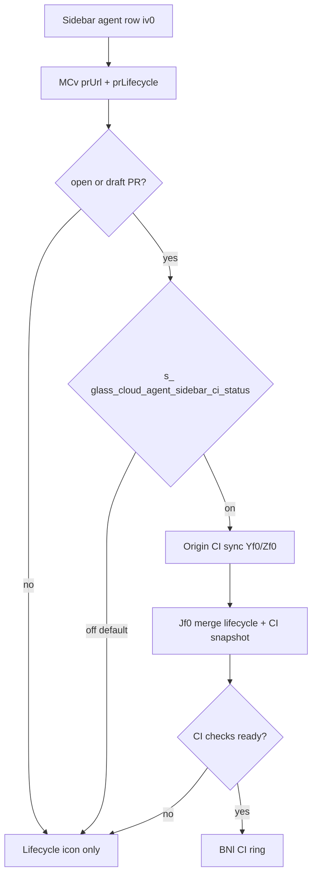

# Detective report: `glass_cloud_agent_sidebar_ci_status`

## Objective

Determine what the Cursor client feature flag `glass_cloud_agent_sidebar_ci_status` controls in Cursor **3.17.6** (commit `4402af7614d46247d892117a612a9072fa99110f`): confirm its kFe/MBe registry entry, locate `checkFeatureGate` / reactive gate call sites, infer effective on/off behavior, and list workbench modules touched.

**Scope:** Read-only forensics on extracted AppImage workbench bundles (`workbench.desktop.main.js`, `workbench.glass.main.js`). No live Cursor install or `state.vscdb` on this VM.

**Success criteria:** Tagged findings (Confirmed / Inferred / Unknown), registry shape verified, call-site status resolved, effective default documented, plan written to this path.

**Assumptions:** Inventory `default: false` maps to minified `default:!1`. Gate hook `s_(flag, predicate)` is the Solid/reactive equivalent of `checkFeatureGate` with a conditional exposure predicate.

**Unknowns at start:** Whether CI status appears in desktop sidebar or only Glass; whether Origin CI sync is required.

---

## Environment

| Field | Value |
|-------|-------|
| OS | Linux 6.12.94+ |
| Cursor version | 3.17.6 |
| Commit | `4402af7614d46247d892117a612a9072fa99110f` |
| `locate-cursor.sh` | `install_status=not_found`, `WORKBENCH_JS=` (empty) |
| Workbench used (fixed extract) | `/workspace/workspace/runs/20260820T110500Z/extract/new/usr/share/cursor/resources/app/out/vs/workbench/workbench.desktop.main.js` |
| Glass twin | `/workspace/workspace/runs/20260820T110500Z/extract/new/usr/share/cursor/resources/app/out/vs/workbench/workbench.glass.main.js` |
| Inventory | `/workspace/workspace/runs/20260820T110500Z/feature-flags-inventory.json` (637 flags) |

---

## Scan checklist

| Script | Exit | Result |
|--------|------|--------|
| `locate-cursor.sh` | 0 | No local Cursor install; empty `WORKBENCH_JS` |
| `scan-paths.sh` | 0 | No `~/.config/Cursor/User/globalStorage/state.vscdb`; projects root exists (4KB) |
| `grep-workbench.sh` (desktop) | 0 | 1 hit — registry snippet only |
| `grep-workbench.sh` (glass) | 0 | 2 hits — registry + `s_()` call site |
| Pre-grep JSON | — | `/workspace/workspace/runs/20260820T110500Z/greps/glass-cloud-agent-sidebar-ci-status.json` |
| Phase 4b module enumeration | — | Logical modules: `ci-checks-ring.react.js`, `pr-lifecycle-presentation.js`, origin CI sync service, sidebar agent row |

---

## Findings

### Registry entry (Confirmed)

- **Confirmed:** Entry in generated client feature-gate catalog (`MBe` / kFe block):

```text
glass_cloud_agent_sidebar_ci_status:{client:!0,default:!1}
```

- **Confirmed:** Parsed semantics — `client: true`, **`default: false`** (`!1`).
- **Confirmed:** Registry appears once in `workbench.desktop.main.js` and twice in `workbench.glass.main.js` (catalog + consumer string in `s_()` call).

### Call sites / runtime consumers (Confirmed — Glass-only)

- **Confirmed:** One reactive gate call in **glass bundle only** (no desktop consumer):

```text
const a=s_("glass_cloud_agent_sidebar_ci_status",s!==void 0)
```

  inside component `MCv`, which renders the trailing PR status affordance on Glass sidebar agent rows (`glass-sidebar-agent-trailing-pr-icon`).

- **Confirmed:** Gate predicate `s !== void 0` means exposure/logging only runs when the agent row has a resolvable PR URL for an **open** or **draft** PR (`ev0({prUrl, prLifecycle})` filters other lifecycle states).

- **Confirmed:** When gate is **on** and PR URL exists:
  1. `Zf0(a ? r : void 0)` subscribes to Origin CI snapshot via sync client (`Yf0` → `PCv` / `zhc` service).
  2. `Jf0({prLifecycle, originCiSnapshot})` chooses presentation:
     - If lifecycle is merged/closed (`qHr(n)`), show lifecycle icon only.
     - Else if CI snapshot is `ready` with `checkStatus.totalCount > 0`, return `{kind:"ci", checkStatus}`.
     - Else fall back to lifecycle icon.
  3. `MCv` renders `BNl` (CI checks ring) for `kind==="ci"`, or lifecycle icon component `nts` otherwise.

- **Confirmed:** When gate is **off** (default): `a` is false → `Zf0(undefined)` → no Origin CI fetch → sidebar shows lifecycle icon only (no CI ring), even when PR URL is present.

- **Inferred:** Feature targets **cloud agent sidebar rows in Glass** with linked open/draft PRs; name aligns with showing GitHub/Origin CI check aggregate status inline in the agent list.

### Effective value / Statsig (Confirmed fallback, Unknown live override)

- **Confirmed:** Fallback via `ExperimentService.checkFeatureGate` resolves to catalog default **`false`** when Statsig unavailable.
- **Unknown:** Live Statsig override for signed-in users — no session on VM.

### Modules touched

| Module (bundle header) | Role | Tag |
|------------------------|------|-----|
| `experimentConfig.gen.js` (embedded) | Registry entry | **Confirmed** |
| `MCv` / `Jf0` / `ev0` / `Yf0` / `Zf0` | Sidebar trailing PR status component chain | **Confirmed** |
| `ci-checks-ring.react.js` (`BNl`) | Renders CI check counts ring from `checkStatus` | **Confirmed** |
| `pr-lifecycle-presentation.js` (`Jf0`, `bzt`, `Gse`) | Lifecycle vs CI presentation merge | **Confirmed** |
| Origin CI sync service (`zhc`, `PCv`) | Subscribes to CI snapshot by PR URL | **Confirmed** |
| Sidebar agent row (`iv0`, `glass-sidebar-agent-trailing-pr-icon`) | Hosts `MCv` when `showTrailingPr` | **Confirmed** |
| `workbench.desktop.main.js` | Registry only | **Confirmed** (negative consumer) |

---

## Internal code map

| Entry point | Location | Snippet / behavior |
|-------------|----------|-------------------|
| Registry | kFe/`MBe` catalog | `glass_cloud_agent_sidebar_ci_status:{client:!0,default:!1}` |
| Gate hook | `MCv` | `s_("glass_cloud_agent_sidebar_ci_status", s!==void 0)` |
| PR URL gate | `ev0` | Returns trimmed `prUrl` only when lifecycle is open or draft |
| CI fetch | `Yf0` → `Zf0` | Reactive subscription to Origin CI snapshot per PR URL |
| Presentation | `Jf0` | `originCiSnapshot.state==="ready" && checkStatus.totalCount>0` → `{kind:"ci"}` |
| Render | `MCv` | `u?.kind==="ci"` → `<BNl checkStatus={...} />` |
| Sidebar host | `iv0` | `children: Vut(MCv, {prUrl: d.prUrl, prLifecycle: d.prLifecycle})` |

**Confidence:** **Confirmed** — registry, call site, and UI branch are directly observable in the glass bundle.

**One-line behavior:** When enabled, Glass cloud-agent sidebar rows with open/draft PRs show a live **Origin CI checks ring** instead of lifecycle icon only; default off hides CI status in the sidebar.

---

## Diagram



---

## Gaps & follow-ups

| Gap | Attempted | Blocker |
|-----|-----------|---------|
| Live Statsig value | `experimentService` paths | No Cursor session / `state.vscdb` |
| Origin CI backend protocol | Bundle strings only | No runtime network capture |
| Exact source repo paths for `MCv` | Module headers in mega-chunk | `MCv` inlined in late bundle segment without nearby `L({"…"()` header |

---

## Workspace relevance

Parent wave-4b inventory: catalog as **client gate, default false, Glass-only consumer** — toggling affects cloud-agent sidebar CI affordance, not desktop workbench UI.
