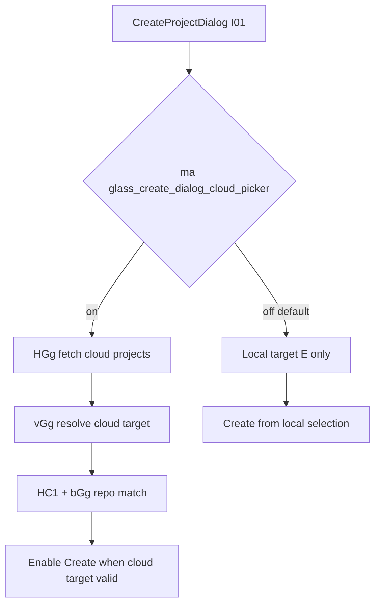

# Detective report: `glass_create_dialog_cloud_picker`

## Objective

Determine what the Cursor client feature flag `glass_create_dialog_cloud_picker` controls in Cursor **3.17.6** (commit `4402af7614d46247d892117a612a9072fa99110f`): confirm registry entry, locate gate call sites, document UI/behavior changes, and list modules touched.

**Scope:** Read-only forensics on extracted workbench bundles. No live Cursor install.

**Success criteria:** Tagged findings, registry verified, call sites resolved, plan at this path.

**Assumptions:** `ma(SGg)` is the reactive feature-gate hook (`getFeatureGateProperty`) where `SGg = "glass_create_dialog_cloud_picker"`.

---

## Environment

| Field | Value |
|-------|-------|
| OS | Linux 6.12.94+ |
| Cursor version | 3.17.6 |
| Commit | `4402af7614d46247d892117a612a9072fa99110f` |
| `locate-cursor.sh` | `install_status=not_found` |
| Workbench (fixed extract) | `…/workbench.desktop.main.js` + `…/workbench.glass.main.js` |
| Pre-grep | `/workspace/workspace/runs/20260820T110500Z/greps/glass-create-dialog-cloud-picker.json` |

---

## Scan checklist

| Script | Exit | Result |
|--------|------|--------|
| `locate-cursor.sh` | 0 | No install; used fixed extract path |
| `scan-paths.sh` | 0 | No global `state.vscdb` |
| `grep-workbench.sh` (desktop) | 0 | 1 hit — registry only |
| `grep-workbench.sh` (glass) | 0 | 2 hits — registry + `SGg` alias module |
| Phase 4b | — | Modules: `create-project-dialog-create-gating.js`, `create-project-dialog.react.js`, `new-project-cloud-picker*.js` |

---

## Findings

### Registry entry (Confirmed)

```text
glass_create_dialog_cloud_picker:{client:!0,default:!1}
```

- **Confirmed:** `client: true`, **`default: false`**.

### Call sites (Confirmed — Glass Create Project dialog)

- **Confirmed:** Constant alias in module `create-project-dialog-create-gating.js`:

```text
SGg="glass_create_dialog_cloud_picker"
```

- **Confirmed:** Primary consumer — `CreateProjectDialog` component (`I01`):

```text
h=ma(SGg)
```

  Reactive boolean `h` drives the entire cloud-picker code path in the create-project dialog.

- **Confirmed:** When `h === true`:
  - `HGg({…, newProjectActive: h, …})` loads Origin **cloud projects** and GitHub connect state.
  - `qGg({cloudProjects: ne, enabled: h && !ee && !R && !te, …})` resolves default cloud target from cloud projects + logical environments.
  - `se = vGg({cloudProjects, logicalEnvironments, selectedTarget})` resolves selected target against available cloud repo groups.
  - `le = h ? se : E` — selected submit target prefers cloud-resolved target when picker enabled.
  - `HC1({cloudPickerEnabled: h, resolvedCloudTarget: se, cloudProjects: ne, …})` gates the **Create** button.

- **Confirmed:** Create-button gating (`HC1` in `new-project-cloud-picker-utils.js`):

```text
return … t ? (!s||l) && !o && !a && bGg(n,i,r,l) : e!==void 0 && !pG(e) && !z8(e)
```

  When `cloudPickerEnabled` (`t`) is true, creation requires successful cloud repo resolution via `bGg(resolvedCloudTarget, cloudProjects, logicalEnvironments, newRepositorySelectable)` plus GitHub connect / loading guards.

- **Confirmed:** When `h === false` (default): dialog uses local target selection (`E`) only; cloud project fetch and cloud target resolution paths are inactive (`enabled: h && …` guards).

- **Inferred:** Sibling flag `glass_project_new_repo_entrypoint` is consulted as `elt("glass_project_new_repo_entrypoint", h && !Y)` — cloud picker interacts with new-repo entrypoint when private worker not selected.

### Desktop / other surfaces (Confirmed negative)

- **Confirmed:** No `ma(SGg)`, `checkFeatureGate(SGg)`, or `s_("glass_create_dialog_cloud_picker")` in desktop bundle — **registry-only** on desktop.

### Effective value (Confirmed fallback)

- Local catalog fallback **`false`** via `MBe[e]?.default??!1`.
- **Unknown:** Live Statsig override.

### Modules touched

| Module | Role | Tag |
|--------|------|-----|
| `create-project-dialog-create-gating.js` | Defines `SGg`; exports `HC1` create-button gating | **Confirmed** |
| `create-project-dialog.react.js` | `CreateProjectDialog` (`I01`) — `h=ma(SGg)` | **Confirmed** |
| `new-project-cloud-picker-utils.js` | `bGg` repo matching, cloud target helpers | **Confirmed** |
| `new-project-cloud-picker.react.js` | Cloud picker UI (menu/footer) | **Inferred** (import graph + module list) |
| `use-new-project-cloud-projects.react.js` | Cloud project query hooks | **Inferred** |
| `project-submit-target.js` | `HGg`, `vGg` target resolution | **Confirmed** |
| `origin-cloud-projects.js` / Origin hooks | Cloud project data source | **Inferred** |

---

## Internal code map

| Entry point | Snippet / behavior |
|-------------|-------------------|
| Registry | `glass_create_dialog_cloud_picker:{client:!0,default:!1}` |
| Alias | `SGg="glass_create_dialog_cloud_picker"` |
| Gate read | `h=ma(SGg)` in `I01` |
| Cloud load | `HGg({newProjectActive: h, …})` |
| Target resolve | `vGg({cloudProjects, logicalEnvironments, selectedTarget})` when `h` |
| Create gate | `HC1({cloudPickerEnabled: h, …})` → `bGg(…)` when cloud mode |
| Submit target | `le = h ? se : E` |

**Confidence:** **Confirmed** — gate hook and downstream cloud-picker wiring are explicit in glass bundle.

**One-line behavior:** Enables an **Origin cloud project picker** in the Glass **Create Project** dialog (repo/environment selection + stricter create gating); default off keeps local-only target selection.

---

## Diagram



---

## Gaps & follow-ups

| Gap | Attempted | Blocker |
|-----|-----------|---------|
| Exact picker UI component tree | Module list + `I01` body | Minified JSX; inferred subcomponents |
| Live Statsig | No session | VM has no Cursor user state |
| Desktop parity | Desktop grep | Confirmed absent |

---

## Workspace relevance

Wave-4b flag: **Glass create-project flow only**, default off. Enables cloud-origin repo/environment picker UX in new-project dialog.
