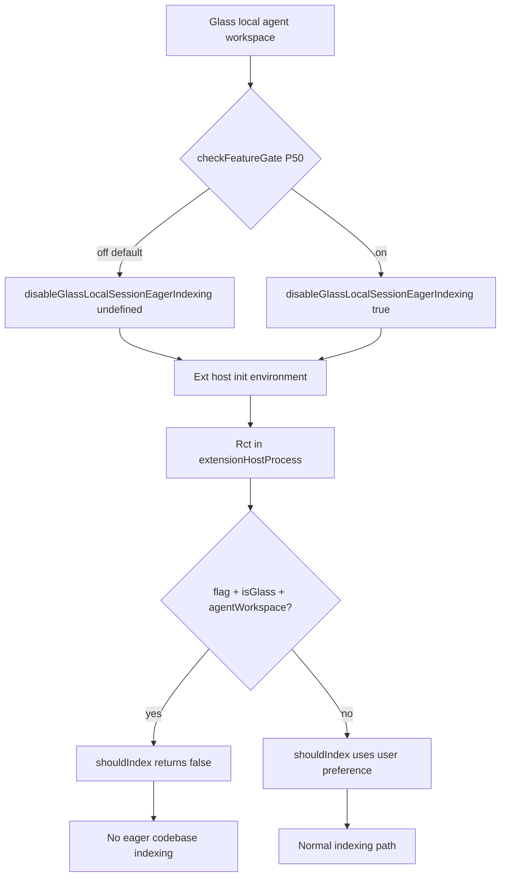

# Detective report: `glass_disable_eager_indexing_for_local_sessions`

## Objective

Determine what `glass_disable_eager_indexing_for_local_sessions` controls in Cursor **3.17.6**: registry shape, gate call sites, end-to-end behavior from workbench through extension host indexing, and modules touched.

**Scope:** Extracted workbench bundles + `extensionHostProcess.js`. Read-only.

**Success criteria:** Confirmed workbench → ext-host → indexing chain documented with evidence tags.

---

## Environment

| Field | Value |
|-------|-------|
| Cursor version | 3.17.6 |
| Commit | `4402af7614d46247d892117a612a9072fa99110f` |
| Workbench | Fixed extract paths (desktop + glass) |
| Extension host | `…/out/vs/workbench/api/node/extensionHostProcess.js` |
| Pre-grep | `/workspace/workspace/runs/20260820T110500Z/greps/glass-disable-eager-indexing-for-local-sessions.json` |

---

## Scan checklist

| Script | Exit | Result |
|--------|------|--------|
| `locate-cursor.sh` | 0 | No install |
| `scan-paths.sh` | 0 | No `state.vscdb` |
| `grep-workbench.sh` (desktop) | 0 | 2 hits — registry + `YQ_` alias |
| `grep-workbench.sh` (glass) | 0 | 2 hits — registry + `P50` alias |
| Ext-host grep | — | `disableGlassLocalSessionEagerIndexing` + `Rct` consumer in `extensionHostProcess.js` |

---

## Findings

### Registry entry (Confirmed)

```text
glass_disable_eager_indexing_for_local_sessions:{client:!0,default:!1}
```

- **Confirmed:** `client: true`, **`default: false`** (`!1`).

### Workbench call site (Confirmed)

- **Confirmed:** Alias constants:
  - Glass: `P50="glass_disable_eager_indexing_for_local_sessions"`
  - Desktop: `YQ_="glass_disable_eager_indexing_for_local_sessions"`

- **Confirmed:** Single behavioral read in `_createExtHostInitData()` (local extension host handshake), glass bundle:

```text
r = isGlass
  && glassWorkspaceRole === "agentWorkspace"
  && bcIdForThisWindow === undefined
  && (role === undefined || role === 1)
  && experimentService.checkFeatureGate(P50, {disableExposureLog:!1})
```

- **Confirmed:** Flag value forwarded to extension host environment payload:

```text
disableGlassLocalSessionEagerIndexing: r || void 0
```

  along with `isGlass`, `glassWorkspaceRole`, `clientLocalMode`, etc.

- **Inferred:** Conditions limit the flag to **local Glass agent workspace sessions** (not cloud bcId windows, not shadow windows) on the primary local extension host role.

### Extension host consumer (Confirmed)

- **Confirmed:** `extensionHostProcess.js` function `Rct`:

```text
function Rct({environment:e, userPreference:n}) {
  return e.shadowWindowForWorkspaceId
    || e.bcIdForThisWindow
    || (e.disableGlassLocalSessionEagerIndexing===!0
        && e.isGlass===!0
        && e.glassWorkspaceRole==="agentWorkspace")
    ? !1
    : n
}
```

- **Confirmed:** `shouldIndex()` on cursor-retrieval control surface:

```text
shouldIndex(){ return Rct({ environment: this._initData.environment, userPreference: this._shouldIndex }) }
```

- **Confirmed behavior when flag is ON:**
  1. Workbench sets `disableGlassLocalSessionEagerIndexing: true` in ext-host init.
  2. `Rct` returns **`false`** regardless of user indexing preference (`_shouldIndex`).
  3. **`shouldIndex()` becomes false** → eager codebase indexing suppressed for that session.

- **Confirmed behavior when flag is OFF (default):** `disableGlassLocalSessionEagerIndexing` is `undefined`; `Rct` falls through to `userPreference` (`_shouldIndex`, normally true) — indexing proceeds per user/settings.

- **Inferred:** Despite the name “disable eager indexing”, the implementation gates the general **`shouldIndex()`** path for local Glass agent workspaces, not a separately named “eager” subroutine in the bundle.

### Related flags (Inferred context)

- **Inferred:** Neighbor registry flags `disable_codebase_indexing:{default:!0}` and `instant_grep_indexing:{default:!1}` are separate killswitches; this flag is a **Glass-local-session-specific** override routed through ext-host init.

### Effective value (Confirmed fallback)

- Catalog default **`false`** → indexing unchanged unless Statsig enables flag.
- **Unknown:** Production Statsig rollout percentage.

### Modules touched

| Module / surface | Role | Tag |
|------------------|------|-----|
| kFe/`MBe` catalog | Registry | **Confirmed** |
| Workbench ext-host manager (`_createExtHostInitData`) | Reads `checkFeatureGate(P50)`; sets init env field | **Confirmed** |
| `extensionHostProcess.js` (`Rct`) | Intercepts `shouldIndex()` | **Confirmed** |
| `cursor-retrieval` ext host (`shouldIndex`) | Indexing enablement | **Confirmed** |
| `L50` watchdog class (same workbench segment) | Local ext-host startup timing — adjacent, not gated by flag | **Confirmed** (orthogonal) |

---

## Internal code map

| Stage | Snippet |
|-------|---------|
| Registry | `glass_disable_eager_indexing_for_local_sessions:{client:!0,default:!1}` |
| Gate read | `checkFeatureGate(P50,{disableExposureLog:!1})` in `_createExtHostInitData` |
| Init payload | `disableGlassLocalSessionEagerIndexing:r\|\|void 0` |
| Ext-host guard | `Rct` → false when env flag + glass agent workspace |
| Indexing API | `shouldIndex(){return Rct({…})}` |

**Confidence:** **Confirmed** — full workbench → ext-host → `shouldIndex()` chain with cited snippets.

**One-line behavior:** When enabled on a **local Glass agent workspace**, passes a flag that forces **`shouldIndex()` false** in the retrieval extension host, suppressing codebase indexing for that session; default off preserves normal indexing preference.

---

## Diagram



---

## Gaps & follow-ups

| Gap | Attempted | Blocker |
|-----|-----------|---------|
| Exact workbench module filename for `_createExtHostInitData` | 500k-char backward search | Function lives in late mega-chunk without nearby module header |
| User-visible indexing UI feedback | `indexing-codebase-status.react.js` exists | No runtime to observe status bar when flag toggled |
| Statsig rollout | No session | Unknown live default |

---

## Workspace relevance

Wave-4b: **performance/isolation knob** for local Glass agent sessions — disables retrieval indexing via ext-host env bridge; default **off** (indexing allowed).
