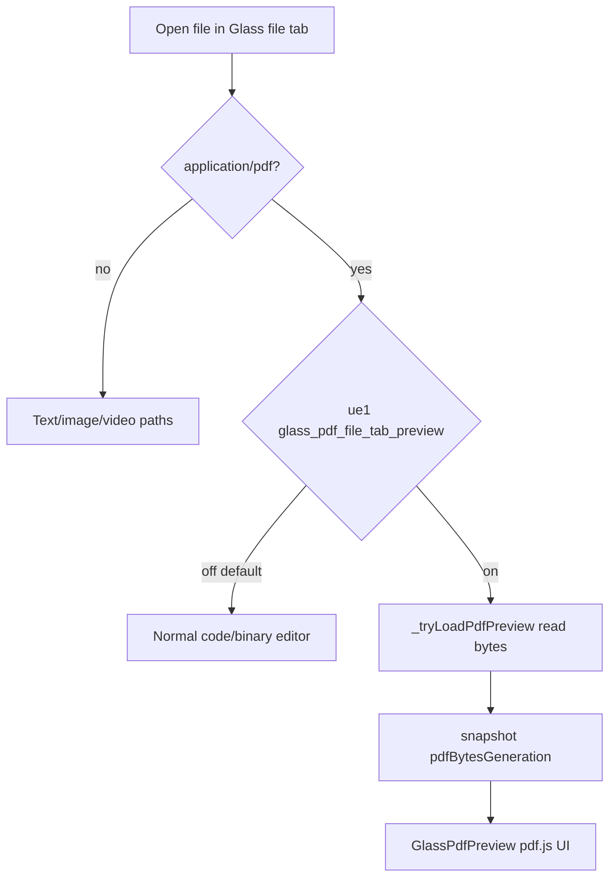

# Detective report: `glass_pdf_file_tab_preview`

## Objective

Determine what `glass_pdf_file_tab_preview` controls in Cursor **3.17.6**: registry, gate helpers, file-tab routing behavior, preview implementation, and modules touched.

**Scope:** Glass workbench bundle (primary consumer); desktop registry cross-check.

---

## Environment

| Field | Value |
|-------|-------|
| Cursor version | 3.17.6 |
| Commit | `4402af7614d46247d892117a612a9072fa99110f` |
| Workbench | Fixed extract (desktop + glass) |
| Pre-grep | `/workspace/workspace/runs/20260820T110500Z/greps/glass-pdf-file-tab-preview.json` |

---

## Scan checklist

| Script | Exit | Result |
|--------|------|--------|
| `locate-cursor.sh` | 0 | No install |
| `scan-paths.sh` | 0 | No `state.vscdb` |
| `grep-workbench.sh` (desktop) | 0 | 1 hit — registry only |
| `grep-workbench.sh` (glass) | 0 | 2 hits — registry + gate module |
| Phase 4b | — | PDF preview module cluster identified |

---

## Findings

### Registry entry (Confirmed)

```text
glass_pdf_file_tab_preview:{client:!0,default:!1}
```

- **Confirmed:** `client: true`, **`default: false`**.

### Gate helpers (Confirmed)

Module `glass-pdf-preview-gate.js`:

```text
jSl="glass_pdf_file_tab_preview"
function XAi(t){ return t.checkFeatureGate(jSl,{disableExposureLog:!0}) }
function ue1(t){ return t.checkFeatureGate(jSl,{disableExposureLog:!1}) }
```

- **`ue1`**: exposure-logging gate — used for primary routing decision.
- **`XAi`**: silent gate — eligibility, large-file handling, refresh paths without extra exposure events.

### Call sites (Confirmed — Glass file tabs)

Primary consumer: `glass-editor-handle.js` (`nhe` editor handle class).

| Method / site | Gate | Behavior |
|---------------|------|----------|
| `_shouldRouteToPdfPreview(path)` | `ue1(experimentService)` | Returns true for eligible `.pdf` paths when flag on |
| `_shouldHoldPdfPreviewWhileWaiting(path)` | `XAi` | Holds PDF preview state while waiting |
| `_tryLoadBinaryMedia` / `_refreshMedia` | `XAi` + `ZAi(mime)` | Loads PDF bytes into snapshot when flag on |
| `_loadCodeFile` large-file branch | `XAi` + `ZAi` | PDFs exempt from large-file text gate when flag on |
| `_collapseFileTreeSidebarForMediaPreview` | `XAi` via `de1(path, gate)` | Collapses file tree for media preview |

- **Confirmed:** PDF detection helper:

```text
function ZAi(t){ return t==="application/pdf" }
function he1({path,isPreviewEnabled}){ return ZAi(xLe(path)) ? isPreviewEnabled : !1 }
```

- **Confirmed routing flow when **`ue1` true** and path is PDF:
  1. `_shouldRouteToPdfPreview` → true
  2. Editor model cleared; snapshot `contentType:"pdf"`
  3. `_tryLoadPdfPreview` reads file bytes (size cap `JAi`)
  4. `_publishPdfBytes` sets `pdfBytesGeneration` on snapshot
  5. UI layer `use-file-tab-editor-panel-presentation.react.js` renders `GlassPdfPreview` (`FXg`) with pdf.js worker (`glass-pdfjs-loader.js`, `pdf.worker.min.mjs`)

- **Confirmed:** When flag **off** (default): `_shouldRouteToPdfPreview` false → PDFs follow normal text/binary editor path (no inline pdf.js preview panel).

- **Confirmed:** Image/video preview paths use separate `oRn` / `Khs` helpers in `glass-viewable-media.js` — PDF preview is **additive** behind this flag.

### Desktop (Confirmed negative)

- Registry only in `workbench.desktop.main.js`; gate module and `XAi`/`ue1` consumers absent.

### Effective value (Confirmed fallback)

- Default **`false`** — PDF file tabs do not use Glass inline preview unless Statsig enables flag.
- **Unknown:** Live Statsig override.

### Modules touched

| Module | Role | Tag |
|--------|------|-----|
| `glass-pdf-preview-gate.js` | `XAi`, `ue1`, `jSl` constant | **Confirmed** |
| `glass-pdf-preview-routing.js` | `he1` path-level PDF preview check | **Confirmed** |
| `glass-viewable-media.js` | `ZAi`, `de1`, `gBg` media snapshot helpers | **Confirmed** |
| `glass-editor-handle.js` | File load routing, PDF bytes, `_shouldRouteToPdfPreview` | **Confirmed** |
| `glass-pdf-preview.react.js` | `GlassPdfPreview` / `FXg` React UI | **Confirmed** |
| `glass-pdfjs-loader.js` | pdf.js worker loader | **Confirmed** |
| `use-file-tab-editor-panel-presentation.react.js` | Renders PDF preview pane in file tab | **Confirmed** |
| `file-tab-content.react.js` | File tab presentation shell | **Inferred** |

---

## Internal code map

| Entry | Snippet |
|-------|---------|
| Registry | `glass_pdf_file_tab_preview:{client:!0,default:!1}` |
| Gate | `ue1(t)=>t.checkFeatureGate(jSl,{disableExposureLog:!1})` |
| Route | `_shouldRouteToPdfPreview(t){ return eligible ? ue1(this._experimentService) : !1 }` |
| Load | `_tryLoadPdfPreview` → `_publishPdfBytes` → `contentType:"pdf"`, `pdfBytesGeneration` |
| Render | `<GlassPdfPreview pdfBytesGeneration={…} getPdfBytes={…} />` |

**Confidence:** **Confirmed** — gate helpers, routing, loader, and React preview component all present in glass bundle.

**One-line behavior:** Enables **inline pdf.js preview** for PDF files opened in **Glass editor file tabs**; default off keeps PDFs on the standard editor/binary path.

---

## Diagram



---

## Gaps & follow-ups

| Gap | Attempted | Blocker |
|-----|-----------|---------|
| Max PDF size constant `JAi` numeric value | Bundle parse | Minified constant; behavior confirmed (too-large → error snapshot) |
| Remote SSH PDF parity | `Khs` handles vscode-remote | Not runtime-tested |
| Statsig rollout | No session | Unknown |

---

## Workspace relevance

Wave-4b: **Glass file-tab media feature**, default off. Adds PDF preview pane alongside existing image/video preview infrastructure.
