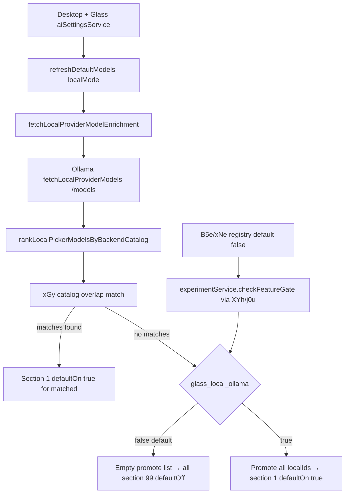

# Detective: feature-flag-glass-local-ollama

## Objective

Determine what the Cursor 3.21.1 client feature flag `glass_local_ollama` controls: registry definition (B5e/xNe), runtime `checkFeatureGate` call sites, effective default, modules touched, and local-mode Ollama model-picker behavior when enabled vs disabled.

**Scope:** Extracted install at `/workspace/workspace/runs/20260916T112727Z/extract/new/` (commit `74f717017ddcbf0554cd8c91ec7e2fb56983a07f`).

**Success criteria:** Confirm B5e/xNe registry entry, enumerate `checkFeatureGate` call sites, describe catalog-overlap vs promote-all fallback in local model ranking, tag findings Confirmed/Inferred/Unknown.

**Assumptions:** Inventory `client=true, default=false` is authoritative for bundled default. Flag name is literal `glass_local_ollama`. Local mode (`Ml.localMode` / `qc.localMode`) is required for the ranking path to run.

**Unknowns:** Remote Statsig assignment per account; live Ollama catalog overlap scenarios without a running local provider; whether Glass-specific UI differs from desktop when both share the same gate in local mode.

## Environment

| Item | Value |
|------|-------|
| OS | Linux |
| Cursor version | 3.21.1 |
| Commit | `74f717017ddcbf0554cd8c91ec7e2fb56983a07f` |
| `locate-cursor.sh` | exit 0; `install_status=not_found` (no live install) |
| Workbench used | `/workspace/workspace/runs/20260916T112727Z/extract/new/usr/share/cursor/resources/app/out/vs/workbench/workbench.desktop.main.js` |
| Glass twin | `/workspace/workspace/runs/20260916T112727Z/extract/new/usr/share/cursor/resources/app/out/vs/workbench/workbench.glass.main.js` |
| Inventory | `/workspace/workspace/runs/20260916T112727Z/feature-flags-inventory.json` |

## Scan checklist

| Script | Exit | Result |
|--------|------|--------|
| `locate-cursor.sh` | 0 | No live Cursor install; `WORKBENCH_JS` empty |
| `scan-paths.sh` | 0 | No `~/.config/Cursor` state DB; projects root exists |
| `grep-workbench.sh --file …desktop… --pattern glass_local_ollama` | 0 | 2 hits (registry + constant export) |
| `grep-workbench.sh --file …glass… --pattern glass_local_ollama` | 0 | 2 hits (registry + constant export) |
| `grep-workbench.sh --file …desktop… --pattern checkFeatureGate\("glass_local_ollama` | 0 | 0 hits (gate uses minified constant `j0u`) |
| `grep-workbench.sh --file …glass… --pattern checkFeatureGate\("glass_local_ollama` | 0 | 0 hits (gate uses minified constant `XYh`) |
| Bundle grep `checkFeatureGate(j0u\|XYh)` | — | 1 runtime gate each in desktop + glass (`rankLocalPickerModelsByBackendCatalog`) |
| Module enumeration (`O({"*.js"`) in bundles) | — | Theme hits: `localProviderModelEnrichment.js`, `localProviderModelMatch.js`, `aiSettingsService.js`, `experimentConfig.gen.js`, `experimentService.js` |
| `inspect-state-vscdb.sh` | — | Not run; `state.vscdb` absent on VM |

## Findings

### Registry (Confirmed)

- **Desktop symbol `B5e`** and **glass symbol `xNe`** in `experimentConfig.gen.js`:
  ```
  glass_local_ollama:{client:!0,default:!1}
  ```
- **Inventory** (`feature-flags-inventory.json`, sourced from kFe/B5e extraction): `client: true`, `default: false` — matches bundle.
- Sibling flags in the same registry cluster: `agent_host_local_loop`, `agent_host_updater`, `agent_host_private_inference`.

### Constant export (Confirmed)

- `localProviderModelEnrichment.js` exports the flag name as a string constant to avoid literal duplication:
  - Desktop: `j0u="glass_local_ollama"`
  - Glass: `XYh="glass_local_ollama"`
- Imports `localProviderModelMatch.js` (`F0u` / `GYh`) which defines overlap helpers `KYh`, `VYh`, `xGy` / `ygf`.

### Call sites (Confirmed — wired in desktop **and** glass)

| Location | Role | Tag |
|----------|------|-----|
| `workbench.desktop.main.js` (`B5e`) | Registry definition | Confirmed |
| `workbench.glass.main.js` (`xNe`) | Registry definition | Confirmed |
| `aiSettingsService.js` → `rankLocalPickerModelsByBackendCatalog` | Sole runtime gate (both bundles) | Confirmed |
| `localProviderModelMatch.js` → `xGy` / `ygf` | Overlap ranking with `promoteAllWithoutOverlap` callback | Confirmed |

**Runtime gate (Confirmed, both bundles, `{disableExposureLog:!1}`):**

```
rankLocalPickerModelsByBackendCatalog(pickerModels, catalogModels) {
  const localIds = pickerModels.map(m => m.name);
  const promoted = xGy(catalogModels, localIds, {
    promoteAllWithoutOverlap: () => this._experimentService.checkFeatureGate(XYh/j0u, {disableExposureLog:!1})
  });
  // promoted → section 1, defaultOn true; remainder → section 99, defaultOn false
}
```

Despite the `glass_` prefix, the gate is **not Glass-only** — desktop `aiSettingsService.refreshDefaultModels` uses the identical path when `qc.localMode` is true.

### What it changes (Confirmed)

Flow (local mode only):

1. `aiSettingsService.refreshDefaultModels` awaits experiment refresh, then calls `fetchLocalProviderModelEnrichment()`.
2. `fetchLocalProviderModelEnrichment` hits `_localInferenceService.fetchLocalProviderModels` (Ollama `/models` via configured `baseUrl`).
3. Deserialized `pickerModels` are passed to `rankLocalPickerModelsByBackendCatalog` along with the backend inference catalog (`u`).
4. `xGy` / `ygf` finds backend catalog entries (lowest `namedModelSectionIndex`) whose names/aliases overlap local model IDs via `KYh`.
5. **When overlap matches exist:** matched local models are promoted to section 1 (`defaultOn: true`); others fall to section 99 — **flag state irrelevant**.
6. **When overlap matches are empty:**
   - Gate **off** (bundled default **false**): `xGy` returns `[]` → **no** models promoted → all local Ollama models land in section 99 with `defaultOn: false` (hidden from default picker selection).
   - Gate **on**: `xGy` returns `[...localIds]` → **all** local Ollama models promoted to section 1 with `defaultOn: true`.

**Inferred:** Flag name reflects Glass-local-Ollama rollout intent; behavior is a fallback to surface all local provider models in the picker when backend catalog naming does not overlap Ollama model IDs (common when Ollama serves custom or unprefixed model names).

### Effective value (Confirmed default; Unknown live override)

| Source | Value |
|--------|-------|
| Bundled default (`B5e` / `xNe` / inventory) | **false** (strict catalog-overlap promotion only) |
| Local `state.vscdb` / Statsig bootstrap | **not probeable** (no Cursor user config on this VM) |
| Dev override (`setFeatureFlagOverride`) | Available via `experimentService` |
| Effective in clean install without remote enable | **false** |

### Local override (Confirmed mechanism)

- `experimentService.setFeatureFlagOverride("glass_local_ollama", value)` — persisted with TTL, fires `_onDidChangeGates`.
- Remote Statsig assignment via `experimentService.checkFeatureGate` → `_statsig.checkGate` with fallback `xNe[t]?.default ?? !1`.
- Gate uses `disableExposureLog: false` (unlike many Glass perf flags), so Statsig exposure is logged when evaluated during model refresh.

## Internal code map

| Module | Entry point | Snippet / API |
|--------|-------------|---------------|
| `experimentConfig.gen.js` | `B5e` / `xNe` registry | `glass_local_ollama:{client:!0,default:!1}` |
| `localProviderModelEnrichment.js` | `j0u` / `XYh` constant | `XYh="glass_local_ollama"` |
| `localProviderModelMatch.js` | `xGy`, `KYh`, `VYh` | Overlap match; `promoteAllWithoutOverlap()` fallback to `[...e]` |
| `experimentService.js` | `checkFeatureGate(t,e)` | Statsig gate or registry default fallback |
| `aiSettingsService.js` | `refreshDefaultModels` | Local-mode branch calling `fetchLocalProviderModelEnrichment` |
| `aiSettingsService.js` | `fetchLocalProviderModelEnrichment` | `_localInferenceService.fetchLocalProviderModels({baseUrl,...})` |
| `aiSettingsService.js` | `rankLocalPickerModelsByBackendCatalog` | Gate → `xGy` → `withLocalPickerSection(model, 1\|99, defaultOn)` |
| `aiSettingsService.js` | `withLocalPickerSection` | Sets `namedModelSectionIndex` + `defaultOn` on picker row |

**Confirmed overlap fallback (`localProviderModelMatch.js` / `xGy`):**

```
function xGy(catalog, localIds, opts) {
  // ... match catalog entries to localIds via KYh ...
  return matches.length === 0 && opts.promoteAllWithoutOverlap() ? [...localIds] : matches;
}
```

**Confirmed gate wiring (`aiSettingsService.js`):**

```
rankLocalPickerModelsByBackendCatalog(t,e){
  const n=t.map(a=>a.name),
  i=xGy(e,n,{promoteAllWithoutOverlap:()=>this._experimentService.checkFeatureGate(XYh,{disableExposureLog:!1})}),
  ...
  for(const a of i) o.push(this.withLocalPickerSection(l,1,!0));
  for(const a of t) s.has(a.name)||o.push(this.withLocalPickerSection(a,99,!1));
}
```

**Confirmed local fetch (`aiSettingsService.js`):**

```
async fetchLocalProviderModelEnrichment(){
  if(!Ml.localMode) return {allProviderModelIds:[],succeeded:!0};
  const t=await this.getLocalInferenceProviderConfig(),
  e=await this._localInferenceService.fetchLocalProviderModels({baseUrl:t.baseUrl,...});
  ...
}
```

## Diagram



## Gaps & follow-ups

- No live Ollama instance on this VM — cannot confirm runtime picker UI with/without catalog overlap (**Unknown** UX delta; code paths **Confirmed**).
- `state.vscdb` absent — cannot confirm per-user Statsig assignment or persisted dev overrides.
- Flag name implies Glass-only scope but runtime gate is shared with desktop local mode — naming vs wiring mismatch documented as **Inferred** rollout artifact.

## Workspace relevance

Not applicable — flag controls local Ollama model picker promotion during `refreshDefaultModels` in local inference mode; no project-artifact or transport coupling.
