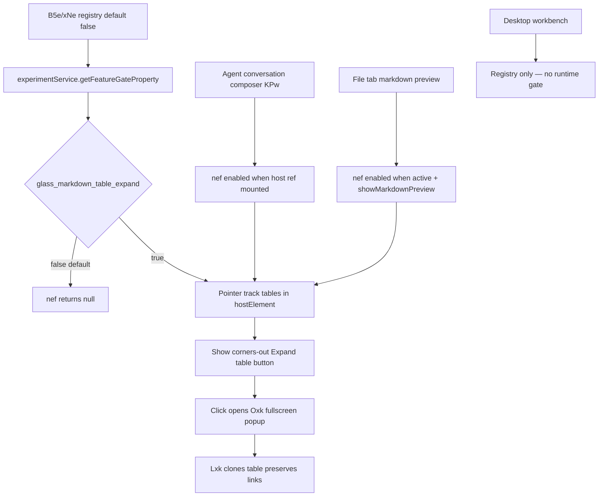

# Detective: feature-flag-glass-markdown-table-expand

## Objective

Determine what the Cursor 3.21.1 client feature flag `glass_markdown_table_expand` controls: registry definition (B5e/xNe), runtime gate call sites, effective default, modules touched, and UI behavior when enabled vs disabled.

**Scope:** Extracted install at `/workspace/workspace/runs/20260916T112727Z/extract/new/` (commit `74f717017ddcbf0554cd8c91ec7e2fb56983a07f`).

**Success criteria:** Confirm B5e/xNe registry entry, enumerate Glass runtime gates, describe markdown-table expand affordance and overlay behavior, tag findings Confirmed/Inferred/Unknown.

**Assumptions:** Inventory `client=true, default=false` is authoritative for bundled default. Flag name is literal `glass_markdown_table_expand`.

**Unknowns:** Remote Statsig assignment per account; live hover/overlay UX without Glass UI session.

## Environment

| Item | Value |
|------|-------|
| OS | Linux |
| Cursor version | 3.21.1 |
| Commit | `74f717017ddcbf0554cd8c91ec7e2fb56983a07f` |
| `locate-cursor.sh` | exit 0; `install_status=not_found` (no live install) |
| Workbench used | `/workspace/workspace/runs/20260916T112727Z/extract/new/usr/share/cursor/resources/app/out/vs/workbench/workbench.desktop.main.js` |
| Glass twin | `/workspace/workspace/runs/20260916T112727Z/extract/new/usr/share/cursor/resources/app/out/vs/workbench/workbench.glass.main.js` |
| Inventory | `/workspace/workspace/runs/20260916T112727Z/feature-flags-inventory.json` |

## Scan checklist

| Script | Exit | Result |
|--------|------|--------|
| `locate-cursor.sh` | 0 | No live Cursor install; `WORKBENCH_JS` empty |
| `scan-paths.sh` | 0 | No `~/.config/Cursor` state DB; projects root exists |
| `grep-workbench.sh --file …desktop… --pattern glass_markdown_table_expand` | 0 | 1 hit (registry snippet in B5e) |
| `grep-workbench.sh --file …glass… --pattern glass_markdown_table_expand` | 0 | 2 hits (registry + `ief` constant in host module) |
| `grep-workbench.sh --file …glass… --pattern checkFeatureGate\("glass_markdown_table` | 0 | 0 hits (gate via `use-feature-gate.react.js` `Gb(ief)` hook, not inline string) |
| Module enumeration (`=O({"*.js"`) in glass bundle) | — | Theme hits: `glass-markdown-table-expand.js`, `glass-markdown-table-expand-host.react.js`, `glass-markdown-table-expand-overlay.react.js`, `use-feature-gate.react.js` |
| `inspect-state-vscdb.sh` | — | Not run; `state.vscdb` absent on VM |

## Findings

### Registry (Confirmed)

- **Desktop symbol `B5e`** and **glass symbol `xNe`** in `experimentConfig.gen.js`:
  ```
  glass_markdown_table_expand:{client:!0,default:!1}
  ```
- **Inventory** (`feature-flags-inventory.json`, sourced from kFe/B5e extraction): `client: true`, `default: false` — matches bundle.
- Sibling flags in same registry cluster: `glass_peaky_file_trees`, `glass_editor_panel_tab_copy_link`, `conversation_table_of_contents`.

### Call sites (Confirmed — wired in Glass only)

| Location | Role | Tag |
|----------|------|-----|
| `workbench.desktop.main.js` (`B5e`) | Registry definition only | Confirmed |
| `workbench.glass.main.js` (`xNe`) | Registry + runtime via `Gb(ief)` | Confirmed |
| `glass-markdown-table-expand-host.react.js` → `nef` | Hover expand-button host + overlay root | Confirmed |
| `agent-conversation-composer` → `KPw` | Mounts `nef` on conversation markdown host | Confirmed |
| File tab markdown preview renderer | Mounts `nef` when markdown preview active | Confirmed |

**Desktop:** `checkFeatureGate("glass_markdown_table_expand"` → **0 hits** (registry-only).

**Glass runtime gate (Confirmed):**

- Flag constant: `ief="glass_markdown_table_expand"` in `glass-markdown-table-expand-host.react.js`.
- Host component `nef` reads gate via `b=Gb(ief,g)` where `Gb` is `use-feature-gate.react.js`:
  ```
  function Gb(t,e,n){... s=va(t); ... r.checkFeatureGate(t,{disableExposureLog:!1})}
  function va(t){... i=n.getFeatureGateProperty(t); ... useSyncExternalStore ...}
  ```
- Component returns `null` when `!n||!b` — both the parent `enabled` prop **and** the feature gate must be true.

**Parent `enabled` preconditions (Confirmed):**

1. **Agent conversation composer (`KPw`)** — `enabled: hostElement !== null` (markdown DOM host ref mounted on composer root).
2. **File tab markdown preview** — `enabled: isActiveTab && showMarkdownPreview && !!filePath`.

### What it changes (Confirmed)

When **`glass_markdown_table_expand` is enabled**:

- Glass shows a hover **"Expand table"** affordance (`corners-out` icon, `data-component="glass-markdown-table-expand-button"`) on `<table>` elements inside the host markdown surface.
- Pointer tracking (`pointerover`/`pointermove`/`scroll`) detects tables via `yxk`/`Hxk`, positions button top-right using `Cxk` geometry (min width 24px, padding offsets 6px/2px).
- Click opens a fullscreen **expanded table overlay** (`Oxk` in `glass-markdown-table-expand-overlay.react.js`):
  - `dR.Popup` with `aria-label="Expanded table"`, aspect-ratio from viewport minus 40px padding.
  - Cloned table rendered in `Lxk` via `Txk`/`Ixk` (strips column resize handles, resets `--markdown-table-prose-cell-inline-size`, preserves link targets through `Sxl` WeakMap + `Axk`/`Pxk` click forwarding).
  - Close via backdrop, X button, or `onOpenChange`.

When **disabled** (bundled default **false**):

- `nef` host returns `null` immediately — no hover button, no expand overlay, markdown tables render inline only with existing prose styling (`--markdown-table-prose-cell-inline-size: 28ch` CSS).

**Inferred:** Feature is Glass-only markdown UX polish for wide tables in agent conversation and file-tab markdown preview surfaces; unrelated to `glass-csv-table` CSV/TSV file preview path.

### Effective value (Confirmed default; Unknown live override)

| Source | Value |
|--------|-------|
| Bundled default (`B5e` / `xNe` / inventory) | **false** (no expand affordance) |
| Local `state.vscdb` / Statsig bootstrap | **not probeable** (no Cursor user config on this VM) |
| Dev override (`setFeatureFlagOverride`) | Available via `experimentService` (same mechanism as other client flags) |
| Effective in clean install without remote enable | **false** |

### Local override (Confirmed mechanism)

- `experimentService.setFeatureFlagOverride("glass_markdown_table_expand", value)` — persisted with TTL, fires `_onDidChangeGates`.
- Remote Statsig assignment via `experimentService.checkFeatureGate` → `_statsig.checkGate` with fallback `xNe[t]?.default ?? !1`.
- React hook `Gb`/`va` subscribes to `getFeatureGateProperty(flag).event` for live updates.
- No dedicated dev-footer toggle found.

## Internal code map

| Module | Entry point | Snippet / API |
|--------|-------------|---------------|
| `experimentConfig.gen.js` | `B5e` / `xNe` registry | `glass_markdown_table_expand:{client:!0,default:!1}` |
| `experimentService.js` | `checkFeatureGate(t,e)` | Statsig gate or `xNe[t]?.default??!1` fallback |
| `use-feature-gate.react.js` | `Gb`, `va` | `Gb(ief,g)` → `va(t)` + exposure `checkFeatureGate` |
| `glass-markdown-table-expand.js` | `yxk`, `Hxk`, `Cxk`, `Txk`, `Ixk` | Table hit-test, button positioning, clone + link remap |
| `glass-markdown-table-expand-host.react.js` | `nef`, `ief` | Hover button host; gate + overlay dialog root |
| `glass-markdown-table-expand-overlay.react.js` | `Oxk`, `Lxk` | Fullscreen popup + cloned table reader |
| `agent-conversation-composer` | `KPw` | `nef({contentKey, enabled: hostElement!==null, hostElement})` |
| File tab markdown preview | row renderer | `nef({contentKey:filePath, enabled:isActive&&showMarkdownPreview, hostElement})` |

**Confirmed gate wiring (`glass-markdown-table-expand-host.react.js`):**

```
ief="glass_markdown_table_expand"
b=Gb(ief,g)
...
!n||!b return null
```

**Confirmed expand button (`nef` render path):**

```
dR.Trigger aria-label="Expand table" data-component="glass-markdown-table-expand-button"
onClick: p(u.table)  // opens Oxk overlay
```

**Confirmed overlay (`glass-markdown-table-expand-overlay.react.js`):**

```
dR.Popup aria-label="Expanded table" aspectRatio=i fullscreenViewportPadding:kxl(40)
children: Lxk({table}) + Close button
```

## Diagram



## Gaps & follow-ups

- No live Glass UI on this VM — hover positioning and overlay feel are **Unknown** (code paths confirmed).
- `state.vscdb` absent — cannot confirm per-user Statsig assignment or persisted dev overrides.
- Exact source filename for file-tab markdown preview parent component not isolated to a single `=O({"…js"})` header (minified adjacent to file-tab renderer bundle).

## Workspace relevance

Not applicable — flag controls Glass markdown table expand UX; no project-artifact or transport coupling.
