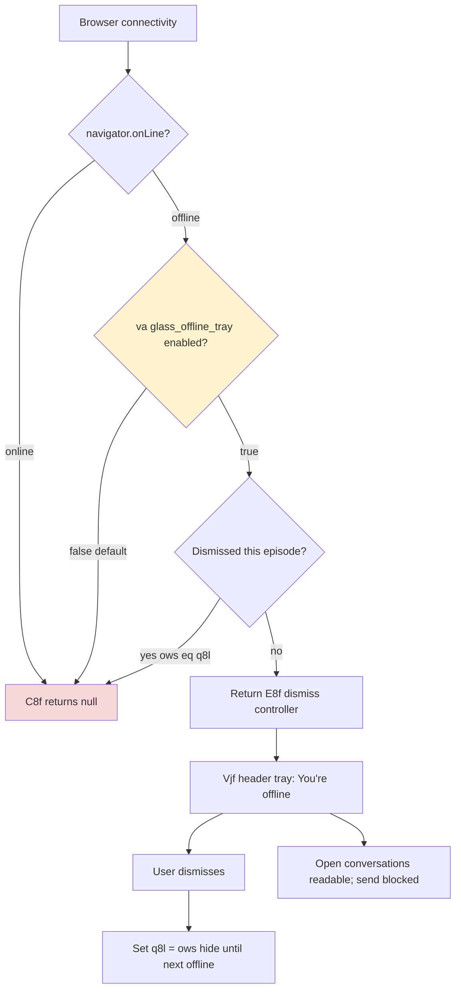

# Detective: `glass_offline_tray`

## Objective

Determine what the Cursor 3.21.1 client feature flag `glass_offline_tray` controls: registry definition (B5e/xNe), runtime gate call sites, effective default, modules touched, offline-detection behavior, and UI surfaces when enabled vs disabled.

**Scope:** Extracted AppImage workbench bundles (desktop + glass) under `/workspace/workspace/runs/20260916T112727Z/extract/new/`, feature-flag inventory, detective scripts.

**Success criteria:** Confirmed registry metadata, exhaustive gate-call search, module map with bundle snippets, tagged findings (Confirmed / Inferred / Unknown).

**Assumptions:**
- Inventory `client: true, default: false` reflects bundled effective value when Statsig is unreachable.
- `va("glass_offline_tray")` in the glass bundle is the reactive feature-gate hook (`experimentService.getFeatureGateProperty`).

**Unknowns:**
- Live Statsig gate assignment per account.
- Whether desktop/classic UI will ever consume this flag (currently glass-only runtime wiring).

---

## Environment

| Field | Value |
|-------|-------|
| OS | Linux 6.12.94+ |
| Cursor version | 3.21.1 |
| Commit | `74f717017ddcbf0554cd8c91ec7e2fb56983a07f` |
| `locate-cursor.sh` | exit 0; `install_status=not_found`, `WORKBENCH_JS` empty |
| Workbench (used) | `/workspace/workspace/runs/20260916T112727Z/extract/new/usr/share/cursor/resources/app/out/vs/workbench/workbench.desktop.main.js` |
| Glass twin | `/workspace/workspace/runs/20260916T112727Z/extract/new/usr/share/cursor/resources/app/out/vs/workbench/workbench.glass.main.js` |
| Inventory | `/workspace/workspace/runs/20260916T112727Z/feature-flags-inventory.json` |
| Manifest | New flag in 3.21.1, `category: "glass"` |

---

## Scan checklist

| Script | Exit | Result |
|--------|------|--------|
| `locate-cursor.sh` | 0 | No live Cursor install; used parent-provided extract path |
| `scan-paths.sh` | 0 | `global_state_vscdb_exists=false`; `projects_root_exists=true` (1 project) |
| `grep-workbench.sh --file …desktop… --pattern glass_offline_tray` | 0 | 1 hit — registry entry in `B5e` only |
| `grep-workbench.sh --file …glass… --pattern glass_offline_tray` | 0 | 2 hits — registry + runtime hook `C8f` |
| `grep-workbench.sh --file …glass… --pattern use-glass-offline-tray` | 0 | 1 hit — hook module header |
| Full-bundle grep `va("glass_offline_tray")` | — | **1** call site (glass only) |
| Full-bundle grep `checkFeatureGate("glass_offline_tray")` | — | **0** hits (glass uses `va()` hook, not string literal `checkFeatureGate`) |
| Module enumeration (`=O({"*.react.js"`)`) | — | `use-glass-offline-tray.react.js`, `glass-offline-tray.react.js`; related `glass-outage-alert-tray.react.js`, `use-glass-outage-alert.react.js`, `tray-constants.js` |

---

## Findings

### Registry entry — **Confirmed**

Bundled feature-gate registry objects include:

```
glass_offline_tray:{client:!0,default:!1}
```

- **Desktop symbol:** `B5e` in `experimentConfig.gen.js` (via `workbench.desktop.main.js`)
- **Glass symbol:** `xNe` in glass bundle registry cluster
- **Inventory** matches: `client: true`, `default: false`
- **Manifest:** listed as a **new flag** in 3.21.1 with `category: "glass"`

### Runtime gate call sites — **Confirmed** (Glass only)

| Bundle | Gate consumer | Count |
|--------|---------------|-------|
| `workbench.desktop.main.js` | Registry only | 0 runtime |
| `workbench.glass.main.js` | `va("glass_offline_tray")` inside hook `C8f()` | 1 |

Hook implementation (**Confirmed** snippet from `use-glass-offline-tray.react.js`):

```
function w8f(){return!Bt.navigator.onLine&&ows!==q8l}
function C8f(){
  const t=va("glass_offline_tray"),
        e=lOw(t?uOw:T8f,w8f,w8f);
  return t&&e?E8f:null
}
```

- Gate **off** (bundled default): `C8f()` returns `null` → no offline tray rendered.
- Gate **on**: subscribes to browser `online`/`offline` events; when offline and not dismissed, returns dismiss controller `E8f`.

**Desktop:** no runtime consumer — registry-only in 3.21.1 extract.

### Offline detection & dismiss semantics — **Confirmed**

| Mechanism | Behavior |
|-----------|----------|
| `uOw(subscriber)` | Registers `online`/`offline` window listeners; notifies subscribers on connectivity change |
| `cOw()` (offline handler) | Increments offline episode counter `ows`, notifies subscribers |
| `w8f()` | True when `!navigator.onLine` **and** user has not dismissed the current offline episode (`ows !== q8l`) |
| `E8f.dismiss()` | Sets `q8l = ows` (dismiss token for current episode); tray reappears on next offline event |

Dismiss is per offline episode, not persisted to storage (**Confirmed** — no reactive-storage key in hook module).

### UI when enabled — **Confirmed**

Component `Vjf` in `glass-offline-tray.react.js` renders shared header-tray primitive `r9t`:

| Property | Value |
|----------|-------|
| `title` | `"You're offline"` |
| `body` | `"Open conversations stay readable. Sending will fail until the connection returns."` |
| `role` | `"status"` |
| `dismissAction` | X button, `aria-label: "Dismiss offline notice"` |
| `visible` | `true` when rendered |

**Two render surfaces** (**Confirmed**):

1. **Agent panel header** — `Es=C8f()` → `lb(Vjf,{placement:"bottom",state:Es})` when surface active (`ga=n&&Es!==null`).
2. **Composer prompt-input tray stack** — `ne=C8f()` → `$A.push(s9(Vjf,{placement:"top",state:ne},"offline"))` alongside outage-alert and other header trays.

Tray does **not** block reading open conversations; copy explicitly states send will fail until connectivity returns (**Confirmed** from body string).

### Related but separate — **Confirmed**

`use-glass-outage-alert.react.js` / `glass-outage-alert-tray.react.js` handle **server-side portal outage alerts** (`portal_outage_alert` reactive-storage key, 24h dismiss TTL). That path is independent of `glass_offline_tray` and uses `I8f()` / `Yjf` — adjacent in the same composer header tray stacks but gated separately.

### Effective value — **Confirmed** (bundled default); **Unknown** (live Statsig)

| Source | Value |
|--------|-------|
| Inventory / registry `default` | `false` |
| `client` flag | `true` |
| Local `state.vscdb` override | **Unknown** — DB absent on VM |
| Statsig remote | **Unknown** — no live session |

**Prefer inventory default:** offline tray **hidden** unless gate enabled remotely or via dev override.

### Local override paths — **Inferred**

Same mechanism as other glass client gates: `experimentService.getFeatureGateProperty` / `setFeatureFlagOverride` (dev builds, TTL-persisted) plus remote Statsig assignment. No flag-specific storage key found.

---

## Internal code map

| Module / artifact | Role | Tag |
|-------------------|------|-----|
| `B5e` / `xNe` registry | Bundled gate definition (`client`, `default`) | **Confirmed** |
| `use-glass-offline-tray.react.js` | Hook `C8f`: gate + online/offline subscription + dismiss state | **Confirmed** |
| `glass-offline-tray.react.js` | Presentational tray `Vjf` ("You're offline") | **Confirmed** |
| `tray-constants.js` | Header-tray stack priorities (`J1s=241`, etc.) | **Confirmed** |
| `r9t` (shared tray primitive) | Renders title/body/dismiss for offline notice | **Confirmed** |
| Agent panel composer header | Consumes `C8f()` → bottom placement | **Confirmed** |
| Prompt-input tray stack | Consumes `C8f()` → top placement in `$A` tray list | **Confirmed** |
| `use-glass-outage-alert.react.js` | Separate server outage alert (not this flag) | **Confirmed** |
| `workbench.desktop.main.js` | Registry only — no offline tray UI | **Confirmed** |

**Entry points:**
- `va("glass_offline_tray")` → reactive gate boolean
- `C8f()` → `{ dismiss } | null`
- `Vjf({ placement, state })` → offline header tray UI
- Window events: `online`, `offline` via `uOw` / `cOw`

---

## Diagram



---

## Gaps & follow-ups

| Probe | Status |
|-------|--------|
| Live `state.vscdb` feature-gate overrides | **Blocked** — `~/.config/Cursor/User/globalStorage/state.vscdb` missing |
| Statsig remote gate value | **Blocked** — no authenticated Cursor session |
| Desktop/classic UI offline tray | **Confirmed absent** — no runtime wiring in `workbench.desktop.main.js` |
| Exact source repo paths (`out-build/...`) | **Partial** — react module filenames embedded in glass bundle; no separate source tree in extract |
| Send-blocking enforcement | **Inferred** — tray copy only; actual send failure likely handled by existing offline/network layers |

---

## Workspace relevance

`glass_offline_tray` is a **Glass-only UX flag** (new in 3.21.1) that surfaces a dismissible offline notice in composer header trays when the browser reports offline. Bundled default `false` means users on stock 3.21.1 builds see **no** offline tray unless Statsig or a dev override enables the gate. It complements — but does not replace — the separate portal outage-alert tray driven by server-pushed outage metadata.
