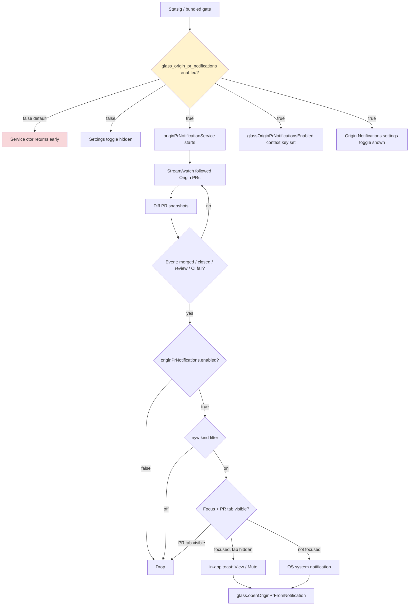

# Detective: `glass_origin_pr_notifications`

## Objective

Determine what the Cursor 3.21.1 client feature flag `glass_origin_pr_notifications` controls: registry definition (B5e/xNe), runtime gate call sites, effective default, modules touched, notification delivery behavior, and UI surfaces when enabled vs disabled.

**Scope:** Extracted AppImage workbench bundles (desktop + glass) under `/workspace/workspace/runs/20260916T112727Z/extract/new/`, feature-flag inventory, detective scripts.

**Success criteria:** Confirmed registry metadata, exhaustive gate-call search, module map with bundle snippets, tagged findings (Confirmed / Inferred / Unknown).

**Assumptions:**
- Inventory `client: true, default: false` reflects bundled effective value when Statsig is unreachable.
- `va("glass_origin_pr_notifications")` in the glass bundle is the reactive feature-gate hook (`experimentService.getFeatureGateProperty`).
- `originPrNotifications.enabled` defaults to `true` inside persisted settings once the gate is on, but the gate itself is off by default.

**Unknowns:**
- Live Statsig gate assignment per account.
- Exact per-kind toggles inside `originPrNotifications.kinds` beyond the `nyw()` default-true fallback.

---

## Environment

| Field | Value |
|-------|-------|
| OS | Linux 6.12.94+ |
| Cursor version | 3.21.1 |
| Commit | `74f717017ddcbf0554cd8c91ec7e2fb56983a07f` |
| `locate-cursor.sh` | exit 0; `install_status=not_found`, `WORKBENCH_JS` empty |
| Workbench (used) | `/workspace/workspace/runs/20260916T112727Z/extract/new/usr/share/cursor/resources/app/out/vs/workbench/workbench.desktop.main.js` |
| Glass twin | `/workspace/workspace/runs/20260916T112727Z/extract/new/usr/share/cursor/resources/app/out/vs/workbench/workbench.glass.main.js` |
| Inventory | `/workspace/workspace/runs/20260916T112727Z/feature-flags-inventory.json` |
| Manifest | New flag in 3.21.1, `category: "glass"` |

---

## Scan checklist

| Script | Exit | Result |
|--------|------|--------|
| `locate-cursor.sh` | 0 | No live Cursor install; used parent-provided extract path |
| `scan-paths.sh` | 0 | `global_state_vscdb_exists=false`; `projects_root_exists=true` (1 project) |
| `grep-workbench.sh --file …desktop… --pattern glass_origin_pr_notifications` | 0 | 3 hits — registry + settings component + search-index condition |
| `grep-workbench.sh --file …glass… --pattern glass_origin_pr_notifications` | 0 | 5 hits — registry + settings + context key + types module + service gate |
| Full-bundle grep `va("glass_origin_pr_notifications")` | — | **2** call sites (glass only) |
| Full-bundle grep `q0("glass_origin_pr_notifications")` | — | **1** call site (desktop settings only) |
| Full-bundle grep `checkFeatureGate("glass_origin_pr_notifications")` | — | **0** string-literal hits; service uses `checkFeatureGate(qSs)` where `qSs="glass_origin_pr_notifications"` |
| `originPrNotificationService` in desktop bundle | — | **0** hits — service is glass-only |
| Module enumeration (`origin-pr-*.js`) | — | 8 modules in glass bundle (see Internal code map) |

---

## Findings

### Registry entry — **Confirmed**

Bundled feature-gate registry objects include:

```
glass_origin_pr_notifications:{client:!0,default:!1}
```

- **Desktop symbol:** `B5e` in `experimentConfig.gen.js` (via `workbench.desktop.main.js`)
- **Glass symbol:** `xNe` in glass bundle registry cluster
- **Inventory** matches: `client: true`, `default: false`
- **Manifest:** listed as a **new flag** in 3.21.1 with `category: "glass"`

### Runtime gate call sites — **Confirmed**

| Bundle | Gate consumer | Count | Role |
|--------|---------------|-------|------|
| `workbench.desktop.main.js` | `q0("glass_origin_pr_notifications")` in settings component `_Sy` | 1 | Gates "Origin Notifications" settings toggle visibility |
| `workbench.desktop.main.js` | `sC("glass_origin_pr_notifications")` in settings search index | 1 | Maps condition `glass-origin-pr-notifications` |
| `workbench.glass.main.js` | `va("glass_origin_pr_notifications")` in settings component `CK1` | 1 | Same settings toggle gate |
| `workbench.glass.main.js` | `va("glass_origin_pr_notifications")` → `Zde(MJa, E)` | 1 | Binds context key `glassOriginPrNotificationsEnabled` |
| `workbench.glass.main.js` | `checkFeatureGate(qSs)` in `originPrNotificationService` ctor | 1 | Early-return disables entire notification subsystem |

Context key registration (**Confirmed**):

```
MJa=new nn("glassOriginPrNotificationsEnabled",!1)
...
const E=va("glass_origin_pr_notifications");Zde(MJa,E)
```

Service constructor gate (**Confirmed** snippet from `origin-pr-notification-service.js`):

```
this._enabled=b.checkFeatureGate(qSs,{disableExposureLog:!0}),!this._enabled)return;
```

Where `qSs="glass_origin_pr_notifications"` (from `origin-pr-notification-types.js`).

**Desktop:** settings UI + search index only — **no** `originPrNotificationService` wiring in 3.21.1 extract.

### Settings UI — **Confirmed**

Settings component `CK1` / `_Sy` (notifications section) reads gate + persisted preference:

```
a=va("glass_origin_pr_notifications"),   // glass (desktop: q0)
l=OO(o,"originPrNotifications"),
c=l?.enabled??!0
```

Rendered only when **both** `isGlass` and gate are true:

```
label:"Origin Notifications"
description:"Notify when Origin pull requests you follow are merged, closed, reviewed, or fail CI"
searchAliases:["origin notifications","pull request notifications","pr notifications","merged","review","ci failure"]
```

Toggle writes `originPrNotifications.enabled` to reactive storage and requests OS notification permission when enabling.

Settings search index entry (**Confirmed**):

```
condition:"glass-origin-pr-notifications"
```

### Notification subsystem (glass only) — **Confirmed**

When gate is enabled, `originPrNotificationService` (`ZSs`) starts and:

| Concern | Implementation |
|---------|----------------|
| Watched PRs | `originPrWatchedUrls` reactive-storage list |
| Muted PRs | `originPrUnsubscribedUrls` reactive-storage list |
| User prefs | `originPrNotifications` (`enabled` + optional per-kind map) |
| Dedup / TTL | `_deliveredLog` with 6h TTL (`kNf=360*60*1e3`) |
| Persistence keys | `originPrLastSeen/`, `originPrDelivered/` |
| Deep link command | `glass.openOriginPrFromNotification` → opens PR tab |

Event kinds handled (**Confirmed** from message builder `oyw`):

| Kind | Toast title pattern |
|------|---------------------|
| `pull_request.merged` | `Merged • {title}` |
| `pull_request.closed` | `Closed • {title}` |
| `pull_request.review.submitted` | `{Approved/Changes requested/Reviewed} • {title}` |
| `repository.check_run.completed` | `CI failed • {title}` |

Per-kind filter (**Confirmed**):

```
function nyw(t,e){return t.enabled&&(t.kinds?.[e]??!0)}
```

Delivery routing (**Confirmed**):

| Focus state | Tier |
|-------------|------|
| Window focused, PR tab not visible | `in-app-toast` |
| Window focused, PR tab visible | `none` (drop) |
| Window not focused | `os-banner` |

Toast actions (**Confirmed**): primary "View Pull Request" (`glass.originPrNotification.view`), secondary "Mute This PR" (`glass.originPrNotification.mute`).

Self-action suppression (**Confirmed**): drops merge/close events when user recently mutated the same PR (`_isRecentSelfMutation`).

### Effective value — **Confirmed** (bundled default); **Unknown** (live Statsig)

| Source | Value |
|--------|-------|
| Inventory / registry `default` | `false` |
| `client` flag | `true` |
| Local `state.vscdb` override | **Unknown** — DB absent on VM |
| Statsig remote | **Unknown** — no live session |

**Prefer inventory default:** Origin PR notification service and settings toggle **hidden/disabled** unless gate enabled remotely or via dev override.

### Local override paths — **Inferred**

Same mechanism as other glass client gates: `experimentService.getFeatureGateProperty` / `setFeatureFlagOverride` (dev builds, TTL-persisted) plus remote Statsig assignment. No flag-specific storage key beyond standard gate override machinery.

---

## Internal code map

| Module / artifact | Role | Tag |
|-------------------|------|-----|
| `B5e` / `xNe` registry | Bundled gate definition (`client`, `default`) | **Confirmed** |
| `origin-pr-notification-types.js` | Constants: `qSs`, `s4l="glass.openOriginPrFromNotification"` | **Confirmed** |
| `origin-pr-notification-service.js` | `ZSs` service: watch lists, streaming, delivery orchestration | **Confirmed** |
| `origin-pr-notification-delivery.js` | Dedup log (`wNf`), toast action builder (`ayw`) | **Confirmed** |
| `origin-pr-notification-diff.js` | PR snapshot diffing for event detection | **Confirmed** |
| `origin-pr-notification-menu-items.react.js` | Settings/menu UI for subscription management | **Confirmed** |
| `origin-pr-subscription-planner.js` | Plans which PR URLs to stream/watch | **Confirmed** |
| `origin-pr-subscription-quick-pick.js` | Quick-pick for manage subscriptions | **Confirmed** |
| `origin-pr-window-coverage.js` | Tracks streamed PR window membership | **Confirmed** |
| `glassContextKeys.js` | `MJa` → `glassOriginPrNotificationsEnabled` | **Confirmed** |
| Settings notifications section (`CK1`/`_Sy`) | "Origin Notifications" toggle gated by flag | **Confirmed** |
| `searchIndex.js` | Settings search condition `glass-origin-pr-notifications` | **Confirmed** |
| `workbench.desktop.main.js` | Registry + settings/search only — no notification service | **Confirmed** |

**Entry points:**
- `va("glass_origin_pr_notifications")` / `q0(...)` → reactive gate boolean
- `checkFeatureGate(qSs)` → service enable/disable at construction
- `Zde(MJa, gateValue)` → context key for command/menu preconditions
- `glass.openOriginPrFromNotification` → open PR tab from notification click
- `originPrNotificationService.watchPullRequest` / `unsubscribePullRequest` → subscription APIs

---

## Diagram



---

## Gaps & follow-ups

| Probe | Status |
|-------|--------|
| Live `state.vscdb` feature-gate overrides | **Blocked** — `~/.config/Cursor/User/globalStorage/state.vscdb` missing |
| Statsig remote gate value | **Blocked** — no authenticated Cursor session |
| Desktop/classic notification delivery | **Confirmed absent** — no `originPrNotificationService` in `workbench.desktop.main.js` |
| Per-kind `originPrNotifications.kinds` UI | **Unknown** — kinds map exists in code but no dedicated settings UI found in extract |
| Exact source repo paths (`out-build/...`) | **Partial** — module filenames embedded in glass bundle; no separate source tree in extract |

---

## Workspace relevance

`glass_origin_pr_notifications` is a **Glass-only runtime flag** (new in 3.21.1) that enables the Origin pull-request notification pipeline: watching followed PRs, diffing state changes, and delivering in-app toasts or OS banners for merge/close/review/CI-failure events. Bundled default `false` means users on stock 3.21.1 builds get **no** Origin PR notifications and **no** settings toggle unless Statsig or a dev override enables the gate. Desktop bundle carries registry + conditional settings/search wiring but does not ship the notification service implementation.
