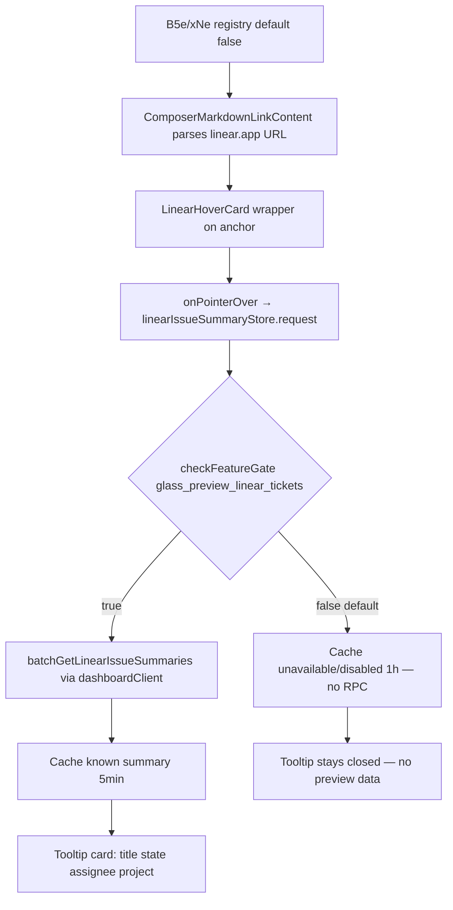

# Detective: `glass_preview_linear_tickets`

## Objective

Determine what the Cursor 3.21.1 client feature flag `glass_preview_linear_tickets` controls: registry definition (B5e/xNe), runtime gate call sites, effective default, modules touched, and Linear ticket hover-preview behavior in composer markdown when enabled vs disabled.

**Scope:** Extracted install at `/workspace/workspace/runs/20260916T112727Z/extract/new/` (commit `74f717017ddcbf0554cd8c91ec7e2fb56983a07f`); desktop + glass workbench bundles; feature-flag inventory.

**Success criteria:** Confirm B5e/xNe registry entry, enumerate `checkFeatureGate` call sites, describe `linearIssueSummaryStore` fetch/cache path and hover-card UI, tag findings Confirmed/Inferred/Unknown.

**Assumptions:** Inventory `client=true, default=false` is authoritative for bundled default. Linear URLs match `https://linear.app/{workspace}/issue/{TEAM-N}` (also `www.linear.app`).

**Unknowns:** Remote Statsig assignment per account; live dashboard RPC responses without authenticated session; whether non-Glass surfaces reuse the same markdown link renderer in production.

---

## Environment

| Item | Value |
|------|-------|
| OS | Linux |
| Cursor version | 3.21.1 |
| Commit | `74f717017ddcbf0554cd8c91ec7e2fb56983a07f` |
| `locate-cursor.sh` | exit 0; `install_status=not_found` |
| Workbench used | `/workspace/workspace/runs/20260916T112727Z/extract/new/usr/share/cursor/resources/app/out/vs/workbench/workbench.desktop.main.js` |
| Glass twin | `/workspace/workspace/runs/20260916T112727Z/extract/new/usr/share/cursor/resources/app/out/vs/workbench/workbench.glass.main.js` |
| Inventory | `/workspace/workspace/runs/20260916T112727Z/feature-flags-inventory.json` |

---

## Scan checklist

| Script | Exit | Result |
|--------|------|--------|
| `locate-cursor.sh` | 0 | No live Cursor install; `WORKBENCH_JS` empty |
| `scan-paths.sh` | 0 | `global_state_vscdb_exists=false`; `projects_root_exists=true` |
| `grep-workbench.sh --file …desktop… --pattern glass_preview_linear_tickets` | 0 | 2 hits (registry + gate in store) |
| `grep-workbench.sh --file …glass… --pattern glass_preview_linear_tickets` | 0 | 2 hits (registry + gate in store) |
| Full-bundle grep `checkFeatureGate("glass_preview_linear_tickets")` | — | **1** call site each in desktop + glass (`linearIssueSummaryStore.request`) |
| Module enumeration | — | Glass: `linearIssueSummaryStore.js`, `linear-issue-link-hover-card.react.js`, `ComposerMarkdownLinkContent.react.js`; desktop: same logic inlined (no separate module headers for hover card) |
| `inspect-state-vscdb.sh` | — | Not run; `state.vscdb` absent on VM |

---

## Findings

### Registry (Confirmed)

- **Desktop symbol `B5e`** and **glass symbol `xNe`** in `experimentConfig.gen.js`:
  ```
  glass_preview_linear_tickets:{client:!0,default:!1}
  ```
- **Inventory** (`feature-flags-inventory.json`, sourced from kFe/B5e extraction): `client: true`, `default: false` — matches bundle.
- Sibling flags in registry cluster: `glass_no_x_on_chips`, `origin_repos`.

### Call sites (Confirmed — wired in desktop **and** glass)

| Location | Role | Tag |
|----------|------|-----|
| `workbench.desktop.main.js` (`B5e`) | Registry definition | Confirmed |
| `workbench.glass.main.js` (`xNe`) | Registry definition | Confirmed |
| `linearIssueSummaryStore` → `request()` | Sole runtime gate (both bundles) | Confirmed |
| `linear-issue-link-hover-card.react.js` | Hover card UI; calls `store.request(identity)` on pointer/focus | Confirmed |
| `ComposerMarkdownLinkContent.react.js` | Wraps `linear.app` links with hover-card wrapper | Confirmed |

**Runtime gate (Confirmed, both bundles, `{disableExposureLog:!0}`):**

```
request(identity) {
  if (!checkFeatureGate("glass_preview_linear_tickets", {disableExposureLog:!0})) {
    this._set(key, {kind:"unavailable", reason:"disabled"}, 3600_000);
    return;
  }
  this._batcher.schedule(identity);  // → batchGetLinearIssueSummaries RPC
}
```

### What it changes (Confirmed)

Flow when a composer markdown link targets `linear.app`:

1. URL parser (`VNo` desktop / `bal` glass) extracts `{workspaceUrlKey, teamKey, number, identifier, canonicalUrl}` from paths like `/cursor/issue/CUR-123`.
2. `ComposerMarkdownLinkContent` renders the anchor; for Linear links it wraps children in `IYb`/`n_1` (hover-card provider).
3. On pointer-over/focus, hover card calls `linearIssueSummaryStore.request(identity)`.
4. **Gate off (bundled default false):** store immediately caches `{kind:"unavailable", reason:"disabled"}` (1h TTL); **no** `dashboardClient().batchGetLinearIssueSummaries` RPC; tooltip never opens with summary (`open` requires `kind==="known"`).
5. **Gate on:** batched RPC (chunks of 25 per workspace) fetches issue summaries; successful responses populate `{kind:"known", summary:{title, stateName, stateType, stateColor, assigneeName, assigneeAvatarUrl, projectName, teamName, updatedAtMs, …}}` (5 min fresh TTL).
6. Hover tooltip (`openDelay: 400ms`, `placement: bottom-start`) shows issue title, identifier, workflow state dot, assignee avatar/name, project/team, and relative updated time.

Link label compaction (**Confirmed**): when link text matches the issue identifier, display collapses to `TEAM-N` (e.g. `CUR-123`) via `pQb`/`Q11`.

Failure handling (**Confirmed**): RPC `Unimplemented` → `reason:"disabled"`; `ResourceExhausted` → `rate_limited`; missing identifiers → `reason:"missing"`; not-connected/workspace-mismatch → `not_available`.

### Effective value (Confirmed default; Unknown live override)

| Source | Value |
|--------|-------|
| Bundled default (`B5e` / `xNe` / inventory) | **false** (no Linear hover fetch) |
| Local `state.vscdb` / Statsig bootstrap | **not probeable** (no Cursor user config on this VM) |
| Dev override (`setFeatureFlagOverride`) | Available via `experimentService` |
| Effective in clean install without remote enable | **false** |

### Local override (Confirmed mechanism)

- `experimentService.setFeatureFlagOverride("glass_preview_linear_tickets", value)` — persisted with TTL, fires `_onDidChangeGates`.
- Remote Statsig assignment via `experimentService.checkFeatureGate` → `_statsig.checkGate` with fallback `xNe[t]?.default ?? !1`.
- Gate uses `disableExposureLog: true` (exposure not logged on evaluation).

---

## Internal code map

| Module | Entry point | Snippet / API |
|--------|-------------|---------------|
| `experimentConfig.gen.js` | `B5e` / `xNe` registry | `glass_preview_linear_tickets:{client:!0,default:!1}` |
| `linearIssueSummaryStore.js` | `linearIssueSummaryStore` service (`enr`/`Wwi`) | `request`, `getSummary`, `onDidChange` |
| `linearIssueSummaryStore.js` | `_fetchChunk` | `dashboardClient().batchGetLinearIssueSummaries({workspaceUrlKey, identifiers})` |
| URL parser (inline) | `VNo` / `bal` | Parses `linear.app` / `www.linear.app` issue URLs |
| `linear-issue-link-hover-card.react.js` | `xYb` / `t_1` | Hover wrapper; `onPointerOver`/`onFocus` → `store.request` |
| `linear-issue-link-hover-card.react.js` | `EYb` / `Qb1` | Preview card (`data-linear-issue`, state dot, assignee) |
| `ComposerMarkdownLinkContent.react.js` | `r2o` / `Z11` | `wrapAnchor: identity => <LinearHoverCard>` for Linear links |
| `experimentService.js` | `checkFeatureGate(t,e)` | Statsig gate or registry default fallback |
| `cursorAuthenticationService` | `dashboardClient()` | Connect RPC transport for Linear summaries |

**Confirmed gate wiring (`linearIssueSummaryStore.js`):**

```
request(t){
  const e=_st(t);
  if(this._inFlight.has(e))return;
  const n=this._entries.get(e);
  if(!(n!==void 0&&n.freshUntilMs>this._now())){
    if(!this._experimentService.checkFeatureGate("glass_preview_linear_tickets",{disableExposureLog:!0})){
      this._set(e,{kind:"unavailable",reason:"disabled"},Sal);
      return
    }
    this._inFlight.add(e),this._batcher.schedule(t)
  }
}
```

**Confirmed hover card trigger (`linear-issue-link-hover-card.react.js`):**

```
onPointerOver: () => store?.request(identity)
open: hovered && summary !== undefined  // only opens after kind==="known"
content: <LinearIssueCard title state assignee project updatedAt />
```

**Confirmed link integration (`ComposerMarkdownLinkContent.react.js`):**

```
const linearLink = parseLinearIssueUrl(href);
wrapAnchor: linearLink ? c => <LinearHoverCard identity={linearLink}>{c}</LinearHoverCard> : undefined
```

---

## Diagram



---

## Gaps & follow-ups

- No authenticated Cursor session on this VM — cannot confirm live RPC payload shapes or Statsig remote enable (**Unknown** runtime UX; code paths **Confirmed**).
- `state.vscdb` absent — cannot confirm per-user Statsig assignment or persisted dev overrides.
- Desktop bundle inlines the same store + hover-card logic without separate `*.react.js` module headers; behavior inferred identical from matching symbols and gate string (**Confirmed** wiring, **Inferred** desktop-only surface reach).

---

## Workspace relevance

Not applicable — flag controls Linear issue hover previews in composer markdown link rendering; no project-artifact or transport coupling in this workspace.
