# Detective: feature-flag-grok-bot-cloud-agent-durable-watch

## Objective

Determine what the Cursor 3.21.1 client feature flag `grok_bot_cloud_agent_durable_watch` controls: registry definition (B5e/xNe), runtime `checkFeatureGate` call sites (or prove registry-only), related Grok-bot / cloud-agent durable-watch infrastructure, effective default, modules touched, and local override paths.

**Scope:** Extracted install at `/workspace/workspace/runs/20260916T112727Z/extract/new/` (commit `74f717017ddcbf0554cd8c91ec7e2fb56983a07f`); workbench desktop + glass bundles under `out/vs/workbench/`.

**Success criteria:** Confirm B5e/xNe registry entry, enumerate `checkFeatureGate` call sites (or prove registry-only), map related `WatchGrokBotTranscripts` / cloud-agent transcript infrastructure, tag findings Confirmed/Inferred/Unknown.

**Assumptions:** Inventory `client=true, default=false` is authoritative for bundled default. Flag name is literal `grok_bot_cloud_agent_durable_watch`. "Durable watch" refers to a long-lived server-streaming transcript/state subscription (cursor + generation replay), not desktop cloud-agent stream reconnect.

**Unknowns:** Remote Statsig assignment per account; exact client UI wiring (if any) not present in 3.21.1 bundles; whether server enforces gate before `WatchGrokBotTranscripts` accepts connections.

## Environment

| Item | Value |
|------|-------|
| OS | Linux 6.12.94+ |
| Cursor version | 3.21.1 |
| Commit | `74f717017ddcbf0554cd8c91ec7e2fb56983a07f` |
| `locate-cursor.sh` | exit 0; `install_status=not_found` (no live install) |
| Workbench desktop | `/workspace/workspace/runs/20260916T112727Z/extract/new/usr/share/cursor/resources/app/out/vs/workbench/workbench.desktop.main.js` |
| Workbench glass | `/workspace/workspace/runs/20260916T112727Z/extract/new/usr/share/cursor/resources/app/out/vs/workbench/workbench.glass.main.js` |
| Inventory | `/workspace/workspace/runs/20260916T112727Z/feature-flags-inventory.json` |

## Scan checklist

| Script | Exit | Result |
|--------|------|--------|
| `locate-cursor.sh` | 0 | No live Cursor install; `WORKBENCH_JS` empty — used parent-provided extract path |
| `scan-paths.sh` | 0 | No `~/.config/Cursor` state DB; projects root exists |
| `grep-workbench.sh --file …desktop… --pattern grok_bot_cloud_agent_durable_watch` | 0 | 1 hit (B5e registry snippet) |
| `grep-workbench.sh --file …glass… --pattern grok_bot_cloud_agent_durable_watch` | 0 | 1 hit (xNe registry snippet) |
| `rg 'checkFeatureGate\("grok_bot_cloud_agent_durable_watch"'` (full extract) | 1 | 0 hits — no client runtime gate |
| `rg 'getFeatureGateProperty\("grok_bot_cloud_agent_durable_watch"'` (full extract) | 1 | 0 hits |
| `rg 'grok_bot_cloud_agent_durable_watch'` (full extract file list) | 0 | 5 files, 1 hit each — registry copies only |
| `rg 'checkFeatureGate\("grok_bot'` (full extract) | 1 | 0 hits — entire grok_bot prefix registry-only in client |
| `rg 'WatchGrokBotTranscripts\|GrokBotTranscriptWatch'` (desktop + glass) | 0 | Proto/service descriptors present; no client stream consumer |
| `inspect-state-vscdb.sh` | — | Not run; `state.vscdb` absent on VM |

## Findings

### Registry (Confirmed)

- **Desktop symbol `B5e`** and **glass symbol `xNe`** in `experimentConfig.gen.js`:
  ```
  grok_bot_cloud_agent_durable_watch:{client:!0,default:!1}
  ```
- **Inventory** (`feature-flags-inventory.json`, sourced from kFe/B5e extraction): `client: true`, `default: false` — matches bundle.
- **Manifest category:** `other` (`manifest.json`).
- **Registry neighbors (Confirmed):** cloud-agent / transcript cluster:
  - `sand_new_transcript_journal`, `sand_cloud_agent_artifacts` (immediately preceding)
  - `sand_computer_use_unicode_typing` (immediately following)
- **Related Grok-bot durable cluster (Confirmed, separate flags):**
  - `grok_bot_durable_identity`, `grok_bot_durable_identity_writes`, `grok_bot_shared_identity`, `grok_bot_identity_backfill`
- Same registry blob is **embedded** (copy-only) in:
  - `out/main.js`
  - `extensions/cursor-agent-host/dist/main.js`
  - `extensions/cursor-always-local/dist/main.js`

### Call sites (Confirmed — registry-only on client)

| Location | Role | Tag |
|----------|------|-----|
| `workbench.desktop.main.js` (`B5e`) | Registry definition only | Confirmed |
| `workbench.glass.main.js` (`xNe`) | Registry definition only | Confirmed |
| `out/main.js` | Registry copy | Confirmed |
| `cursor-agent-host/dist/main.js` | Registry copy | Confirmed |
| `cursor-always-local/dist/main.js` | Registry copy | Confirmed |

**No client runtime branches (Confirmed):**

- `rg 'checkFeatureGate\("grok_bot_cloud_agent_durable_watch"'` across entire extract → **0 hits**
- `rg 'getFeatureGateProperty\("grok_bot_cloud_agent_durable_watch"'` → **0 hits**
- No minified variable assignment `="grok_bot_cloud_agent_durable_watch"` outside registry
- All `grok_bot_*` flags share **0** `checkFeatureGate` call sites in desktop/glass (prefix-wide search)

### Related durable-watch infrastructure (Confirmed present; not gated by this flag)

**Grok-bot transcript watch RPC stack (Confirmed — proto + service descriptor only in 3.21.1 client):**

| Component | Type | Role |
|-----------|------|------|
| `watchGrokBotTranscripts` | Server-streaming RPC on GrokBot service | Long-lived watch stream for transcript/state updates |
| `WatchGrokBotTranscriptsRequest` | Request | `cursors[]`, `include_unlisted_agents`, `inline_body_max_bytes` |
| `GrokBotTranscriptWatchFrame` | Stream frame oneof | Multiplexed event frames (see below) |
| `GrokBotTranscriptWatchConnected` | Connected frame | `stream_id`, `server_time_ms`, **`absolute_lifetime_ms`** — durable stream lifetime |
| `GrokBotTranscriptWatchRows` | Rows frame | `agent_id`, `generation`, `entries`, `replay`, `session_id` — cursor/generation replay |
| `GrokBotTranscriptWatchCleared` | Cleared frame | Generation bump on transcript reset |
| `GrokBotTranscriptWatchCursorTooOld` | Error frame | Client cursor stale — must resync |
| `GrokBotTranscriptWatchHeartbeat` | Keepalive | `server_time_ms` |
| `GrokBotTranscriptWatchAgentState` / `AgentStateChanged` | State frames | Live agent roster / snapshot updates |
| `GrokBotTranscriptWatchComputerActions` | Actions frame | Computer-use action feed |
| `GrokBotTranscriptWatchTurnFailed` | Failure frame | Turn failure notifications |
| `GrokBotTranscriptWatchRosterChanged` | Roster frame | Agent join/leave/update events |
| `GrokBotTranscriptWatchBoxState` | Box state frame | Sandbox/box state snapshots |

**Confirmed RPC cluster snippet (desktop):**

```
commitGrokBotTranscriptEntries:{name:"CommitGrokBotTranscriptEntries",…,kind:oe.Unary},
listGrokBotTranscriptEntries:{name:"ListGrokBotTranscriptEntries",…,kind:oe.Unary},
watchGrokBotTranscripts:{name:"WatchGrokBotTranscripts",I:h8v,O:p7v,kind:oe.ServerStreaming},
setGrokBotAgentClientState:{name:"SetGrokBotAgentClientState",…,kind:oe.Unary},
listGrokBotAgentSessions:{name:"ListGrokBotAgentSessions",…,kind:oe.Unary}
```

**Confirmed connected frame (durable lifetime semantics):**

```
GrokBotTranscriptWatchConnected: stream_id, server_time_ms, absolute_lifetime_ms
```

**Cloud-agent client stack (Confirmed — separate from Grok-bot watch RPC; no gate wiring):**

| Module | Role |
|--------|------|
| `loadedCloudAgent.js` | Reference-counted loaded cloud agent; `_streamConnectedDisposable`, `_connected` observable |
| `cloudAgentStream.js` | Cloud-agent conversation stream; reconnect constants (`xMd="cloud_agent_stop_permanent_stream_reconnect"`) |
| `cloudAgentRepositoryService.js` | Cloud agent repository / lifecycle orchestration |
| `cloudAgentTranscriptIndexWorkerMain.js` | Web worker for local transcript index reconciliation (`cloudAgentTranscriptIndexWorkerHost`) |
| `cloudAgentArtifactsStore.js` | Artifact listing for cloud agents (neighbor flag `sand_cloud_agent_artifacts`) |

**Desktop vs glass (Confirmed):**

- Both bundles ship identical Grok-bot transcript watch **proto stubs** and service descriptors.
- Neither bundle contains a `watchGrokBotTranscripts(` client call site or a dedicated Grok-bot transcript watch service module — only `grokBotContextualBanner.js` / `grokBotContextualBannerSession.js` Grok-bot workbench modules found.
- Cloud-agent stream/index modules present in both desktop and glass.

### Sibling / adjacent flags (Confirmed registry; separate concerns)

| Flag | Bundled default | Runtime in 3.21.1 client |
|------|-----------------|--------------------------|
| `grok_bot_cloud_agent_durable_watch` | false | Registry-only |
| `sand_cloud_agent_artifacts` | false | Registry-only |
| `sand_new_transcript_journal` | false | Registry-only |
| `grok_bot_durable_identity` | false | Registry-only |
| `grok_bot_durable_identity_writes` | false | Registry-only |
| `cloud_agent_stop_permanent_stream_reconnect` | false | Registry-only (constant `xMd` in `cloudAgentStream.js`; no `checkFeatureGate` hit) |
| `local_agent_event_subscriptions` | false | **Glass runtime** — separate gate with active `checkFeatureGate` |

### What it changes (Inferred)

**`grok_bot_cloud_agent_durable_watch`** is a boolean Statsig gate in the **Grok-bot × cloud-agent transcript** cluster. Name, registry placement (between `sand_cloud_agent_artifacts` and sand/mobile flags), and adjacent proto scaffolding imply it will gate a **durable server-streaming watch** for Grok-bot cloud-agent transcripts and live state — the `WatchGrokBotTranscripts` RPC with cursor/generation replay (`GrokBotTranscriptWatchRows`), heartbeat keepalives, and bounded stream lifetime (`absolute_lifetime_ms` on connect).

When **enabled** (remote Statsig assignment, **Inferred**):

- Client (future) opens/maintains `WatchGrokBotTranscripts` streams instead of polling `listGrokBotTranscriptEntries` or relying solely on ephemeral cloud-agent conversation streams.
- Receives multiplexed frames: transcript rows, agent state/roster changes, computer actions, turn failures, box state — suitable for Grok-bot fleet / multiplayer dashboards watching cloud agents.

When **disabled** (bundled default `false`):

- Durable watch path remains off; existing cloud-agent streaming (`cloudAgentStream.js` / `loadedCloudAgent.js`) and transcript index worker continue under their own gates (none wired to this flag in 3.21.1).

**Why Inferred:** Zero `checkFeatureGate("grok_bot_cloud_agent_durable_watch")` call sites; proto/RPC scaffolding is present but no client stream consumer ships in this build.

### Effective value (Confirmed default; Unknown live override)

| Source | Value |
|--------|-------|
| Bundled default (`B5e` / `xNe` / inventory) | **false** |
| Local `state.vscdb` / Statsig bootstrap | **not probeable** (no Cursor user config on this VM) |
| Dev override (`setFeatureFlagOverride`) | Available via generic dev flag UI (`Object.keys(B5e)`) but no product branch consumes it in 3.21.1 client |
| Effective in clean install without remote enable | **false** (registry-only; no client UI branch) |

### Local override (Confirmed mechanism, no product effect in client)

- `experimentService.setFeatureFlagOverride("grok_bot_cloud_agent_durable_watch", value)` — generic dev override path exists via `Object.keys(B5e)` iteration.
- **No product code** reads this gate in the 3.21.1 desktop/glass client bundles.
- Override would only affect Statsig exposure unless server-side handlers independently check the same gate name before accepting `WatchGrokBotTranscripts`.

## Internal code map

| Module / artifact | Entry point | Snippet / API |
|-------------------|-------------|---------------|
| `experimentConfig.gen.js` (desktop/glass) | `B5e` / `xNe` registry | `grok_bot_cloud_agent_durable_watch:{client:!0,default:!1}` |
| `experimentService.js` | `checkFeatureGate(e,t)` | `B5e[e]?.default??!1` fallback (no dedicated call) |
| GrokBot service descriptor | `watchGrokBotTranscripts` | Server-streaming RPC; `WatchGrokBotTranscriptsRequest` with cursors |
| `GrokBotTranscriptWatchFrame` | Stream multiplex | connected / rows / cleared / cursor_too_old / heartbeat / agent_state / … |
| `GrokBotTranscriptWatchConnected` | Connect handshake | `stream_id`, `absolute_lifetime_ms` |
| `loadedCloudAgent.js` | Reference lease + stream | `_streamConnectedDisposable`, `_connected` observable |
| `cloudAgentStream.js` | Conversation stream | `cloud_agent_stop_permanent_stream_reconnect` constant |
| `cloudAgentTranscriptIndexWorkerMain.js` | Index worker | `cloudAgentTranscriptIndexWorkerHost` |
| `cloudAgentArtifactsStore.js` | Artifacts | `listArtifacts()` via artifact cache |
| `out/main.js` | Embedded registry | Registry copy |
| `cursor-agent-host/dist/main.js` | Embedded registry | Registry copy |

**Confirmed registry snippet (desktop B5e):**

```
…sand_new_transcript_journal:{client:!0,default:!1},sand_cloud_agent_artifacts:{client:!0,default:!1},grok_bot_cloud_agent_durable_watch:{client:!0,default:!1},sand_computer_use_unicode_typing:{client:!0,default:!1}…
```

**Confirmed watch RPC descriptor:**

```
watchGrokBotTranscripts:{name:"WatchGrokBotTranscripts",I:h8v,O:p7v,kind:oe.ServerStreaming}
```

**Confirmed stream frame oneof:**

```
GrokBotTranscriptWatchFrame: connected | rows | cleared | cursor_too_old | heartbeat | agent_state | computer_actions | agent_state_changed | turn_failed | roster_changed | box_state
```

**Confirmed loadedCloudAgent stream hook:**

```
_streamConnectedDisposable=this._register(new rn),this._connected=new Vh(!1)
```

## Diagram

```mermaid
flowchart TD
  A[B5e/xNe registry grok_bot_cloud_agent_durable_watch default false] --> B[experimentService.checkFeatureGate]
  B --> C{Statsig initialized?}
  C -->|yes| D[statsig.checkGate grok_bot_cloud_agent_durable_watch]
  C -->|no| E[return B5e default false]
  D --> F{Client product code calls gate?}
  F -->|3.21.1 desktop/glass| G[No — registry-only in AppImage]
  D --> H[Server / future Grok bot client]
  H -->|gate on| I[Inferred: WatchGrokBotTranscripts durable stream]
  I --> J[GrokBotTranscriptWatchFrame multiplex]
  J --> K[rows / agent_state / roster / computer_actions / heartbeat]
  H -->|gate off| L[Durable watch disabled]
  M[cloudAgentStream / loadedCloudAgent] -.->|separate stack, not gated| N[Ephemeral cloud-agent conversation stream]
  O[sand_cloud_agent_artifacts] -.->|sibling flag, registry-only| A
  P[grok_bot_durable_identity] -.->|sibling durable cluster| A
```



## Gaps & follow-ups

- **Live Statsig value:** `globalStorage/state.vscdb` absent; cannot confirm per-user override or remote gate assignment.
- **Server-side enforcement:** Unknown whether `WatchGrokBotTranscripts` handler checks this gate before accepting streams (proto ships in client; handler is server-side).
- **Future client module:** No `watchGrokBotTranscripts(` call site in 3.21.1 — consumer module likely unreleased or server-driven via glass Grok-bot UI not yet bundled.

## Workspace relevance

This run inventories a **new 3.21.1 flag** (`manifest.json`) for Notion/feature-flag sync. Bundled default `false` means durable Grok-bot cloud-agent watch is off in stock installs until Statsig enables it and client wiring lands.
