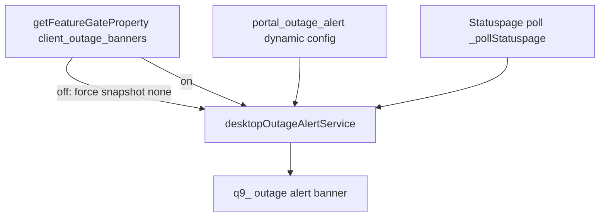

# Detective: feature-flag-client-outage-banners

## Objective

Determine what `client_outage_banners` does in Cursor **3.22.5**: registry metadata, **runtime reader** (`getFeatureGateProperty`), and the desktop outage-alert pipeline (Statuspage + Statsig dynamic config). User noted **hits** (registry + call site). Success = end-to-end banner gating diagram.

**Assumptions:** `portal_outage_alert` dynamic config and Statuspage polling are the content sources when the gate is on.

**Unknowns:** Exact Statuspage component IDs; Glass parity (desktop service confirmed).

## Environment

| Item | Value |
|------|--------|
| OS | Linux (cloud agent VM) |
| Cursor version | 3.22.5 |
| Commit | `a00aa8754ab5bae70b637d98e126f9dbd4e1e5d0` |
| Workbench | Extracted `workbench.desktop.main.js` + `workbench.glass.main.js` |
| Inventory | `feature-flags-inventory.json` |

## Scan checklist

| Script | Exit | Result |
|--------|------|--------|
| `locate-cursor.sh` | 0 | No live install |
| `scan-paths.sh` | 0 | No `state.vscdb` |
| `grep-workbench.sh` (desktop, `client_outage_banners`) | 0 | `hit_count=2` — registry + `getFeatureGateProperty` |
| `grep-workbench.sh` (glass, same) | 0 | `hit_count=2` |
| `inspect-state-vscdb.sh` | 1 | DB missing |

## Findings

### Registry (`kFe` / `p9e` / `fLe`)

- **Confirmed** — `client: true`, `default: false` (inventory + bundle).

```text
client_numeric_metrics:{client:!0,default:!0},client_outage_banners:{client:!0,default:!1},solidjs_total_observers_metric:{client:!0,default:!1}
```

### Runtime gate reader

- **Confirmed** — `experimentService.getFeatureGateProperty("client_outage_banners")` in desktop outage alert service constructor; reactive `l.event(u)` updates `_clientOutageBannersEnabled` and calls `_recomputeSnapshot()`.
- **Confirmed** — `_recomputeSnapshot()` early-outs when gate false: clears visible snapshot to `none`, cancels expiry scheduler:

```text
_recomputeSnapshot(){if(!this._clientOutageBannersEnabled){this._snapshot.kind!=="none"&&(this._snapshot=utp,this._onDidChangeSnapshot.fire()),this._expiryScheduler.cancel();return}
```

- **Confirmed** — When enabled, snapshot merges **Statsig dynamic config** `portal_outage_alert` (`enabled`, `title`, `description`) with **Statuspage** poll candidate (`_pollStatuspage`), dismissals in workspace storage (`ior` key), and legacy Glass dismissal migration.

### UI layer

- **Confirmed** — Service id `desktopOutageAlertService` (`Fd("desktopOutageAlertService")`); React hook `j9_()` subscribes to `onDidChangeSnapshot`; component `q9_` renders `V9_` alert with dismiss action when `snapshot.kind === "visible"`.
- **Confirmed** — Log string `[desktop outage alert] Statuspage components refresh failed` on poll errors.
- **Inferred** — Banners are **dismissible outage/incident alerts** in the desktop shell (role `status`), not billing banners.

### Default behavior

- **Inferred** — Bundled default `false` → outage banner pipeline is **disabled** unless Statsig turns the gate on (even if `portal_outage_alert` or Statuspage would otherwise show content).

## Internal code map

| Module / area | Role | Tie to flag |
|---------------|------|-------------|
| `p9e` / `fLe` | Gate catalog | **Confirmed** |
| `desktopOutageAlertService` (`g4o` class) | Poll Statuspage, merge config, expose `snapshot` | **Confirmed** — reads gate |
| `j9_` / `q9_` / `V9_` | React hook + outage alert presentation | **Confirmed** |
| `portal_outage_alert` (dynamic config) | Title/body/enabled override | **Confirmed** — used inside service |
| Workspace storage `ior` | Dismissal persistence | **Confirmed** |

**Gate wiring snippet (Confirmed):**

```text
const l=t.getFeatureGateProperty("client_outage_banners"),u=()=>{this._clientOutageBannersEnabled=l.nonReactive(),this._recomputeSnapshot()};
```

## Diagram



## Gaps & follow-ups

- Glass bundle also contains gate reader snippet; full Glass UI placement not isolated in this pass.
- No live Statuspage incident to validate visible banner.

## Workspace relevance

None.

---

## Summary (for Notion)

| Field | Value |
|-------|--------|
| **Key** | `client_outage_banners` |
| **Client** | true |
| **Bundled default** | false |
| **Registry-only** | **no** — `getFeatureGateProperty` in `desktopOutageAlertService` |
| **What it changes** | Master switch for **desktop outage/incident banners** sourced from `portal_outage_alert` + Statuspage polling; when off, alerts are suppressed regardless of upstream signals. |
| **Confidence** | **High** (service + recompute logic Confirmed) |
| **Modules** | `desktopOutageAlertService`, React `q9_`/`V9_`; dynamic config `portal_outage_alert` |
