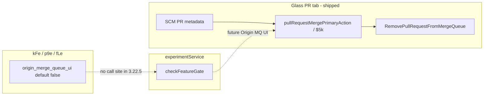

# Detective: `origin_merge_queue_ui`

## Objective

Determine what the client feature gate `origin_merge_queue_ui` does in Cursor **3.22.5** (`a00aa8754ab5bae70b637d98e126f9dbd4e1e5d0`): confirm `kFe` registry metadata, locate `checkFeatureGate` / minified registry (`p9e` desktop, `fLe` glass) call sites, map adjacent Origin merge-queue PR UI modules, and classify evidence. Success = reproducible bundle citations plus a clear shipped-vs-placeholder verdict.

**Assumptions:** Inventory `client`/`default` from `feature-flags-inventory.json` is authoritative. Extracted AppImage workbench under the run path substitutes for `locate-cursor.sh` when no live install exists.

**Unknowns:** Statsig exposure on a real user profile; whether a future build gates existing merge-queue actions behind this flag.

## Environment

| Item | Value |
|------|--------|
| OS | Linux (cloud agent VM) |
| Cursor version | 3.22.5 |
| Commit | `a00aa8754ab5bae70b637d98e126f9dbd4e1e5d0` |
| `locate-cursor.sh` | `install_status=not_found`, `WORKBENCH_JS` empty |
| Workbench (probed) | `/workspace/workspace/runs/20260924T110844Z/extract/new/usr/share/cursor/resources/app/out/vs/workbench/workbench.desktop.main.js` |
| Glass twin | `/workspace/workspace/runs/20260924T110844Z/extract/new/usr/share/cursor/resources/app/out/vs/workbench/workbench.glass.main.js` |
| Inventory | `/workspace/workspace/runs/20260924T110844Z/feature-flags-inventory.json` |
| Manifest | `/workspace/workspace/runs/20260924T110844Z/manifest.json` (`new_flags`, category `other`) |

## Scan checklist

| Script | Exit | Result |
|--------|------|--------|
| `locate-cursor.sh` | 0 | No local Cursor install; empty `WORKBENCH_JS` |
| `scan-paths.sh` | 0 | No global `state.vscdb`; `~/.cursor/projects` exists |
| `grep-workbench.sh` (desktop, `origin_merge_queue_ui`) | 0 | `hit_count=1` — registry snippet only |
| `grep-workbench.sh` (glass, same) | 0 | `hit_count=1` — registry snippet only |
| `inspect-state-vscdb.sh` | 1 | `state.vscdb not found` |
| Phase 4b module grep (glass) | — | `remove-from-merge-queue-flow.js`, `pullRequestMergePrimaryAction.js`, SCM merge-queue RPCs present; flag name not referenced outside registry |

## Findings

### Registry (`kFe` / `p9e` / `fLe`)

- **Confirmed** — Inventory: `origin_merge_queue_ui` → `client: true`, `default: false`.
- **Confirmed** — Embedded registry in both bundles among Origin PR gates: `origin_raw_file_links` (default true), `origin_merge_queue_ui` (default false), `origin_inbox_osp_watch`.
- **Confirmed** — Desktop registry minifies as `p9e={...origin_merge_queue_ui:{client:!0,default:!1}...}`; glass uses `fLe={...}` with the same entry.
- **Confirmed** — Flag string appears **once** per workbench bundle and in shared catalog copies (`out/main.js`, `cursor-always-local`, `cursor-agent-host`) — no additional quoted occurrences.

### Gate call sites

- **Confirmed** — Zero `checkFeatureGate("origin_merge_queue_ui")`, `checkGate`, `_a`, or bracket dynamic access in desktop or glass workbench (full-bundle Python scan).
- **Confirmed** — Among wired Origin-related gates in glass, only `origin_mcp` has live `checkFeatureGate` calls; not `origin_merge_queue_ui`.
- **Inferred** — Flag is **registry-only in 3.22.5** for client rollout bookkeeping; default **off** matches “no reader” behavior.

### Related merge-queue behavior (not gated by this flag)

- **Confirmed** — Glass PR tab builds primary actions via `$5k` / `pullRequestMergePrimaryAction.js`, using PR fields `requiresMergeQueue` and `isInMergeQueue` (from `aiserver.v1` SCM pull-request metadata) to surface actions including `removeFromMergeQueue`.
- **Confirmed** — `remove-from-merge-queue-flow.js` defines action id `c$l="remove-from-merge-queue"` and wires `removePullRequestFromMergeQueue` SCM RPC (`aiserver.v1.SCMService/RemovePullRequestFromMergeQueue`).
- **Confirmed** — User-facing copy includes “Failed to remove from merge queue” and label “Remove from merge queue”.
- **Inferred** — `origin_merge_queue_ui` likely targets **Origin-specific merge-queue chrome or visibility** layered on existing SCM-driven merge-queue state, not the underlying merge-queue RPC plumbing (which already ships without this gate).

### Statsig / local effective value

- **Unknown** — No probeable `state.vscdb` on this VM.

## Internal code map

| Module / area | Role | Tie to flag |
|---------------|------|-------------|
| `p9e` / `fLe` (`kFe`) | Client gate catalog | **Confirmed** — only place flag is named |
| `pullRequestMergePrimaryAction.js` | PR primary action model | **Confirmed** — merge-queue actions via PR state |
| `remove-from-merge-queue-flow.js` | Remove-from-queue UX flow | **Confirmed** — not behind `origin_merge_queue_ui` |
| `PullRequestRepositoryService` / SCM protos | `is_in_merge_queue`, `requires_merge_queue` | **Confirmed** — data model for queue state |
| `use-origin-repo-merge-methods.react.js` | Origin merge methods | **Inferred** — adjacent Origin PR merge UX |
| `origin_merge_queue_ui` branches | — | **Unknown** — absent in 3.22.5 |

**Registry snippet (Confirmed):**

```text
origin_raw_file_links:{client:!0,default:!0},origin_merge_queue_ui:{client:!0,default:!1},origin_inbox_osp_watch:{client:!0,default:!1}
```

**Merge-queue action snippet (Confirmed, unwired to flag):**

```text
requiresMergeQueue:t.requiresMergeQueue,isInMergeQueue:t.isInMergeQueue,...case"removeFromMergeQueue":return{type:"removeFromMergeQueue",label:f.label,...}
```

## Diagram



## Gaps & follow-ups

- No live Cursor session to validate Statsig override or UI when flag is force-enabled.
- Portal/web Origin merge-queue UI (if any) not in extracted IDE bundles; flag name suggests Origin product surface.

## Workspace relevance

Supports feature-flag inventory sync for commit `a00aa8754ab5bae70b637d98e126f9dbd4e1e5d0`.

---

## Executive summary

| Field | Value |
|-------|--------|
| **Key** | `origin_merge_queue_ui` |
| **Client** | true |
| **Bundled default** | false (inventory) |
| **Registry-only** | **yes** (workbench) |
| **What it changes** | Reserved default-off gate for future **Origin merge-queue UI**; merge-queue remove/merge actions already exist in Glass PR tabs driven by SCM `isInMergeQueue` / `requiresMergeQueue` without this flag. |
| **Confidence** | **High** (registry-only); **Medium** (product intent from name + neighbors) |
| **Modules** | `p9e`/`fLe` registry; related unwired: `remove-from-merge-queue-flow.js`, `pullRequestMergePrimaryAction.js`, SCM merge-queue RPCs |
