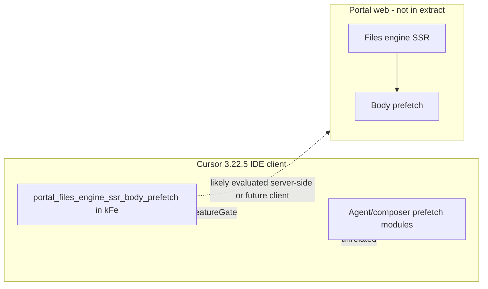

# Detective: `portal_files_engine_ssr_body_prefetch`

## Objective

Determine what the client feature gate `portal_files_engine_ssr_body_prefetch` does in Cursor **3.22.5** (`a00aa8754ab5bae70b637d98e126f9dbd4e1e5d0`): confirm `kFe` registry metadata, find gate call sites, search for Portal “files engine” / SSR body prefetch implementation in workbench and extensions, and classify evidence.

**Assumptions:** Inventory defaults are authoritative. Flag name implies **cursor.com Portal** server rendering prefetch of file bodies; client bundle may only register the gate for Statsig.

**Unknowns:** Portal web app code (not shipped in IDE extract); runtime behavior when enabled server-side only.

## Environment

| Item | Value |
|------|--------|
| OS | Linux (cloud agent VM) |
| Cursor version | 3.22.5 |
| Commit | `a00aa8754ab5bae70b637d98e126f9dbd4e1e5d0` |
| `locate-cursor.sh` | `install_status=not_found` |
| Workbench (probed) | `/workspace/workspace/runs/20260924T110844Z/extract/new/usr/share/cursor/resources/app/out/vs/workbench/workbench.desktop.main.js` |
| Glass twin | `/workspace/workspace/runs/20260924T110844Z/extract/new/usr/share/cursor/resources/app/out/vs/workbench/workbench.glass.main.js` |
| Inventory | `/workspace/workspace/runs/20260924T110844Z/feature-flags-inventory.json` |

## Scan checklist

| Script | Exit | Result |
|--------|------|--------|
| `locate-cursor.sh` | 0 | No install; used extract paths |
| `scan-paths.sh` | 0 | No `state.vscdb` |
| `grep-workbench.sh` (desktop, flag name) | 0 | `hit_count=1` — registry only |
| `grep-workbench.sh` (glass, flag name) | 0 | `hit_count=1` — registry only |
| `inspect-state-vscdb.sh` | 1 | DB missing |
| Phase 4b keyword scan | — | No `FilesEngine`, `filesEngine`, `ssrBody`, or `bodyPrefetch` symbols; `portal_files` only in registry string |

## Findings

### Registry (`kFe` / `p9e` / `fLe`)

- **Confirmed** — Inventory: `portal_files_engine_ssr_body_prefetch` → `client: true`, `default: false`.
- **Confirmed** — Registry neighborhood in both bundles: `portal_pr_code_tour`, `portal_files_engine_ssr_body_prefetch`, `enable_code_tours_custom_prompt`, `portal_pr_code_tour_stack_nav` (Portal PR / code-tour cluster).
- **Confirmed** — Flag string occurs **once** per artifact in IDE tree: both workbench bundles, `out/main.js`, `cursor-always-local`, `cursor-agent-host` (shared catalog blob only).

### Gate call sites

- **Confirmed** — Zero `checkFeatureGate("portal_files_engine_ssr_body_prefetch")` or equivalent in workbench desktop/glass.
- **Confirmed** — Zero wired `portal_*` gates in glass `checkFeatureGate("...")` string-literal scan (other subsystems use `sandbox_read_control_portal`, not this key).
- **Inferred** — **Registry-only in the IDE client** for 3.22.5; default off ⇒ no client behavior change from bundled code paths.

### Related prefetch subsystems (generic, not this flag)

- **Confirmed** — Glass embeds unrelated prefetch modules: `cloudAgentBlobPrefetchRequest.js`, `cloudAgentStreamPrefetch.js`, `composerBubblePrefetchPlanner.js`, `pr-query-prefetch.js`, `marketplaceDataPrefetch.js`, `blob-prefetch-filter.ts`.
- **Inferred** — These serve agent/composer/PR prefetch, not Portal files-engine SSR bodies.
- **Unknown** — Actual Portal files-engine SSR prefetch likely lives in web/portal deployment not present in this extract.

### Statsig / local effective value

- **Unknown** — No local DB; no runtime network capture.

## Internal code map

| Module / area | Role | Tie to flag |
|---------------|------|-------------|
| `p9e` / `fLe` | Client gate catalog | **Confirmed** — sole naming site |
| `portal_pr_code_tour*` modules | Portal PR code tour (sibling gates) | **Inferred** — same manifest batch; separate wired gates |
| `*prefetch*.js` (agent/composer) | IDE prefetch planners | **Confirmed** — exist; **not** referenced by this flag name |
| Portal files engine SSR | — | **Unknown** — not in IDE bundles |

**Registry snippet (Confirmed):**

```text
portal_pr_code_tour:{client:!0,default:!1},portal_files_engine_ssr_body_prefetch:{client:!0,default:!1},enable_code_tours_custom_prompt:{client:!0,default:!1}
```

## Diagram



## Gaps & follow-ups

- Portal web repository not in workspace extract; cannot confirm SSR prefetch implementation.
- No `out-build/.../files*engine*` module paths in workbench bundle for this feature.

## Workspace relevance

Catalog entry for Notion / manifest `new_flags` at commit `a00aa8754ab5bae70b637d98e126f9dbd4e1e5d0`.

---

## Executive summary

| Field | Value |
|-------|--------|
| **Key** | `portal_files_engine_ssr_body_prefetch` |
| **Client** | true |
| **Bundled default** | false (inventory) |
| **Registry-only** | **yes** (IDE workbench) |
| **What it changes** | Default-off client gate registered for **Portal files-engine SSR response-body prefetch**; no IDE `checkFeatureGate` wiring or `FilesEngine` symbols in 3.22.5 bundles. |
| **Confidence** | **High** (registry-only in client); **Low** (exact Portal SSR behavior — name + sibling `portal_*` flags only) |
| **Modules** | `p9e`/`fLe` registry only; unrelated prefetch: `cloudAgentBlobPrefetchRequest.js`, `composerBubblePrefetchPlanner.js`, `pr-query-prefetch.js` |
