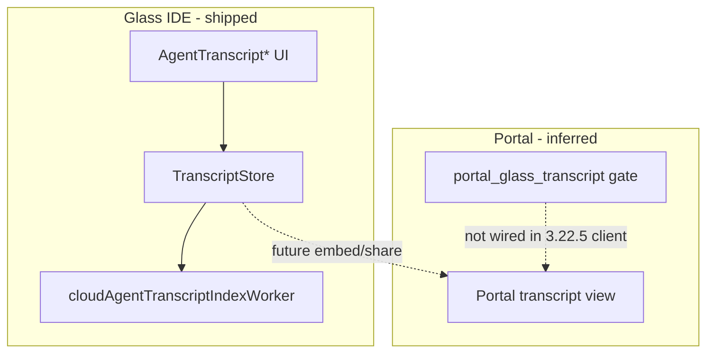

# Detective: `portal_glass_transcript`

## Objective

Determine what the client feature gate `portal_glass_transcript` does in Cursor **3.22.5** (`a00aa8754ab5bae70b637d98e126f9dbd4e1e5d0`): confirm registry metadata, locate gate call sites, map Glass/Portal transcript subsystems (`TranscriptStore`, agent transcript UI), and classify evidence.

**Assumptions:** Inventory `default: false` is authoritative. Flag sits beside other Portal/Glass PR gates (`agents_github_pr_tab`, `portal_hide_projects_sidebar`).

**Unknowns:** Portal web rendering of Glass transcripts; effective value on user machines.

## Environment

| Item | Value |
|------|--------|
| OS | Linux (cloud agent VM) |
| Cursor version | 3.22.5 |
| Commit | `a00aa8754ab5bae70b637d98e126f9dbd4e1e5d0` |
| `locate-cursor.sh` | `install_status=not_found` |
| Workbench (probed) | `/workspace/workspace/runs/20260924T110844Z/extract/new/usr/share/cursor/resources/app/out/vs/workbench/workbench.desktop.main.js` |
| Glass twin | `/workspace/workspace/runs/20260924T110844Z/extract/new/usr/share/cursor/resources/app/out/vs/workbench/workbench.glass.main.js` |
| Inventory | `/workspace/workspace/runs/20260924T110844Z/feature-flags-inventory.json` |

## Scan checklist

| Script | Exit | Result |
|--------|------|--------|
| `locate-cursor.sh` | 0 | No install |
| `scan-paths.sh` | 0 | No `state.vscdb` |
| `grep-workbench.sh` (desktop) | 0 | `hit_count=1` — registry |
| `grep-workbench.sh` (glass) | 0 | `hit_count=1` — registry |
| `inspect-state-vscdb.sh` | 1 | DB missing |
| Phase 4b | — | `TranscriptStore` + 40+ `AgentTranscript*` modules in glass; flag name not used outside registry |

## Findings

### Registry (`kFe` / `p9e` / `fLe`)

- **Confirmed** — Inventory: `portal_glass_transcript` → `client: true`, `default: false`.
- **Confirmed** — Registry cluster: `agents_github_pr_tab`, `portal_glass_transcript`, `portal_hide_projects_sidebar` (default true).
- **Confirmed** — Single occurrence per workbench bundle and shared catalog copies (`out/main.js`, extensions) — no quoted runtime references.

### Gate call sites

- **Confirmed** — Zero `checkFeatureGate("portal_glass_transcript")` in desktop or glass.
- **Confirmed** — Related wired transcript gates exist under different keys, e.g. `share_transcripts_include_plan`, `local_agent_transcript_search_in_glass` — not `portal_glass_transcript`.
- **Inferred** — **Registry-only** in 3.22.5 IDE client; default off.

### Glass transcript stack (ships without this flag)

- **Confirmed** — `TranscriptStore` implements disk writes (`writeFromStateIncremental`, jsonl export) with log prefix `[TranscriptStore] Failed to write transcript` / `Failed to generate transcript overview`.
- **Confirmed** — Large Glass agent transcript UI surface: modules such as `AgentTranscriptRow.js`, `AgentTranscriptToolCallView.js`, `AgentTranscriptPlanCard.js`, `AgentTranscriptTailStatus.js`, etc. (112 module headers matching `transcript` in glass bundle enumeration).
- **Confirmed** — Cloud agent transcript indexing worker: `cloudAgentTranscriptIndexWorkerMain.js` under `services/agentData/browser/`.
- **Inferred** — `portal_glass_transcript` targets **exposing or embedding Glass-style agent transcripts in cursor.com Portal** (PR/agent activity context), not the in-IDE Glass transcript renderer (which is already present and gated elsewhere).

### Statsig / local effective value

- **Unknown** — No `state.vscdb` on VM.

## Internal code map

| Module / area | Role | Tie to flag |
|---------------|------|-------------|
| `p9e` / `fLe` | Client gate catalog | **Confirmed** — only naming site for flag |
| `TranscriptStore` (embedded) | Persist/export conversation transcripts | **Confirmed** — active; not gated by `portal_glass_transcript` |
| `AgentTranscript*.js` | Glass transcript UI components | **Confirmed** — active Glass UX |
| `cloudAgentTranscriptIndexWorkerMain.js` | Background transcript index | **Confirmed** — agent data plane |
| `share_transcripts_include_plan` gate | Transcript sharing behavior | **Confirmed** — separate wired gate |
| `portal_glass_transcript` branches | — | **Unknown** — absent |

**Registry snippet (Confirmed):**

```text
agents_github_pr_tab:{client:!0,default:!1},portal_glass_transcript:{client:!0,default:!1},portal_hide_projects_sidebar:{client:!0,default:!0}
```

**TranscriptStore snippet (Confirmed):**

```text
console.error("[TranscriptStore] Failed to generate transcript overview:",f)}p&&await this.writeFile(this.resolveFilePath(n,"jsonl"),L6a(p))
```

## Diagram



## Gaps & follow-ups

- Portal frontend not in extract; cannot confirm SSR/CSR transcript pages.
- No runtime test with flag forced on via Statsig.

## Workspace relevance

Feature-flag pipeline / Notion sync for `manifest.json` `new_flags` entry.

---

## Executive summary

| Field | Value |
|-------|--------|
| **Key** | `portal_glass_transcript` |
| **Client** | true |
| **Bundled default** | false (inventory) |
| **Registry-only** | **yes** (workbench) |
| **What it changes** | Reserved default-off gate for **Portal presentation of Glass agent transcripts**; IDE already ships `TranscriptStore` + `AgentTranscript*` UI under other gates, not this key. |
| **Confidence** | **High** (registry-only); **Medium** (Portal vs IDE split — naming + PR-tab neighbor flags) |
| **Modules** | `p9e`/`fLe` registry; related unwired: `TranscriptStore`, `AgentTranscript*.js`, `cloudAgentTranscriptIndexWorkerMain.js` |
