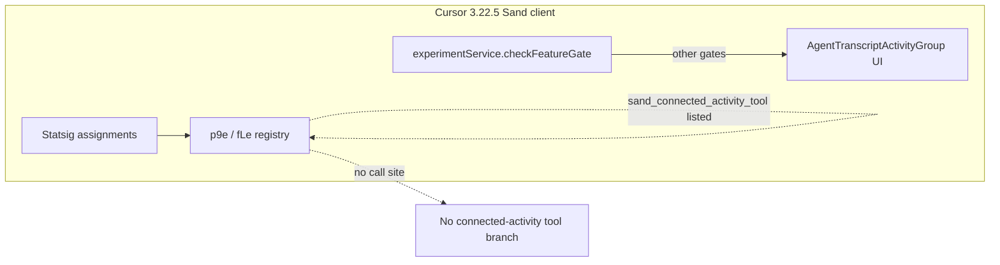

# Detective: feature-flag-sand-connected-activity-tool

## Objective

Determine what the client feature gate `sand_connected_activity_tool` does in Cursor **3.22.5** (`a00aa8754ab5bae70b637d98e126f9dbd4e1e5d0`): confirm `kFe`/registry metadata (`p9e` / `fLe`), locate any `experimentService.checkFeatureGate` wiring, map adjacent Sand/agent-transcript modules, and classify evidence. Success = reproducible bundle citations plus a clear shipped-vs-placeholder verdict.

**Assumptions:** `feature-flags-inventory.json` is authoritative for `client`/`default`. Desktop registry minifies as `p9e`; Glass as `fLe`.

**Unknowns:** Statsig exposure, per-user overrides in `state.vscdb`, runtime UI when force-enabled server-side.

## Environment

| Item | Value |
|------|--------|
| OS | Linux (cloud agent VM) |
| Cursor version | 3.22.5 |
| Commit | `a00aa8754ab5bae70b637d98e126f9dbd4e1e5d0` |
| `locate-cursor.sh` | `install_status=not_found`, `WORKBENCH_JS` empty |
| Workbench (probed) | `/workspace/workspace/runs/20260924T110844Z/extract/new/usr/share/cursor/resources/app/out/vs/workbench/workbench.desktop.main.js` |
| Glass twin | `/workspace/workspace/runs/20260924T110844Z/extract/new/usr/share/cursor/resources/app/out/vs/workbench/workbench.glass.main.js` |
| Inventory | `/workspace/workspace/runs/20260924T110844Z/feature-flags-inventory.json` |

## Scan checklist

| Script | Exit | Result |
|--------|------|--------|
| `locate-cursor.sh` | 0 | No local Cursor install; workbench only in extract tree |
| `scan-paths.sh` | 0 | No global `state.vscdb`; `~/.cursor/projects` exists |
| `grep-workbench.sh` (desktop, `sand_connected_activity_tool`) | 0 | `hit_count=1` — registry snippet only |
| `grep-workbench.sh` (glass, same) | 0 | `hit_count=1` — registry snippet only |
| `inspect-state-vscdb.sh` | 1 | `state.vscdb not found` |
| Phase 4b module grep (desktop bundle) | 0 | Related modules: `AgentTranscriptActivityGroup.js`, `activity-grouping.js` (no flag literals in module bodies) |

## Findings

### Registry (`kFe` / `p9e` / `fLe`)

- **Confirmed** — Inventory: `client: true`, `default: false`.
- **Confirmed** — Registry neighbors: `sand_messages_tools` (default off), `sand_special_settings`, `sand_enable_home_pull_to_refresh` — all Sand mobile/desktop UX gates in the same blob region.
- **Confirmed** — Desktop: `sand_messages_tools:{client:!0,default:!1},sand_connected_activity_tool:{client:!0,default:!1}` inside `p9e={...}`.
- **Confirmed** — Glass: identical entry inside `fLe={...}`.

### `checkFeatureGate` / call sites

- **Confirmed** — String literal `sand_connected_activity_tool` occurs **once** per workbench bundle and once each in `out/main.js`, `cursor-always-local/dist/main.js`, `cursor-agent-host/dist/main.js` (catalog copies only).
- **Confirmed** — Zero quoted `checkFeatureGate("sand_connected_activity_tool")` in desktop (308 `checkFeatureGate` occurrences) or glass (407); no dynamic bracket access containing this key.
- **Inferred** — Registered for remote rollout; **not wired** to client branches in 3.22.5. Bundled default `false` ⇒ shipped behavior matches “off” with no client reader.

### Related runtime (not gated by this flag name)

- **Confirmed** — `AgentTranscriptActivityGroup.js` groups tool runs in agent transcript UI (`loadingAction:"Running"`, `completedAction:"Ran"`).
- **Confirmed** — `activity-grouping.js` supports transcript activity presentation (desktop + glass bundles).
- **Confirmed** — No `connectedActivityToolCall` / `activityToolCall` proto case in glass tool dispatch (`connectScmToolCall` exists; activity-specific tool case absent).
- **Inferred** — Name + adjacency to `sand_messages_tools` suggests a future **agent tool or transcript card for “connected” third-party activity** (integrations feed), distinct from generic activity grouping already shipped.

### Effective value / Statsig

- **Unknown** — No local `state.vscdb` on VM.

## Internal code map

| Module / area | Role | Tie to flag |
|---------------|------|-------------|
| `p9e` / `fLe` | Client gate catalog (`kFe`) | **Confirmed** — only place gate is named |
| `experimentService.checkFeatureGate` | Gate evaluation | **Confirmed** — no call for this key |
| `AgentTranscriptActivityGroup.js` | Collapsible tool-run groups in transcript | **Inferred** — likely UI host for a future connected-activity tool |
| `activity-grouping.js` | Activity grouping helpers | **Inferred** — adjacent presentation layer |
| `sand_messages_tools` (sibling gate) | Also registry-only in 3.22.5 | **Inferred** — paired rollout for message-attached tools |

**Registry snippet (desktop, Confirmed):**

```
sand_messages_tools:{client:!0,default:!1},sand_connected_activity_tool:{client:!0,default:!1},grok_bot_hide_internal_details:{client:!0,default:!0}
```

## Diagram



## Gaps & follow-ups

- No live Cursor profile — cannot validate Statsig force-enable or transcript UX.
- Activity-specific agent tool proto not present; future build may add `*ActivityToolCall` cases.

## Workspace relevance

None; investigation used extracted AppImage workbench only.

---

## Summary (executive)

| Field | Value |
|-------|--------|
| **Key** | `sand_connected_activity_tool` |
| **Client** | true |
| **Bundled default** | false (inventory) |
| **Registry-only** | **yes** |
| **What it changes** | Reserved Sand gate for a future **connected-activity agent tool / transcript affordance**; existing activity grouping UI is separate and unwired to this key. |
| **Confidence** | **Medium** (registry Confirmed; purpose Inferred from name + `sand_messages_tools` + transcript modules) |
| **Modules** | `p9e`/`fLe` only; related unwired: `AgentTranscriptActivityGroup.js`, `activity-grouping.js` |
