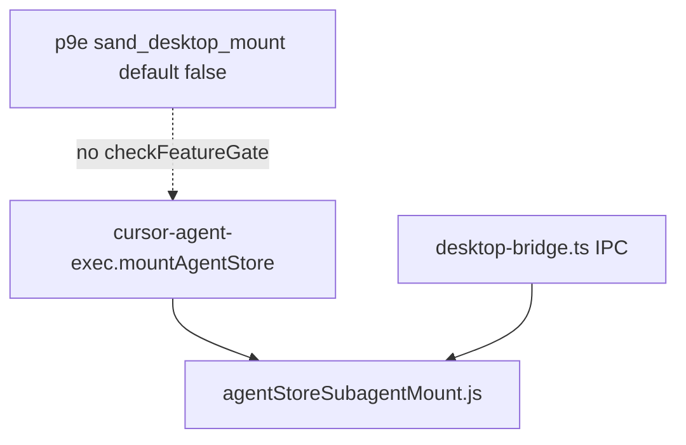

# Detective: feature-flag-sand-desktop-mount

## Objective

Determine what the client feature gate `sand_desktop_mount` does in Cursor **3.22.5** (`a00aa8754ab5bae70b637d98e126f9dbd4e1e5d0`): confirm registry metadata, find `checkFeatureGate` call sites, map desktop/agent-store mount infrastructure, and classify evidence.

**Assumptions:** Inventory authoritative for `client`/`default`. Registry symbols: `p9e` (desktop), `fLe` (glass).

**Unknowns:** Statsig exposure, local gate overrides, end-to-end desktop mount UX without a Sand desktop client on this VM.

## Environment

| Item | Value |
|------|--------|
| OS | Linux (cloud agent VM) |
| Cursor version | 3.22.5 |
| Commit | `a00aa8754ab5bae70b637d98e126f9dbd4e1e5d0` |
| `locate-cursor.sh` | `install_status=not_found` |
| Workbench (probed) | `/workspace/workspace/runs/20260924T110844Z/extract/new/usr/share/cursor/resources/app/out/vs/workbench/workbench.desktop.main.js` |
| Glass twin | `/workspace/workspace/runs/20260924T110844Z/extract/new/usr/share/cursor/resources/app/out/vs/workbench/workbench.glass.main.js` |
| Inventory | `/workspace/workspace/runs/20260924T110844Z/feature-flags-inventory.json` |

## Scan checklist

| Script | Exit | Result |
|--------|------|--------|
| `locate-cursor.sh` | 0 | No local install |
| `scan-paths.sh` | 0 | No global `state.vscdb` |
| `grep-workbench.sh` (desktop, `sand_desktop_mount`) | 0 | `hit_count=1` |
| `grep-workbench.sh` (glass, same) | 0 | `hit_count=1` |
| `inspect-state-vscdb.sh` | 1 | DB not found |
| Phase 4b (module headers in desktop bundle) | — | `agentStoreSubagentMount.js`, `agent-store-commands.ts`, `desktop-bridge.ts` present; no flag literal in module bodies |

## Findings

### Registry (`kFe` / `p9e` / `fLe`)

- **Confirmed** — Inventory: `client: true`, `default: false`.
- **Confirmed** — Clustered with Sand desktop onboarding gates: `sand_grok_main_agent`, `sand_share_bot` (default **true**), `sand_marketplace_for_you_auth_aware`, `sand_onboarding_role_selection`.
- **Confirmed** — Snippet: `sand_grok_main_agent:{client:!0,default:!1},sand_desktop_mount:{client:!0,default:!1},sand_marketplace_for_you_auth_aware:{client:!0,default:!1}`.

### `checkFeatureGate` / call sites

- **Confirmed** — Literal `sand_desktop_mount` count = **1** in each workbench bundle and catalog copies in `out/main.js`, extension mains — registry only.
- **Confirmed** — Zero quoted `checkFeatureGate("sand_desktop_mount")` in desktop/glass bundles.
- **Inferred** — Placeholder gate for desktop Sand rollout; default off ⇒ no client branch in 3.22.5.

### Related runtime (not gated by this flag name)

- **Confirmed** — `agent-store-commands.ts` defines `cursor-agent-exec.mountAgentStore` and `cursor-agent-exec.resolveAgentStoreScopePath` (desktop + glass).
- **Confirmed** — `agentStoreSubagentMount.js` syncs subagent IDs via command execution; constant `agent_store_sync_client`.
- **Confirmed** — `desktop-bridge.ts` validates desktop IPC messages (`sendMessage`, max text size `256*1024`, thread id checks) — Sand desktop shell bridge, not feature-gated.
- **Confirmed** — AppImage path handling exists elsewhere (`.AppImage.zsync` in update service); no `.mount_cursor` string in workbench (FUSE mount is runtime, not bundle string).
- **Inferred** — `sand_desktop_mount` likely gates **mounting the agent store / subagent workspace onto the Sand desktop client** (local FS exposure via agent-exec), building on existing mount commands.

### Effective value / Statsig

- **Unknown** — No `state.vscdb`.

## Internal code map

| Module / area | Role | Tie to flag |
|---------------|------|-------------|
| `p9e` / `fLe` | Gate catalog | **Confirmed** — only naming site |
| `agent-store-commands.ts` | `mountAgentStore` command IDs | **Confirmed** — mount plumbing exists today |
| `agentStoreSubagentMount.js` | Subagent store sync on mount | **Confirmed** — unwired to gate |
| `desktop-bridge.ts` | Sand desktop message bridge | **Confirmed** — companion desktop shell IPC |
| `sand_grok_main_agent` (sibling) | Registry-only, default off | **Inferred** — paired desktop Sand feature set |

**Registry snippet (Confirmed):**

```
sand_share_bot:{client:!0,default:!0},sand_grok_main_agent:{client:!0,default:!1},sand_desktop_mount:{client:!0,default:!1}
```

## Diagram



## Gaps & follow-ups

- Cannot exercise Sand desktop mount flow on headless VM.
- Mount may be enforced server-side or in unreleased desktop host binary not in workbench bundle.

## Workspace relevance

None.

---

## Summary (executive)

| Field | Value |
|-------|--------|
| **Key** | `sand_desktop_mount` |
| **Client** | true |
| **Bundled default** | false (inventory) |
| **Registry-only** | **yes** |
| **What it changes** | Reserved gate to enable **agent-store / subagent filesystem mount on Sand desktop**; underlying `mountAgentStore` commands and bridge exist but are not gated by this key in 3.22.5. |
| **Confidence** | **Medium** (registry Confirmed; behavior Inferred from mount commands + naming) |
| **Modules** | `p9e`/`fLe`; related: `agent-store-commands.ts`, `agentStoreSubagentMount.js`, `desktop-bridge.ts` |
