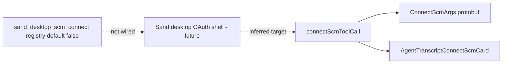

# Detective: feature-flag-sand-desktop-scm-connect

## Objective

Determine what the client feature gate `sand_desktop_scm_connect` does in Cursor **3.22.5** (`a00aa8754ab5bae70b637d98e126f9dbd4e1e5d0`): confirm registry metadata, locate `checkFeatureGate` wiring, map SCM connect tool/UI stack, and classify evidence.

**Assumptions:** Inventory authoritative. Registry: `p9e` / `fLe`.

**Unknowns:** OAuth flow differences on desktop vs web when gate enabled; local overrides.

## Environment

| Item | Value |
|------|--------|
| OS | Linux (cloud agent VM) |
| Cursor version | 3.22.5 |
| Commit | `a00aa8754ab5bae70b637d98e126f9dbd4e1e5d0` |
| Workbench | `/workspace/workspace/runs/20260924T110844Z/extract/new/usr/share/cursor/resources/app/out/vs/workbench/workbench.desktop.main.js` |
| Glass | `/workspace/workspace/runs/20260924T110844Z/extract/new/usr/share/cursor/resources/app/out/vs/workbench/workbench.glass.main.js` |
| Inventory | `/workspace/workspace/runs/20260924T110844Z/feature-flags-inventory.json` |

## Scan checklist

| Script | Exit | Result |
|--------|------|--------|
| `locate-cursor.sh` | 0 | No local install |
| `scan-paths.sh` | 0 | No global `state.vscdb` |
| `grep-workbench.sh` (desktop) | 0 | `hit_count=1` for `sand_desktop_scm_connect` |
| `grep-workbench.sh` (glass) | 0 | `hit_count=1` |
| `inspect-state-vscdb.sh` | 1 | DB missing |
| Phase 4b | — | `connect_scm_tool_pb.js`, `connectScmQueryHandler.js`, `AgentTranscriptConnectScmCard.js`, `connectScmToolCall` dispatch present |

## Findings

### Registry (`kFe` / `p9e` / `fLe`)

- **Confirmed** — Inventory: `client: true`, `default: false`.
- **Confirmed** — Neighbors: `grok_bot_cloud_agent_durable_watch`, `grok_bot_mcp_catalog_status_killswitch`, `sand_computer_use_unicode_typing`, `sand_usage_limit_tray_recovery` — cloud-agent + desktop Sand ops cluster.
- **Confirmed** — Snippet: `sand_desktop_scm_connect:{client:!0,default:!1},sand_computer_use_unicode_typing:{client:!0,default:!1}`.

### `checkFeatureGate` / call sites

- **Confirmed** — Literal appears once per catalog copy; **zero** quoted `checkFeatureGate("sand_desktop_scm_connect")`.
- **Inferred** — Registry-only in 3.22.5; default off.

### Related runtime (SCM connect stack — not gated by this key)

- **Confirmed** — Proto: `connect_scm_tool_pb.js` defines `agent.v1.ConnectScmArgs`, `ConnectScmGithub` with repository + optional `ghe_application`.
- **Confirmed** — UI: `AgentTranscriptConnectScmCard.js` string `Connect GitHub so the agent can review pull requests and access your repositories.`
- **Confirmed** — Glass tool pipeline includes `case"connectScmToolCall"` (13 references in `workbench.glass.main.js`); handler maps to agent tool execution layer.
- **Confirmed** — `connectScmQueryHandler.js` present in both bundles (query/status handling).
- **Confirmed** — Glass migration flows warn about local git state (`glass.migration.gitTransferFailure`, worktree preflight) — adjacent desktop/git UX, not referencing this gate.
- **Inferred** — Gate targets **routing GitHub SCM connect OAuth / token capture through the Sand desktop shell** instead of web-only or cloud-only connect cards; connect tool UI already ships without this flag.

### Effective value / Statsig

- **Unknown** — No local DB.

## Internal code map

| Module / area | Role | Tie to flag |
|---------------|------|-------------|
| `p9e` / `fLe` | Gate catalog | **Confirmed** — only naming site |
| `connect_scm_tool_pb.js` | ConnectScm agent tool schema | **Confirmed** — tool exists |
| `AgentTranscriptConnectScmCard.js` | Transcript card prompting GitHub connect | **Confirmed** — unwired to gate |
| `connectScmQueryHandler.js` | SCM connect queries | **Confirmed** |
| Tool dispatch (`connectScmToolCall`) | Runtime tool case | **Confirmed** — active without gate |

**Proto snippet (Confirmed):**

```
connect_scm_tool_pb.js → agent.v1.ConnectScmArgs { tool_call_id, github: ConnectScmGithub }
```

## Diagram



## Gaps & follow-ups

- Desktop OAuth redirect handlers likely live outside workbench bundle (Electron main / Sand host).
- Cannot compare gated vs ungated SCM connect without Statsig override.

## Workspace relevance

None.

---

## Summary (executive)

| Field | Value |
|-------|--------|
| **Key** | `sand_desktop_scm_connect` |
| **Client** | true |
| **Bundled default** | false (inventory) |
| **Registry-only** | **yes** |
| **What it changes** | Reserved gate for **desktop-native GitHub SCM connect** in Sand; `connectScmToolCall` + transcript card already exist and are not gated by this name in 3.22.5. |
| **Confidence** | **Medium–High** on tool stack (Confirmed); **Medium** on desktop-specific OAuth (Inferred) |
| **Modules** | `p9e`/`fLe`; related: `connect_scm_tool_pb.js`, `AgentTranscriptConnectScmCard.js`, `connectScmQueryHandler.js` |
