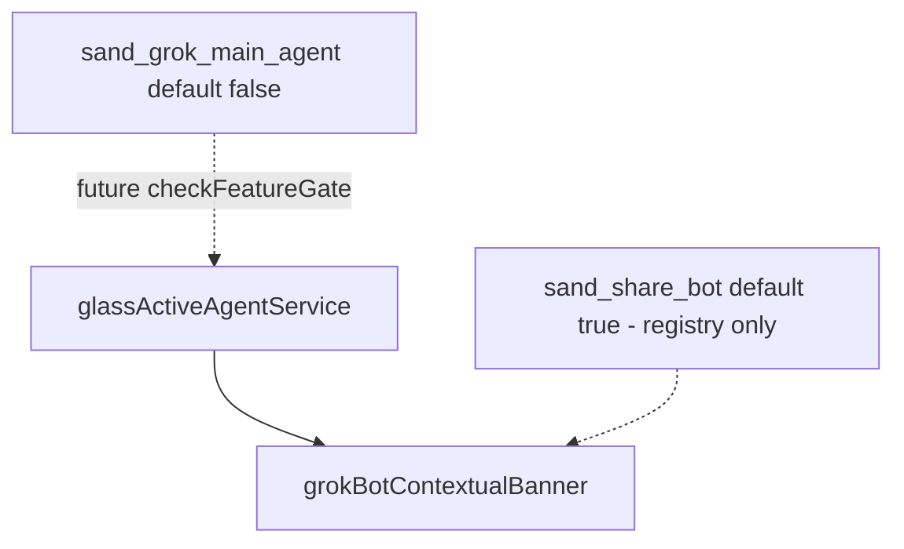

# Detective: feature-flag-sand-grok-main-agent

## Objective

Determine what the client feature gate `sand_grok_main_agent` does in Cursor **3.22.5** (`a00aa8754ab5bae70b637d98e126f9dbd4e1e5d0`): confirm registry metadata, locate `checkFeatureGate` call sites, map Grok/Sand agent selection infrastructure, and classify evidence.

**Assumptions:** Inventory authoritative. Registry: `p9e` / `fLe`.

**Unknowns:** Statsig exposure; which agent ID becomes “main” when enabled; interaction with default-on `sand_share_bot`.

## Environment

| Item | Value |
|------|--------|
| OS | Linux (cloud agent VM) |
| Cursor version | 3.22.5 |
| Commit | `a00aa8754ab5bae70b637d98e126f9dbd4e1e5d0` |
| Workbench | `/workspace/workspace/runs/20260924T110844Z/extract/new/usr/share/cursor/resources/app/out/vs/workbench/workbench.desktop.main.js` |
| Glass | `/workspace/workspace/runs/20260924T110844Z/extract/new/usr/share/cursor/resources/app/out/vs/workbench/workbench.glass.main.js` |
| Inventory | `/workspace/workspace/runs/20260924T110844Z/feature-flags-inventory.json` |

## Scan checklist

| Script | Exit | Result |
|--------|------|--------|
| `locate-cursor.sh` | 0 | No local install |
| `scan-paths.sh` | 0 | No global `state.vscdb` |
| `grep-workbench.sh` (desktop) | 0 | `hit_count=1` |
| `grep-workbench.sh` (glass) | 0 | `hit_count=1` |
| `inspect-state-vscdb.sh` | 1 | DB missing |
| Phase 4b | — | `glassActiveAgentService.js`, `grokBotContextualBanner.js`, many `grok_bot_*` gates in same registry region |

## Findings

### Registry (`kFe` / `p9e` / `fLe`)

- **Confirmed** — Inventory: `client: true`, `default: false`.
- **Confirmed** — Sits between default-on `sand_share_bot` and default-off `sand_desktop_mount` in the Sand desktop cluster; nearby `grok_bot_*` fleet/onboarding gates (several default **true**).
- **Confirmed** — Snippet: `sand_share_bot:{client:!0,default:!0},sand_grok_main_agent:{client:!0,default:!1},sand_desktop_mount:{client:!0,default:!1}`.

### `checkFeatureGate` / call sites

- **Confirmed** — Literal count = 1 per catalog surface; **zero** quoted `checkFeatureGate("sand_grok_main_agent")` in either workbench bundle.
- **Confirmed** — Sibling `sand_share_bot` also has **zero** quoted call sites (registry-only in 3.22.5) — both are rollout placeholders in this build.
- **Inferred** — Default off ⇒ Grok-as-main-agent path not active client-side without Statsig override.

### Related runtime (Grok / active agent — not gated by this key)

- **Confirmed** — `glassActiveAgentService.js` (`cursor/glass.lastRealAgent`, `cursor/glass.skipPersistAdopt`) tracks last real agent in Glass/Sand shell.
- **Confirmed** — `grokBotContextualBanner.js` / `grokBotContextualBannerSession.js` — Grok bot chrome in agent UI.
- **Confirmed** — Numerous shipped `grok_bot_*` gates (fleet, invites, checklist) default true in inventory; separate from `sand_grok_main_agent`.
- **Confirmed** — Config schema includes `sand_share_bot_export_policy` object (export policy enum) — Sand bot sharing policy, adjacent product surface.
- **Inferred** — `sand_grok_main_agent` enables selecting **Grok bot as the default/main agent persona** in Sand (desktop/mobile shell), overriding generic agent selection while `sand_share_bot` (default on) governs sharing affordances.

### Effective value / Statsig

- **Unknown** — No local profile.

## Internal code map

| Module / area | Role | Tie to flag |
|---------------|------|-------------|
| `p9e` / `fLe` | Gate catalog | **Confirmed** — only naming site |
| `glassActiveAgentService.js` | Persist / resolve active agent | **Inferred** — likely integration point when wired |
| `grokBotContextualBanner.js` | Grok-specific agent chrome | **Inferred** — UX when Grok is main |
| `sand_share_bot` (sibling, default true) | Registry-only here | **Inferred** — complementary Sand bot feature |
| `grok_bot_*` gates | Fleet/onboarding (many wired elsewhere) | **Confirmed** — related product area |

**Service snippet (Confirmed):**

```
glassActiveAgentService.js → keys: cursor/glass.lastRealAgent, cursor/glass.skipPersistAdopt
```

## Diagram



## Gaps & follow-ups

- Agent ID / composer template for “Grok main” not referenced by gate string in bundle.
- Requires Sand client runtime to validate default agent switch.

## Workspace relevance

None.

---

## Summary (executive)

| Field | Value |
|-------|--------|
| **Key** | `sand_grok_main_agent` |
| **Client** | true |
| **Bundled default** | false (inventory) |
| **Registry-only** | **yes** |
| **What it changes** | Reserved gate to make **Grok bot the main/default Sand agent**; Grok banners and active-agent services exist but are not keyed off this flag in 3.22.5. |
| **Confidence** | **Medium** (registry Confirmed; agent-selection behavior Inferred) |
| **Modules** | `p9e`/`fLe`; related: `glassActiveAgentService.js`, `grokBotContextualBanner.js`, sibling `sand_share_bot` |
