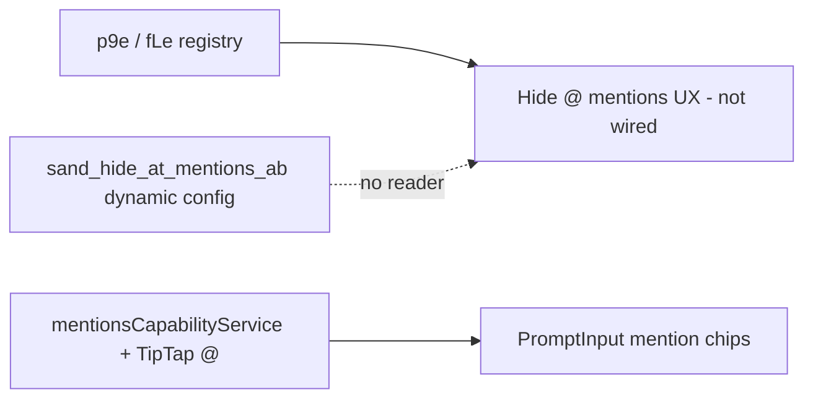

# Detective: feature-flag-sand-hide-at-mentions

## Objective

Determine what the client feature gate `sand_hide_at_mentions` does in Cursor **3.22.5** (`a00aa8754ab5bae70b637d98e126f9dbd4e1e5d0`): confirm `kFe`/registry metadata (`p9e` / `fLe`), locate `checkFeatureGate` call sites (if any), map @-mention composer infrastructure, and classify evidence.

**Scope:** Read-only forensics on extracted AppImage workbench bundles (`workbench.desktop.main.js`, `workbench.glass.main.js`) and `feature-flags-inventory.json`.

**Success criteria:** Reproducible bundle citations, internal code map for mention/slash UX, clear shipped-vs-placeholder verdict.

**Assumptions:** Inventory defaults are authoritative. Desktop gate catalog minifies as `p9e`; Glass as `fLe`.

**Unknowns:** Whether AB key `sand_hide_at_mentions_ab` is consumed at runtime; Statsig overrides; mobile-only vs desktop reach.

## Environment

| Item | Value |
|------|--------|
| OS | Linux (cloud agent VM) |
| Cursor version | 3.22.5 |
| Commit | `a00aa8754ab5bae70b637d98e126f9dbd4e1e5d0` |
| `locate-cursor.sh` | `install_status=not_found`, `WORKBENCH_JS` empty |
| Workbench (probed) | `.../extract/new/usr/share/cursor/resources/app/out/vs/workbench/workbench.desktop.main.js` |
| Glass twin | `.../workbench.glass.main.js` |
| Inventory | `.../feature-flags-inventory.json` |

## Scan checklist

| Script | Exit | Result |
|--------|------|--------|
| `locate-cursor.sh` | 0 | No local Cursor install |
| `scan-paths.sh` | 0 | No global `state.vscdb`; `projects_root` minimal |
| `grep-workbench.sh` (desktop, `sand_hide_at_mentions`) | 0 | `hit_count=1` in registry snippet (+ second snippet `sand_hide_at_mentions_ab`) |
| `grep-workbench.sh` (glass, same) | 0 | Same as desktop |
| `inspect-state-vscdb.sh` | 1 | `state.vscdb not found` |
| Python app-wide scan | 0 | `sand_hide_at_mentions` ×2 per workbench (registry + AB map); **0** `checkFeatureGate("sand_hide_at_mentions")` |

## Findings

### Registry (`kFe` / `p9e` / `fLe`)

- **Confirmed** — Inventory: `client: true`, `default: false`.

```json
{"name": "sand_hide_at_mentions", "client": true, "default": false}
```

- **Confirmed** — Desktop workbench **two** literal hits (user-noted “wb hits”): (1) client gate map in `experimentConfig.gen.js` neighborhood, (2) dynamic AB config entry `sand_hide_at_mentions_ab` with `fallbackValues:{enabled:!1}` and `parseValue:{enabled:Fm}` (paired with `sand_hide_slash_commands_ab`).

```
sand_hide_slash_commands:{client:!0,default:!1},sand_hide_at_mentions:{client:!0,default:!1},sand_agent_titles:{client:!0,default:!0}
...
sand_hide_slash_commands_ab:{client:!0,fallbackValues:{enabled:!1},parseValue:{enabled:Fm}},sand_hide_at_mentions_ab:{client:!0,fallbackValues:{enabled:!1},parseValue:{enabled:Fm}}
```

- **Confirmed** — Same literals mirrored in glass `fLe`, `out/main.js`, and extension `main.js` bundles (registry propagation).

### `checkFeatureGate` / call sites

- **Confirmed** — No `checkFeatureGate` (or quoted dynamic equivalent) references `sand_hide_at_mentions` or `sand_hide_at_mentions_ab` in desktop/glass workbench (~306 / ~405 total `checkFeatureGate` calls scanned).
- **Confirmed** — Sibling gate `sand_hide_slash_commands` is also registry-only (2 literals: main + `_ab`), with no client reader in 3.22.5.
- **Inferred** — Gates are staged for Sand/Grok composer UX to **suppress @-mention affordances** (picker, chips, trigger) in parallel with hiding `/` slash commands — **not yet wired** to mention UI in this build.

### Adjacent @-mention implementation (**Confirmed**, not gated)

- **Confirmed** — `mentionsCapabilityService.js`: ranks/builds mention items (`getPastChatMentionItems`, file/folder/branch mention providers).
- **Confirmed** — TipTap mention extension (`index.js` in bundle): `mentionSuggestionChar` default `"@"`, mention chip DOM attrs `data-mention-suggestion-char`.
- **Confirmed** — Prompt input surface (`$of` / PromptInput): `onMentionsChange`, `hideMentionChipRemoveButton`, mention-only placeholder behavior.
- **Confirmed** — `ComposerSlashMenu.js` exists for `/` command menu (sibling product area to `sand_hide_slash_commands`).

### Effective value / Statsig

- **Unknown** — No local DB; AB config key present but no bundle reader located.

## Internal code map

| Module (bundle header) | Entry / API | Tie to flag |
|------------------------|-------------|-------------|
| `experimentConfig.gen.js` | `p9e` / `fLe` gate maps | **Confirmed** — sole flag literals |
| `mentionsCapabilityService.js` | `getPastChatMentionItems`, mention ranking | **Confirmed** — functional @ mentions |
| `index.js` (TipTap mention) | `mentionSuggestionChar`, mention node attrs | **Confirmed** — `@` trigger |
| Prompt input (`PromptInputContext.js` / `$of`) | `onMentionsChange`, mention chips | **Confirmed** — composer UX host |
| `ComposerSlashMenu.js` | slash menu chrome | **Inferred** — parallel to `sand_hide_slash_commands` |
| `experimentService.checkFeatureGate` | Gate evaluation | **Confirmed** — no calls for this key |

**Registry snippet (Confirmed):**

```
sand_hide_at_mentions:{client:!0,default:!1}
```

## Diagram



## Gaps & follow-ups

- Could not tie `sand_hide_at_mentions_ab` to a specific experiment consumer (no string reference outside registry/AB map).
- No runtime Sand composer session on this VM.
- Source maps unavailable; React composer shell is compiler-bundled.

## Workspace relevance

None.

---

## Summary (for automation)

| Field | Value |
|-------|--------|
| **Key** | `sand_hide_at_mentions` |
| **Client** | true |
| **Bundled default** | false |
| **Registry-only** | **Mostly yes** — 2 workbench literals (main gate + `sand_hide_at_mentions_ab`); **no** `checkFeatureGate` reader |
| **What it changes** | Reserved gate (+ AB key) to **hide @-mention UI** in Sand/Grok composer; mention stack ships **ungated** in 3.22.5 |
| **Confidence** | **Medium** (registry **Confirmed**; intent **Inferred** from name + `sand_hide_slash_commands` pair + mention modules) |
| **Modules** | `experimentConfig.gen.js`; `mentionsCapabilityService.js`; TipTap mention `index.js`; PromptInput; `ComposerSlashMenu.js` |
