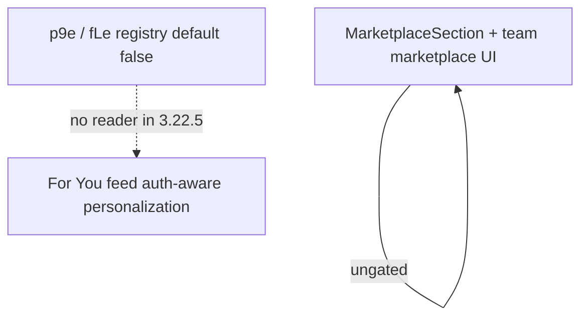

# Detective: feature-flag-sand-marketplace-for-you-auth-aware

## Objective

Determine what the client feature gate `sand_marketplace_for_you_auth_aware` does in Cursor **3.22.5** (`a00aa8754ab5bae70b637d98e126f9dbd4e1e5d0`): confirm `kFe`/registry metadata (`p9e` / `fLe`), locate `checkFeatureGate` call sites (if any), map marketplace “For You” surfaces, and classify evidence.

**Assumptions:** Inventory defaults are authoritative. Flag is catalogued in `manifest.json` / `feature-flags-inventory.json`.

**Unknowns:** Whether “For You” is mobile-only; server-side personalization; interaction with `sand_mobile_unified_marketplace`.

## Environment

| Item | Value |
|------|--------|
| OS | Linux (cloud agent VM) |
| Cursor version | 3.22.5 |
| Commit | `a00aa8754ab5bae70b637d98e126f9dbd4e1e5d0` |
| `locate-cursor.sh` | `install_status=not_found`, `WORKBENCH_JS` empty |
| Workbench (probed) | `.../workbench.desktop.main.js` + `workbench.glass.main.js` |
| Inventory | `.../feature-flags-inventory.json` |

## Scan checklist

| Script | Exit | Result |
|--------|------|--------|
| `locate-cursor.sh` | 0 | No local install |
| `scan-paths.sh` | 0 | No `state.vscdb` |
| `grep-workbench.sh` (desktop, flag name) | 0 | `hit_count=1` — registry only |
| `grep-workbench.sh` (glass, flag name) | 0 | `hit_count=1` |
| `inspect-state-vscdb.sh` | 1 | DB missing |
| Python app-wide scan | 0 | Single literal per bundle file; **0** `checkFeatureGate` for key; no `ForYou` / `marketplaceForYou` identifiers |

## Findings

### Registry (`kFe` / `p9e` / `fLe`)

- **Confirmed** — Inventory: `client: true`, `default: false`.

```json
{"name": "sand_marketplace_for_you_auth_aware", "client": true, "default": false}
```

- **Confirmed** — Registry cluster (desktop) places gate with Sand marketplace/desktop experiment neighbors:

```
sand_grok_main_agent:{client:!0,default:!1},sand_desktop_mount:{client:!0,default:!1},sand_marketplace_for_you_auth_aware:{client:!0,default:!1},sand_header_template_share_menu:{client:!0,default:!0}
```

- **Confirmed** — Related mobile gate `sand_mobile_unified_marketplace` defaults **false** in same `sand_mobile_*` region of catalog (separate key).

### `checkFeatureGate` / call sites

- **Confirmed** — No `checkFeatureGate` references to `sand_marketplace_for_you_auth_aware` in desktop or glass bundles.
- **Inferred** — Registered for staged rollout of an **auth-aware “For You” marketplace feed** (personalized recommendations respecting sign-in / account state); **no client branch** reads this key in 3.22.5.

### Marketplace implementation (adjacent, **Confirmed**, not gated by this name)

- **Confirmed** — Multiple shipped marketplace modules in desktop bundle headers, e.g. `MarketplaceSection.js`, `MarketplacePluginRow.js`, team marketplace modals (`ManageTeamMarketplaceModal.js`, `CreateTeamMarketplaceForm.js`), `AddPluginsToMarketplaceMenu.js`.
- **Confirmed** — Glass dynamic config includes marketplace presentation keys (e.g. `marketplaceCategoryKey`, `marketplaceMaxCards`) — separate from this boolean gate.
- **Inferred** — `auth_aware` suffix implies “For You” rows change with authentication (signed-out vs signed-in, team vs personal) once wired.

### Effective value / Statsig

- **Unknown** — No local overrides.

## Internal code map

| Module / area | Role | Tie to flag |
|---------------|------|-------------|
| `experimentConfig.gen.js` | `p9e` / `fLe` registry | **Confirmed** — only literal |
| `MarketplaceSection.js` / team marketplace modals | Plugin marketplace UI | **Confirmed** — functional marketplace |
| `sand_mobile_unified_marketplace` (registry neighbor) | Mobile unified marketplace gate | **Inferred** — related rollout |
| `experimentService.checkFeatureGate` | Client gating | **Confirmed** — no call |

**Registry snippet (Confirmed):**

```
sand_marketplace_for_you_auth_aware:{client:!0,default:!1}
```

## Diagram



## Gaps & follow-ups

- No UI string `For You` tied to this gate name in bundles (minified; may live in mobile-only chunks not isolated).
- No live marketplace session with auth states on this VM.

## Workspace relevance

None.

---

## Summary (for automation)

| Field | Value |
|-------|--------|
| **Key** | `sand_marketplace_for_you_auth_aware` |
| **Client** | true |
| **Bundled default** | false |
| **Registry-only** | **yes** |
| **What it changes** | Placeholder for **auth-aware “For You” marketplace** personalization; marketplace chrome exists but **not gated** by this key |
| **Confidence** | **Medium-Low** (registry **Confirmed**; product intent **Inferred** from name + neighbors) |
| **Modules** | `experimentConfig.gen.js`; `MarketplaceSection.js` and team marketplace modals; neighbor `sand_mobile_unified_marketplace` |
