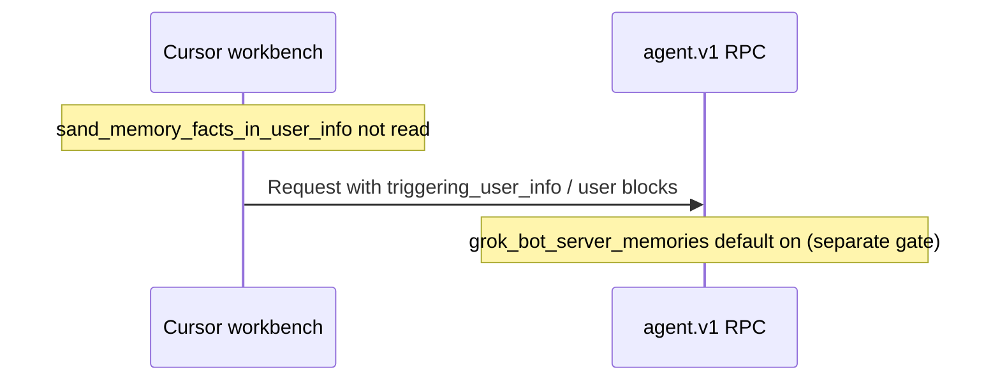

# Detective: feature-flag-sand-memory-facts-in-user-info

## Objective

Determine what the client feature gate `sand_memory_facts_in_user_info` does in Cursor **3.22.5** (`a00aa8754ab5bae70b637d98e126f9dbd4e1e5d0`): confirm `kFe`/registry metadata (`p9e` / `fLe`), locate `checkFeatureGate` call sites (if any), map agent `user_info` / memory protobuf surfaces, and classify evidence.

**Assumptions:** Inventory defaults are authoritative.

**Unknowns:** Server-side enforcement; overlap with `grok_bot_server_memories` (default **true**); mobile Sand vs desktop.

## Environment

| Item | Value |
|------|--------|
| OS | Linux (cloud agent VM) |
| Cursor version | 3.22.5 |
| Commit | `a00aa8754ab5bae70b637d98e126f9dbd4e1e5d0` |
| `locate-cursor.sh` | `install_status=not_found` |
| Workbench (probed) | `workbench.desktop.main.js` + `workbench.glass.main.js` |
| Inventory | `feature-flags-inventory.json` |

## Scan checklist

| Script | Exit | Result |
|--------|------|--------|
| `locate-cursor.sh` | 0 | No local install |
| `scan-paths.sh` | 0 | No `state.vscdb` |
| `grep-workbench.sh` (desktop, flag name) | 0 | `hit_count=1` |
| `grep-workbench.sh` (glass, flag name) | 0 | `hit_count=1` |
| `inspect-state-vscdb.sh` | 1 | DB missing |
| Python scan | 0 | `memory_facts` / `facts_in_user_info` each appear **once** in workbench (registry substring only); **0** gate readers |

## Findings

### Registry (`kFe` / `p9e` / `fLe`)

- **Confirmed** — Inventory: `client: true`, `default: false`.

```json
{"name": "sand_memory_facts_in_user_info", "client": true, "default": false}
```

- **Confirmed** — Registry cluster ties gate to Grok Bot memory / Sand memory neighborhood:

```
grok_bot_server_memories:{client:!0,default:!0},grok_bot_stripe_link:{client:!0,default:!0},grok_bot_spend_approval_passkey:{client:!0,default:!1},sand_memory_facts_in_user_info:{client:!0,default:!1},sand_memory_dreaming:{client:!0,default:!1}
```

### `checkFeatureGate` / call sites

- **Confirmed** — No `checkFeatureGate` references `sand_memory_facts_in_user_info` in desktop/glass.
- **Inferred** — When wired, gate would control whether **structured memory “facts”** are attached to the **user info** payload on agent requests (alongside `triggering_user_info` / conversation user blocks) — **not implemented** behind this key in 3.22.5 client.

### Agent user-info / memory context (adjacent, **Confirmed**)

- **Confirmed** — `agent_pb.js` defines `agent.v1.TriggeringUserInfo` (`auth_id`, `user_id`) and request fields `triggering_user_info` on agent actions / conversation messages.
- **Confirmed** — `ConversationHistory` proto includes `replace_user_info` scalar — indicates client can reshape user-info sections in history payloads.
- **Confirmed** — `grok_bot_server_memories` defaults **true** (separate gate; registry-only reader pattern similar to other Grok gates in this build).
- **Inferred** — `sand_memory_facts_in_user_info` is a **Sand-specific** toggle to embed memory-derived facts into that user-info channel vs keeping memories only in other surfaces (`sand_memory_dreaming`, etc.).

### Effective value / Statsig

- **Unknown** — No local DB.

## Internal code map

| Module / area | Role | Tie to flag |
|---------------|------|-------------|
| `experimentConfig.gen.js` | Gate catalog | **Confirmed** — sole literal |
| `agent_pb.js` | `TriggeringUserInfo`, `triggering_user_info`, `replace_user_info` | **Confirmed** — transport shape for user info |
| `grok_bot_server_memories` (default true) | Server memories feature flag | **Inferred** — related memory pipeline |
| `sand_memory_dreaming` (registry neighbor) | Sand memory UX gate | **Inferred** — same product area |
| `experimentService.checkFeatureGate` | Gate evaluation | **Confirmed** — no call |

**Registry snippet (Confirmed):**

```
sand_memory_facts_in_user_info:{client:!0,default:!1}
```

## Diagram



## Gaps & follow-ups

- No protobuf field literally named `memory_facts` located (only gate string contains `memory_facts`).
- Memory fact serialization path not isolated in minified bundle.

## Workspace relevance

None.

---

## Summary (for automation)

| Field | Value |
|-------|--------|
| **Key** | `sand_memory_facts_in_user_info` |
| **Client** | true |
| **Bundled default** | false |
| **Registry-only** | **yes** |
| **What it changes** | Placeholder to include **memory facts in agent user-info** payloads; `agent.v1` user-info protos exist but gate **unread** in 3.22.5 |
| **Confidence** | **Medium-Low** (registry **Confirmed**; behavior **Inferred** from name + `agent_pb.js` user-info fields) |
| **Modules** | `experimentConfig.gen.js`; `agent_pb.js` (`TriggeringUserInfo`); neighbors `grok_bot_server_memories`, `sand_memory_dreaming` |
