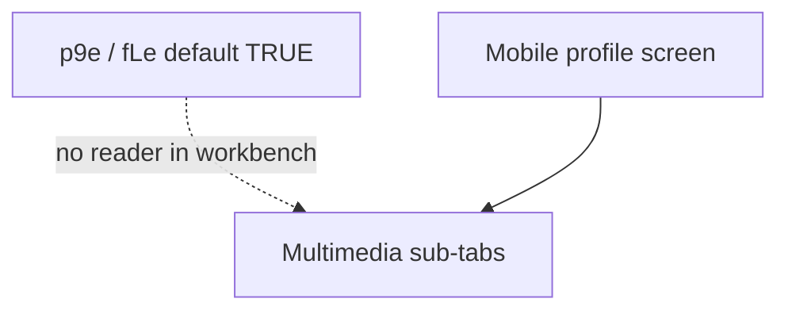

# Detective: feature-flag-sand-mobile-profile-multimedia-tabs

## Objective

Determine what the client feature gate `sand_mobile_profile_multimedia_tabs` does in Cursor **3.22.5** (`a00aa8754ab5bae70b637d98e126f9dbd4e1e5d0`): confirm `kFe`/registry metadata (`p9e` / `fLe`), locate `checkFeatureGate` call sites (if any), map mobile profile/settings navigation, and classify evidence.

**Assumptions:** Inventory defaults are authoritative. `default: true` in catalog is the bundled fallback when no remote override exists.

**Unknowns:** Whether multimedia tabs ship unconditionally via separate code path; React Native / mobile shell not extracted as separate bundle on desktop artifact.

## Environment

| Item | Value |
|------|--------|
| OS | Linux (cloud agent VM) |
| Cursor version | 3.22.5 |
| Commit | `a00aa8754ab5bae70b637d98e126f9dbd4e1e5d0` |
| `locate-cursor.sh` | `install_status=not_found` |
| Workbench (probed) | `workbench.desktop.main.js` + `workbench.glass.main.js` |
| Inventory | `feature-flags-inventory.json` |

## Scan checklist

| Script | Exit | Result |
|--------|------|--------|
| `locate-cursor.sh` | 0 | No local install |
| `scan-paths.sh` | 0 | No `state.vscdb` |
| `grep-workbench.sh` (desktop, flag name) | 0 | `hit_count=1` — registry only |
| `grep-workbench.sh` (glass, flag name) | 0 | `hit_count=1` |
| `inspect-state-vscdb.sh` | 1 | DB missing |
| Python scan | 0 | `multimedia` / `profile_multimedia` / `multimedia_tabs` literals only in registry; **0** `checkFeatureGate` for key; **0** `sand_*` string args to `checkFeatureGate` in glass |

## Findings

### Registry (`kFe` / `p9e` / `fLe`)

- **Confirmed** — Inventory: `client: true`, `default: **true**` (unusual among Sand gates in this batch).

```json
{"name": "sand_mobile_profile_multimedia_tabs", "client": true, "default": true}
```

- **Confirmed** — Registry cluster (mobile Sand gates):

```
sand_mobile_app_store_update_indicator:{client:!0,default:!0},sand_mobile_profile_multimedia_tabs:{client:!0,default:!0},sand_mobile_slash_skill_trigger:{client:!0,default:!0},sand_mobile_dictation_diagnostics:{client:!0,default:!0}
```

### `checkFeatureGate` / call sites

- **Confirmed** — No `checkFeatureGate` references `sand_mobile_profile_multimedia_tabs` in desktop or glass.
- **Confirmed** — No `checkFeatureGate("sand_...")` string literals of any kind in `workbench.glass.main.js` (0 matches) — Sand mobile gates in this artifact appear **registry-only** as a class.
- **Inferred** — Gate documents intended default-on behavior for **multimedia sub-tabs on mobile user profile** (e.g. photos/video/audio), but client wiring is **not present** in extracted 3.22.5 workbench; mobile UX may live in a host not probed here, or feature ships without reading this key yet.

### Profile / settings navigation (adjacent, **Confirmed**)

- **Confirmed** — Settings nav helpers expose `profileTabEnabled` gating the **profile** settings tab (`visibleTabs` / `mRy` / `ghk` pattern in bundle) — separate boolean from this feature gate name.
- **Inferred** — `sand_mobile_profile_multimedia_tabs` targets **in-profile multimedia tabs**, not the desktop settings profile tab flag.

### Effective value / Statsig

- **Unknown** — Bundled default **true** implies kill-switch semantics once wired (disable tabs when forced false remotely).

## Internal code map

| Module / area | Role | Tie to flag |
|---------------|------|-------------|
| `experimentConfig.gen.js` | `p9e` / `fLe` registry | **Confirmed** — only literal |
| Settings nav (`settingsNav` / `profileTabEnabled`) | Profile tab visibility in settings | **Confirmed** — related profile UX, different control |
| `sand_mobile_*` neighbors | Mobile feature cluster | **Inferred** — same Sand mobile host |
| `experimentService.checkFeatureGate` | Gate evaluation | **Confirmed** — no call |

**Registry snippet (Confirmed):**

```
sand_mobile_profile_multimedia_tabs:{client:!0,default:!0}
```

## Diagram



## Gaps & follow-ups

- No `MultimediaTab` / `profileMultimedia` identifiers in workbench strings.
- Mobile shell binaries not separately extracted in this run; cannot confirm RN implementation.

## Workspace relevance

None.

---

## Summary (for automation)

| Field | Value |
|-------|--------|
| **Key** | `sand_mobile_profile_multimedia_tabs` |
| **Client** | true |
| **Bundled default** | **true** |
| **Registry-only** | **yes** (in extracted workbench) |
| **What it changes** | Catalog default-on gate for **multimedia tabs on mobile user profile**; **no** `checkFeatureGate` wiring located in 3.22.5 workbench/glass |
| **Confidence** | **Medium-Low** (registry **Confirmed**; UX **Inferred** from name + `sand_mobile_*` cluster) |
| **Modules** | `experimentConfig.gen.js`; settings `profileTabEnabled` (adjacent); `sand_mobile_slash_skill_trigger` neighbors |
