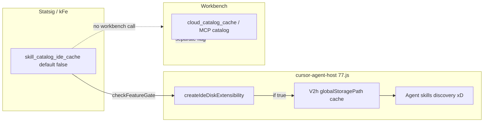

# Detective: `skill_catalog_ide_cache`

## Objective

Determine what the client feature gate `skill_catalog_ide_cache` does in Cursor **3.22.5** (`a00aa8754ab5bae70b637d98e126f9dbd4e1e5d0`): confirm `kFe` registry metadata, find **all** gate call sites (workbench + extensions), describe cache behavior when enabled, and distinguish from `cloud_catalog_cache` MCP catalog caching.

**Assumptions:** Inventory `default: false` is authoritative. Agent skills discovery runs through `cursor-agent-host` IDE disk extensibility (`createIdeDiskExtensibility`).

**Unknowns:** On-disk cache layout from `V2h(globalStoragePath)` without de-minifying agent-host chunk exports.

## Environment

| Item | Value |
|------|--------|
| OS | Linux (cloud agent VM) |
| Cursor version | 3.22.5 |
| Commit | `a00aa8754ab5bae70b637d98e126f9dbd4e1e5d0` |
| `locate-cursor.sh` | `install_status=not_found` |
| Workbench (probed) | `/workspace/workspace/runs/20260924T110844Z/extract/new/usr/share/cursor/resources/app/out/vs/workbench/workbench.desktop.main.js` |
| Glass twin | `/workspace/workspace/runs/20260924T110844Z/extract/new/usr/share/cursor/resources/app/out/vs/workbench/workbench.glass.main.js` |
| Agent host ext | `/workspace/workspace/runs/20260924T110844Z/extract/new/usr/share/cursor/resources/app/extensions/cursor-agent-host/dist/77.js` |
| Inventory | `/workspace/workspace/runs/20260924T110844Z/feature-flags-inventory.json` |

## Scan checklist

| Script | Exit | Result |
|--------|------|--------|
| `locate-cursor.sh` | 0 | No install |
| `scan-paths.sh` | 0 | No `state.vscdb` |
| `grep-workbench.sh` (desktop) | 0 | `hit_count=1` — registry only in workbench |
| `grep-workbench.sh` (glass) | 0 | `hit_count=1` — registry only in workbench |
| `inspect-state-vscdb.sh` | 1 | DB missing |
| Extension probe (`77.js`) | — | **Confirmed** `checkFeatureGate("skill_catalog_ide_cache")` call site |

## Findings

### Registry (`kFe` / `p9e` / `fLe`)

- **Confirmed** — Inventory: `skill_catalog_ide_cache` → `client: true`, `default: false` (adjacent `skill_icon_color`, default false).
- **Confirmed** — Registry entry in `p9e` / `fLe` blobs in workbench, `out/main.js`, and extension catalog copies.
- **Confirmed** — Workbench bundles: flag string **once** each (catalog only).

### Gate call sites

- **Confirmed** — **Wired in extension** `cursor-agent-host/dist/77.js` (`createIdeDiskExtensibility`):
  - Constants: `j="rules_discovery_respect_cursorignore"`, `A="subagents_discovery_allow_external_symlinks"`, `_="skill_catalog_ide_cache"`.
  - Parallel gate reads: `c.cursor.checkFeatureGate(_)` (fourth promise in `Promise.all`).
- **Confirmed** — When `globalStoragePath` is defined **and** gate returns true, skills discovery config includes `agentSkillsCatalogCache: (0,a.V2h)(e.globalStoragePath)`; otherwise that property is omitted (spread omits empty branch).
- **Confirmed** — Zero `checkFeatureGate("skill_catalog_ide_cache")` in workbench desktop/glass main bundles.
- **Inferred** — Default **false** ⇒ IDE agent-host skills discovery runs **without** persistent catalog cache unless Statsig enables the gate.

### Distinction: MCP `cloud_catalog_cache`

- **Confirmed** — Separate gate `r9a="cloud_catalog_cache"` in workbench drives `_readCatalogCacheEnabled()` for MCP/dashboard plugin catalog (`_catalogCacheEnabled`, `getMcpCatalog`) — **not** `skill_catalog_ide_cache`.
- **Confirmed** — Sibling wired skill UI gate in workbench: `skill_icon_color` for `SKILL.md` icon coloring — independent of catalog cache.

### Statsig / local effective value

- **Unknown** — No local profile; cache directory would live under extension `globalStoragePath` when enabled.

## Internal code map

| Module / area | Role | Tie to flag |
|---------------|------|-------------|
| `p9e` / `fLe` | Client gate catalog | **Confirmed** — registry |
| `cursor-agent-host/dist/77.js` | `createIdeDiskExtensibility` | **Confirmed** — reads gate, passes `agentSkillsCatalogCache` |
| `cursor-agent-host/dist/744.js` | Agent host exec / skills plumbing (`xD`, exports) | **Inferred** — hosts `V2h` cache factory |
| `agentSkills.js`, `skill-dispatch.js`, `agents-skills-sync-entry.react.js` | Skills UX/dispatch | **Inferred** — consumers of discovery surface |
| `cloudCatalogService.js` + `cloud_catalog_cache` | MCP cloud catalog cache | **Confirmed** — **different** flag |
| Workbench `checkFeatureGate(skill_icon_color)` | SKILL.md header color | **Confirmed** — unrelated |

**Extension snippet (Confirmed):**

```text
const j="rules_discovery_respect_cursorignore",A="subagents_discovery_allow_external_symlinks",_="skill_catalog_ide_cache";
... Promise.resolve(c.cursor.checkFeatureGate(_)).catch(()=>!1) ...
...!0===h?{}:{agentSkillsCatalogCache:(0,a.V2h)(e.globalStoragePath)}
```

**Registry snippet (Confirmed):**

```text
skill_icon_color:{client:!0,default:!1},skill_catalog_ide_cache:{client:!0,default:!1},opt_devs_into_experimental_model_toggle:{client:!0,default:!1}
```

## Diagram



## Gaps & follow-ups

- `V2h` cache schema/TTL not extracted from minified `83815` shared chunk.
- No runtime verification of cache files on disk with flag enabled.

## Workspace relevance

Documents agent skills caching gate for feature-flag inventory; distinct from MCP `cloud_catalog_cache`.

---

## Executive summary

| Field | Value |
|-------|--------|
| **Key** | `skill_catalog_ide_cache` |
| **Client** | true |
| **Bundled default** | false (inventory) |
| **Registry-only** | **no** — wired in `cursor-agent-host/dist/77.js`; registry-only in workbench main bundles |
| **What it changes** | When enabled (and `globalStoragePath` present), agent-host IDE skills discovery attaches **`agentSkillsCatalogCache`** via `V2h(globalStoragePath)` to avoid re-fetching skills catalog; default off skips cache. |
| **Confidence** | **High** (extension call site + conditional spread) |
| **Modules** | `77.js` (`createIdeDiskExtensibility`); `744.js` (agent host exec); registry `p9e`/`fLe`; not `cloudCatalogService` / `cloud_catalog_cache` |
