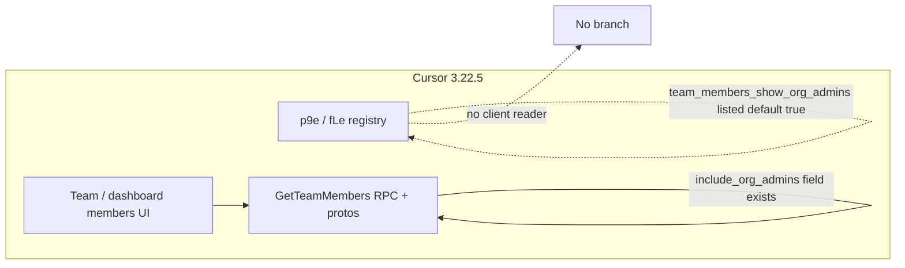

# Detective: feature-flag-team-members-show-org-admins

## Objective

Determine what the client feature gate `team_members_show_org_admins` does in Cursor **3.22.5** (`a00aa8754ab5bae70b637d98e126f9dbd4e1e5d0`): confirm `kFe`/registry metadata (`p9e` / `fLe`), locate runtime readers, map API/UI touchpoints, and classify shipped vs placeholder. Success = reproducible bundle citations and a clear verdict on default-on behavior without a client reader.

**Assumptions:** `feature-flags-inventory.json` is authoritative for `client`/`default`. Desktop registry minifies as `p9e`; Glass as `fLe`.

**Unknowns:** Per-user Statsig overrides; whether a newer build wires `include_org_admins` on `GetTeamMembers` through this gate (not present in this bundle).

## Environment

| Item | Value |
|------|--------|
| OS | Linux (cloud agent VM) |
| Cursor version | 3.22.5 |
| Commit | `a00aa8754ab5bae70b637d98e126f9dbd4e1e5d0` |
| `locate-cursor.sh` | `install_status=not_found`, `WORKBENCH_JS` empty |
| Workbench (probed) | `/workspace/workspace/runs/20260924T110844Z/extract/new/usr/share/cursor/resources/app/out/vs/workbench/workbench.desktop.main.js` |
| Glass twin | `/workspace/workspace/runs/20260924T110844Z/extract/new/usr/share/cursor/resources/app/out/vs/workbench/workbench.glass.main.js` |
| Inventory | `/workspace/workspace/runs/20260924T110844Z/feature-flags-inventory.json` |

## Scan checklist

| Script | Exit | Result |
|--------|------|--------|
| `locate-cursor.sh` | 0 | No local Cursor install on VM |
| `scan-paths.sh` | 0 | No global `state.vscdb`; `~/.cursor/projects` exists |
| `grep-workbench.sh` (desktop, `team_members_show_org_admins`) | 0 | `hit_count=1` — registry snippet only |
| `grep-workbench.sh` (glass, same) | 0 | `hit_count=1` — registry snippet only |
| `inspect-state-vscdb.sh` | 1 | `state.vscdb not found` |

## Findings

### Registry (`kFe` / `p9e` / `fLe`)

- **Confirmed** — Inventory: `client: true`, `default: true`.
- **Confirmed** — Desktop `p9e` blob includes `team_members_show_org_admins:{client:!0,default:!0}` adjacent to `org_billing_admin_role` and org-team settings gates.
- **Confirmed** — Glass `fLe` carries the same entry (grep snippet matches desktop).

### `checkFeatureGate` / `getFeatureGateProperty`

- **Confirmed** — Literal `team_members_show_org_admins` occurs **once** per workbench bundle (registry only). Zero `checkFeatureGate("team_members_show_org_admins")` and zero `getFeatureGateProperty("team_members_show_org_admins")` in desktop or glass (Python scan of full bundles).
- **Confirmed** — String also appears only in catalog copies: `out/main.js`, `cursor-always-local/dist/main.js`, `cursor-agent-host/dist/main.js` (same registry pattern as other gates).

### API / data model (related, not gated in this build)

- **Confirmed** — `dashboard_pb.js` (bundled) defines `GetTeamMembersRequest` with optional `include_org_admins` and `GetTeamMembersResponse` with repeated `org_admins` (`TeamOrgAdmin` messages).
- **Confirmed** — gRPC catalog lists `getTeamMembers` → `GetTeamMembers` unary RPC (proto types `Yxu`/`Qxu` in bundle).
- **Inferred** — When wired, the gate likely sets `include_org_admins` on team-member fetches so the dashboard can list organization-level admins alongside team members; **no client code sets that field in 3.22.5**.

### Effective value

- **Inferred** — Bundled default `true` would mean “show org admins” if a reader existed; with no reader, UI behavior does not branch on this gate in this build.
- **Unknown** — Server-side behavior if Statsig forces the gate off for some users (no local profile).

## Internal code map

| Module / area | Role | Tie to flag |
|---------------|------|-------------|
| `p9e` / `fLe` | Client feature-gate catalog | **Confirmed** — only literal name site |
| `dashboard_pb.js` | `GetTeamMembers*` protos (`include_org_admins`, `org_admins`) | **Confirmed** — API surface the gate likely targets |
| `permissions.ts` | Team permission constants (`team.*`) | **Inferred** — adjacent org/team admin UX |
| `experimentService` | Gate evaluation | **Confirmed** — no calls for this key |

**Registry snippet (Confirmed):**

```
org_billing_admin_role:{client:!0,default:!1},team_members_show_org_admins:{client:!0,default:!0},org_team_settings_copy_on_create:{client:!0,default:!0}
```

## Diagram



## Gaps & follow-ups

- No `state.vscdb` — cannot verify overrides.
- Team members settings UI may live in web dashboard chunks not isolated by gate string search; no `include_org_admins` assignment found in workbench JS.

## Workspace relevance

None; forensics used extracted AppImage workbench only.

---

## Summary (for Notion)

| Field | Value |
|-------|--------|
| **Key** | `team_members_show_org_admins` |
| **Client** | true |
| **Bundled default** | true |
| **Registry-only** | **yes** (no `checkFeatureGate` / `getFeatureGateProperty` in 3.22.5) |
| **What it changes** | Reserved gate (default **on**) to expose **organization admins in team-members experiences**, aligned with `GetTeamMembersRequest.include_org_admins` / `org_admins` response fields — not wired in this client build. |
| **Confidence** | **Medium** (registry + protos Confirmed; UI wiring Inferred) |
| **Modules** | `p9e`/`fLe`; related `dashboard_pb.js` (`GetTeamMembers*`) |
