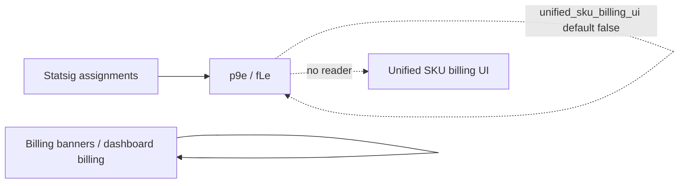

# Detective: feature-flag-unified-sku-billing-ui

## Objective

Determine what the client feature gate `unified_sku_billing_ui` does in Cursor **3.22.5** (`a00aa8754ab5bae70b637d98e126f9dbd4e1e5d0`): confirm registry metadata, find runtime call sites, and map billing UI modules. Success = evidence-backed shipped-vs-placeholder verdict.

**Assumptions:** Inventory and `p9e`/`fLe` registry blobs are authoritative for defaults.

**Unknowns:** Statsig exposure; whether billing UI ships behind server-driven experiments without embedding the gate name in the bundle.

## Environment

| Item | Value |
|------|--------|
| OS | Linux (cloud agent VM) |
| Cursor version | 3.22.5 |
| Commit | `a00aa8754ab5bae70b637d98e126f9dbd4e1e5d0` |
| `locate-cursor.sh` | `install_status=not_found` |
| Workbench (probed) | `.../workbench.desktop.main.js` (extract path under `20260924T110844Z/extract/new/`) |
| Glass twin | `.../workbench.glass.main.js` |
| Inventory | `/workspace/workspace/runs/20260924T110844Z/feature-flags-inventory.json` |

## Scan checklist

| Script | Exit | Result |
|--------|------|--------|
| `locate-cursor.sh` | 0 | No live install |
| `scan-paths.sh` | 0 | No `state.vscdb` |
| `grep-workbench.sh` (desktop, `unified_sku_billing_ui`) | 0 | `hit_count=1` — registry |
| `grep-workbench.sh` (glass, same) | 0 | `hit_count=1` |
| `inspect-state-vscdb.sh` | 1 | DB missing |

## Findings

### Registry (`kFe` / `p9e` / `fLe`)

- **Confirmed** — `client: true`, `default: false` in inventory and bundles.
- **Confirmed** — Registry context neighbors: `xai_commerce_webview`, `sand_mobile_xai_commerce_webview`, `enable_cc_plugin_import` (commerce/billing cluster).

```text
xai_commerce_webview:{client:!0,default:!1},sand_mobile_xai_commerce_webview:{client:!0,default:!1},unified_sku_billing_ui:{client:!0,default:!1},enable_cc_plugin_import:{client:!0,default:!0}
```

### Runtime readers

- **Confirmed** — Single literal per workbench file; **zero** `checkFeatureGate` / `getFeatureGateProperty` for this key (desktop + glass).
- **Confirmed** — No `UnifiedSkuBilling`, `skuBillingUi`, or other camelCase alias in workbench (string search).
- **Confirmed** — Catalog-only copies in `out/main.js`, `cursor-always-local`, `cursor-agent-host`.

### Billing context (unwired)

- **Confirmed** — `dashboard_pb.js` embeds extensive billing/prepaid/xAI commerce protos (`GetUserPrepaidBilling`, `GetXaiCommerceBearerToken`, etc.).
- **Confirmed** — Workbench includes billing-banner storage keys (`cursor.billingBanner.*`) and dashboard billing flows (separate from this gate name).
- **Inferred** — Gate targets a **unified SKU-based billing settings UI** (single surface for product SKUs) default-off for dark launch; existing billing banners/settings are not gated by this string in 3.22.5.

## Internal code map

| Module / area | Role | Tie to flag |
|---------------|------|-------------|
| `p9e` / `fLe` | Gate catalog | **Confirmed** — only name site |
| `dashboard_pb.js` | Billing / prepaid / commerce RPC protos | **Inferred** — likely data layer for future UI |
| Billing banner helpers | Payment-failed / mandate UI (`cursor.billingBanner.*`) | **Confirmed** — present; **not** gated by `unified_sku_billing_ui` |
| `experimentService` | Gate evaluation | **Confirmed** — no calls for this key |

## Diagram



## Gaps & follow-ups

- No runtime UI test (gate force-enable) on this VM.
- Exact Figma/route name for “unified SKU” UI not present as string in bundle.

## Workspace relevance

None.

---

## Summary (for Notion)

| Field | Value |
|-------|--------|
| **Key** | `unified_sku_billing_ui` |
| **Client** | true |
| **Bundled default** | false |
| **Registry-only** | **yes** |
| **What it changes** | Placeholder (default off) for a **unified SKU billing settings UI**; billing protos and legacy billing banners exist but are **not** wired to this gate name in 3.22.5. |
| **Confidence** | **Medium** (registry Confirmed; product intent Inferred from name + neighbor gates) |
| **Modules** | `p9e`/`fLe` only; adjacent `dashboard_pb.js` billing protos |
