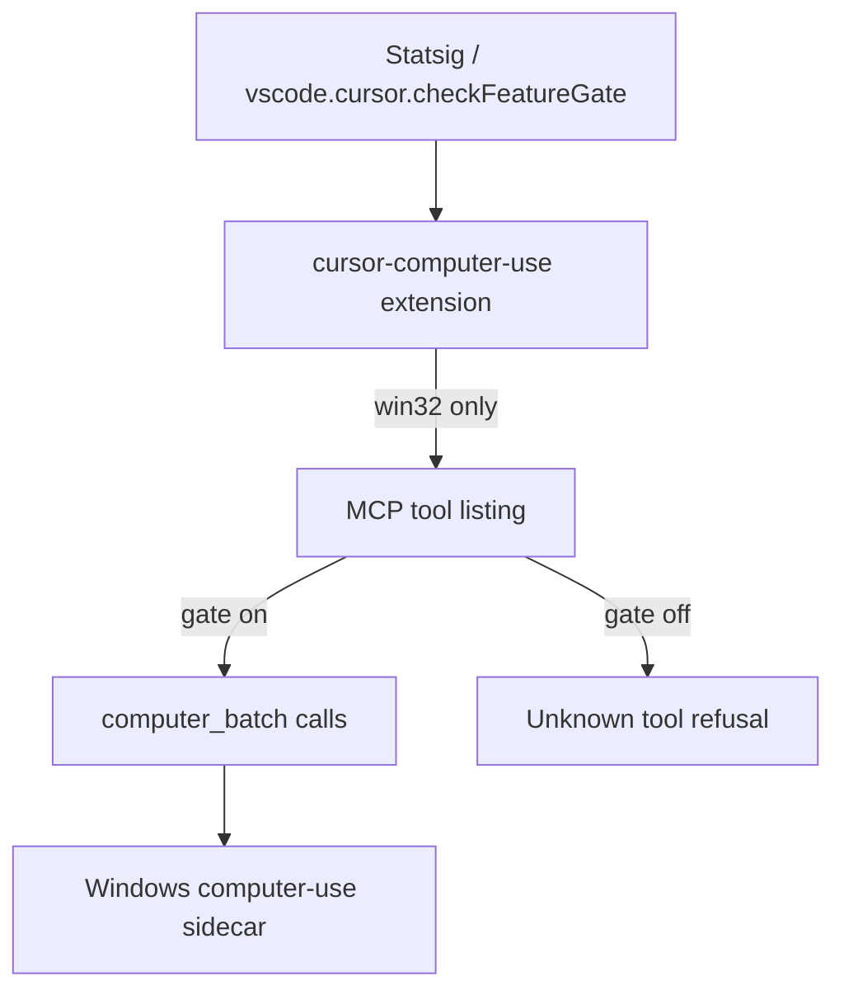

# Detective: feature-flag-windows-computer-use-batch

## Objective

Determine what `windows_computer_use_batch` does in Cursor **3.22.5**: registry metadata plus **extension-level** wiring for the `computer_batch` MCP tool on Windows. Success = confirmed gate read sites and tool behavior when on vs off.

**Assumptions:** `cursor-computer-use` extension in the extract matches the shipped AppImage extension.

**Unknowns:** Statsig rollout percentage; behavior on non-Windows platforms (gate intentionally not read).

## Environment

| Item | Value |
|------|--------|
| OS | Linux (cloud agent VM; extension logic inspected from source/dist) |
| Cursor version | 3.22.5 |
| Commit | `a00aa8754ab5bae70b637d98e126f9dbd4e1e5d0` |
| Workbench | Extracted `workbench.desktop.main.js` / `workbench.glass.main.js` |
| Extension tree | `.../extensions/cursor-computer-use/` |
| Inventory | `feature-flags-inventory.json` |

## Scan checklist

| Script | Exit | Result |
|--------|------|--------|
| `locate-cursor.sh` | 0 | No live install |
| `scan-paths.sh` | 0 | No `state.vscdb` |
| `grep-workbench.sh` (desktop, `windows_computer_use_batch`) | 0 | `hit_count=1` — registry only |
| `grep-workbench.sh` (glass, same) | 0 | `hit_count=1` |
| Extension source grep | — | **Confirmed** `checkFeatureGate` in `extension.ts` + tests |

## Findings

### Registry (`p9e` / `fLe`)

- **Confirmed** — `client: true`, `default: false`; neighbors include `mac_computer_use`, `playwright_autor*` gates.

```text
mac_computer_use:{client:!0,default:!1},windows_computer_use_batch:{client:!0,default:!1},playwright_autor
```

### Runtime wiring (`cursor-computer-use` extension)

- **Confirmed** — Constant `WINDOWS_COMPUTER_USE_BATCH_FEATURE_GATE = 'windows_computer_use_batch'` in `extension.ts`.
- **Confirmed** — `batchListed()` calls `vscode.cursor.checkFeatureGate(WINDOWS_COMPUTER_USE_BATCH_FEATURE_GATE)` **only when** `backendFactory.platform === 'win32'`; errors → `false`.
- **Confirmed** — Same gate read is passed into `ComputerUseMcpToolset` / `computerUseMcpTools({ batch })` so listing and execution stay consistent (comments in `tools.ts`).
- **Confirmed** — When gate off: `computer_batch` not advertised; calls return unknown-tool refusal (see `tools.test.ts` / `extension.test.ts`).
- **Confirmed** — macOS never reads this gate; batch tool does not exist on darwin (`BATCH_SCOPE = process.platform === "win32"`).

### Workbench bundle

- **Confirmed** — Workbench contains **registry only** (no direct `checkFeatureGate` for this string in `workbench.desktop.main.js`); evaluation happens in extension host via `vscode.cursor.checkFeatureGate`.

### Effective value

- **Inferred** — Default `false` → shipped 3.22.5 Windows builds hide `computer_batch` unless Statsig enables the gate.
- **Unknown** — Live Windows session validation not run on this Linux VM.

## Internal code map

| Module / area | Role | Tie to flag |
|---------------|------|-------------|
| `p9e` / `fLe` | Gate catalog | **Confirmed** |
| `extensions/cursor-computer-use/src/extension.ts` | Activation; `batchListed()` gate read | **Confirmed** |
| `extensions/cursor-computer-use/src/mcp/tools.ts` | `computer_batch` tool; Windows-only batch scope | **Confirmed** |
| `extensions/cursor-computer-use/dist/extension.js` | Shipped bundle | **Confirmed** — same gate string |
| `ComputerUseToolCallView.js` | UI for computer-use tool calls | **Inferred** — renders batch results when tool runs |

**Extension snippet (Confirmed):**

```typescript
const WINDOWS_COMPUTER_USE_BATCH_FEATURE_GATE = 'windows_computer_use_batch';
// ...
return await vscode.cursor.checkFeatureGate(WINDOWS_COMPUTER_USE_BATCH_FEATURE_GATE);
```

## Diagram



## Gaps & follow-ups

- No Windows VM to execute `extension.test.ts` here.
- Workbench does not reference gate string beyond registry (by design).

## Workspace relevance

None.

---

## Summary (for Notion)

| Field | Value |
|-------|--------|
| **Key** | `windows_computer_use_batch` |
| **Client** | true |
| **Bundled default** | false |
| **Registry-only** | **no** — wired in `cursor-computer-use` extension |
| **What it changes** | On **Windows only**, enables MCP tool **`computer_batch`** (multi-step computer-use batch RPC to the Windows sidecar); off → tool hidden and calls refused. |
| **Confidence** | **High** (extension + tests Confirmed) |
| **Modules** | `cursor-computer-use` (`extension.ts`, `mcp/tools.ts`); registry `p9e`/`fLe` |
