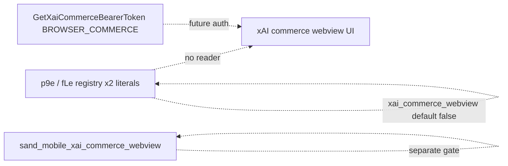

# Detective: feature-flag-xai-commerce-webview

## Objective

Determine what `xai_commerce_webview` does in Cursor **3.22.5**: registry metadata, workbench hit count, commerce API surfaces, and any runtime gate readers. User noted **hits** (2× string occurrences in desktop/glass bundles). Success = separate registry duplicates from real call sites.

**Assumptions:** Duplicate literals inside the same file reflect repeated `p9e`/`fLe` (or kFe) blobs, not multiple consumers.

**Unknowns:** Hosted commerce URL; exact webview entry command when gate ships.

## Environment

| Item | Value |
|------|--------|
| OS | Linux (cloud agent VM) |
| Cursor version | 3.22.5 |
| Commit | `a00aa8754ab5bae70b637d98e126f9dbd4e1e5d0` |
| Workbench | Extracted desktop + glass `workbench.*.main.js` |
| Inventory | `feature-flags-inventory.json` |

## Scan checklist

| Script | Exit | Result |
|--------|------|--------|
| `locate-cursor.sh` | 0 | No live install |
| `scan-paths.sh` | 0 | No `state.vscdb` |
| `grep-workbench.sh` (desktop, `xai_commerce_webview`) | 0 | `hit_count=1` per grep window (bundle also contains second registry copy → **2** total literals in file) |
| `grep-workbench.sh` (glass, same) | 0 | `hit_count=1`; **2** total literals in glass file |
| `inspect-state-vscdb.sh` | 1 | DB missing |

## Findings

### Registry (`kFe` / `p9e` / `fLe`)

- **Confirmed** — `client: true`, `default: false`.
- **Confirmed** — **Two** occurrences per workbench file; both are registry/catalog context (adjacent `xai_team_link`, `sand_mobile_xai_commerce_webview`, `unified_sku_billing_ui`).

```text
xai_team_link:{client:!0,default:!0},xai_commerce_webview:{client:!0,default:!1},sand_mobile_xai_commerce_webview:{client:!0,default:!1}
```

- **Confirmed** — Separate mobile gate `sand_mobile_xai_commerce_webview` (default false) listed beside desktop/web gate.

### Runtime readers

- **Confirmed** — Zero `checkFeatureGate("xai_commerce_webview")`, zero `getFeatureGateProperty("xai_commerce_webview")` in desktop or glass bundles.
- **Confirmed** — No `XaiCommerceWebview` / `commerceWebview` identifier in workbench (symbol search).
- **Inferred** — **Hits = duplicate registry entries only**, not wired UI branches in 3.22.5.

### Commerce API (related infrastructure)

- **Confirmed** — `dashboard_pb.js` defines `XaiCommerceBearerPurpose` including `BROWSER_COMMERCE` and messages `GetXaiCommerceBearerTokenRequest/Response`, `XaiCommerceBearerCredential`, refusals.
- **Confirmed** — gRPC client catalog exposes `getXaiCommerceBearerToken` unary RPC.
- **Inferred** — Future **embedded webview** commerce flow will fetch a short-lived bearer via `GetXaiCommerceBearerToken` with purpose `BROWSER_COMMERCE`; gate will likely guard opening that webview (desktop) parallel to `sand_mobile_xai_commerce_webview` on mobile.

### Sibling gates

- **Confirmed** — `xai_team_link` default **true** (separate gate) — team linking without commerce webview.

## Internal code map

| Module / area | Role | Tie to flag |
|---------------|------|-------------|
| `p9e` / `fLe` | Gate catalog (2× literal per bundle) | **Confirmed** |
| `dashboard_pb.js` | xAI commerce bearer token protos | **Confirmed** — backend contract |
| `sand_mobile_xai_commerce_webview` | Mobile counterpart gate | **Confirmed** — registry neighbor |
| `experimentService` | Gate evaluation | **Confirmed** — no calls for desktop webview gate |

## Diagram



## Gaps & follow-ups

- Webview implementation (command ID, URL) not referenced by gate string in this build.
- No Glass/desktop UI manual test with gate forced on.

## Workspace relevance

None.

---

## Summary (for Notion)

| Field | Value |
|-------|--------|
| **Key** | `xai_commerce_webview` |
| **Client** | true |
| **Bundled default** | false |
| **Registry-only** | **yes** (2× registry literals; **no** `checkFeatureGate` / `getFeatureGateProperty`) |
| **What it changes** | Reserved gate for **xAI commerce in an embedded webview**; bearer-token protos exist (`BROWSER_COMMERCE`) but **no client branch** in 3.22.5. |
| **Confidence** | **Medium** (registry + protos Confirmed; webview UX Inferred) |
| **Modules** | `p9e`/`fLe`; `dashboard_pb.js`; neighbor `sand_mobile_xai_commerce_webview` |
